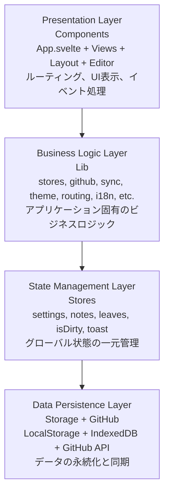

# アーキテクチャドキュメント

Agasteerのアーキテクチャ、技術スタック、プロジェクト構造について説明します。

## アーキテクチャ概要

Agasteerは、**コンポーネントベースアーキテクチャ**を採用した軽量Markdownノートアプリケーションです。

### 設計哲学

- **シンプリシティ**: 必要最小限の依存関係とコード量
- **ブラウザファースト**: サーバーレス、完全クライアントサイド
- **直接統合**: GitHub APIを直接呼び出し、中間サービス不要
- **即時性**: IndexedDB/LocalStorageによる自動保存、設定変更の即座反映
- **モジュール性**: コンポーネント分割とユーティリティ関数の再利用による保守性の向上
- **DRY原則**: 重複コードの徹底的な削減
- **遅延ロード**: 必要なデータのみを取得（アーカイブの遅延Pull等）

### アーキテクチャパターン

Agasteerは4層のレイヤー構造で設計されています。



詳細なファイル構造は[プロジェクト構造](#プロジェクト構造)セクションを参照してください。

---

## 技術スタック

### フレームワーク & ライブラリ

| 技術                | バージョン | 役割                                      |
| ------------------- | ---------- | ----------------------------------------- |
| **Svelte**          | 5.55+      | リアクティブUIフレームワーク（runes構文） |
| **TypeScript**      | 5.7.2      | 型安全性の提供                            |
| **Vite**            | 5.4+       | ビルドツール & 開発サーバー               |
| **vite-plugin-pwa** | 1.2.0      | PWA（Service Worker）自動生成             |
| **CodeMirror**      | 6.0.1      | 高機能エディタ                            |
| **marked**          | 17+        | マークダウン→HTML変換（プレビュー）       |
| **DOMPurify**       | 3+         | XSSサニタイゼーション                     |
| **svelte-i18n**     | 4+         | 国際化（i18n）対応                        |

### CodeMirrorエコシステム

- **@codemirror/state**: エディタの状態管理
- **@codemirror/view**: レンダリングとUI
- **@codemirror/commands**: 基本的な編集コマンド（Undo/Redo等）
- **@codemirror/lang-markdown**: Markdown構文ハイライト
- **@codemirror/theme-one-dark**: ダークテーマ
- **codemirror (basicSetup)**: 行番号、フォールド等の基本機能

### 開発ツール

- **Prettier** (3.3.3): コード整形
- **prettier-plugin-svelte**: Svelteファイル対応
- **svelte-check** (4+): 型チェック
- **Husky** (9.1.6): Gitフック管理

---

## GitHub構造

Agasteerは、GitHubリポジトリを永続化ストレージとして使用します。データは`.agasteer/`ディレクトリ配下に保存されます。

### フォルダ構造

```
.agasteer/
├── notes/                    # 通常のノート・リーフ（Homeワールド）
│   ├── metadata.json         # ノートのメタデータ（order, badge等）
│   ├── Note1/
│   │   ├── SubNote/          # サブノート（2階層まで）
│   │   │   └── leaf.md
│   │   └── leaf.md
│   └── Note2/
│       └── leaf.md
└── archive/                  # アーカイブされたノート・リーフ
    ├── metadata.json         # アーカイブのメタデータ
    ├── ArchivedNote/
    │   ├── SubNote/          # 階層構造は維持
    │   └── leaf.md
    └── standalone.md         # リーフ単体のアーカイブ
```

### ワールド（World）概念

Agasteerは**Home**と**Archive**の2つのワールドを持ちます。

| ワールド | パス                 | 説明                                           |
| -------- | -------------------- | ---------------------------------------------- |
| Home     | `.agasteer/notes/`   | 通常のノート・リーフ。Pull時に常にロード       |
| Archive  | `.agasteer/archive/` | アーカイブ済みデータ。遅延ロード（必要時のみ） |

**遅延ロード**: Archiveワールドは、ユーザーがArchiveに切り替えた時点で初めてPullされます。これにより通常のPull操作を高速に保ちます。

---

## プロジェクト構造

```
agasteer/
├── .husky/
│   └── pre-commit                       # npm run lintを実行
├── public/
│   └── assets/
│       ├── app-icon.png                 # PWA/ファビコン用アイコン（互換用PNG）
│       └── app-icon.webp                # PWA/ファビコン用アイコン（WebP）
│       ├── agasteer-icon.png            # 設定画面アイコン（About、互換用PNG）
│       └── agasteer-icon.webp           # 設定画面アイコン（About、WebP）
├── src/
│   ├── components/
│   │   ├── badges/
│   │   │   ├── BadgeButton.svelte       # バッジ選択ボタン
│   │   │   └── IconBadgePicker.svelte   # バッジアイコン+色ピッカー
│   │   ├── buttons/
│   │   │   ├── IconButton.svelte        # 共通アイコンボタン基盤
│   │   │   ├── PushButton.svelte        # Pushボタン共通コンポーネント
│   │   │   ├── PullButton.svelte        # Pullボタン共通コンポーネント
│   │   │   └── ShareButton.svelte       # シェアボタン共通コンポーネント
│   │   ├── cards/
│   │   │   └── NoteCard.svelte          # ノートカード共通コンポーネント
│   │   ├── editor/
│   │   │   └── MarkdownEditor.svelte    # CodeMirrorエディタラッパー
│   │   ├── icons/                       # SVGアイコンコンポーネント群（20個超、AppIcon/ArchiveIcon/EyeIcon等）
│   │   ├── layout/
│   │   │   ├── Breadcrumbs.svelte       # パンくずリスト（ワールド切替UI含む）
│   │   │   ├── Footer.svelte            # フッター
│   │   │   ├── Header.svelte            # ヘッダー
│   │   │   ├── InstallBanner.svelte     # PWAインストールバナー
│   │   │   ├── Loading.svelte           # ローディング表示
│   │   │   ├── Modal.svelte             # 確認/アラートダイアログ
│   │   │   ├── MoveModal.svelte         # ノート/リーフの移動モーダル
│   │   │   ├── OcrModal.svelte          # OCR実行モーダル
│   │   │   ├── PaneView.svelte          # 左右ペイン表示の共通枠
│   │   │   ├── SearchBar.svelte         # 検索バー
│   │   │   ├── SettingsModal.svelte     # 設定モーダル
│   │   │   ├── StatsPanel.svelte        # リーフ統計パネル
│   │   │   ├── Toast.svelte             # トースト通知
│   │   │   ├── WelcomeModal.svelte      # 初回ウェルカムガイド
│   │   │   ├── footer/
│   │   │   │   ├── AutoSaveIndicator.svelte # 自動保存インジケータ
│   │   │   │   ├── EditorFooter.svelte  # エディタ画面フッター
│   │   │   │   ├── HomeFooter.svelte    # ホーム画面フッター
│   │   │   │   ├── NoteFooter.svelte    # ノート画面フッター
│   │   │   │   └── PreviewFooter.svelte # プレビュー画面フッター
│   │   │   └── header/
│   │   │       └── StaleCheckIndicator.svelte # Stale検出インジケータ
│   │   ├── settings/
│   │   │   ├── QRCodeSection.svelte         # QRコード表示
│   │   │   ├── GitHubSettings.svelte        # GitHub設定
│   │   │   ├── LanguageSelector.svelte      # 言語選択
│   │   │   ├── ThemeSelector.svelte         # テーマ選択
│   │   │   ├── ToolNameInput.svelte         # ツール名入力
│   │   │   ├── FontCustomizer.svelte        # フォントカスタマイズ
│   │   │   ├── BackgroundCustomizer.svelte  # 背景画像カスタマイズ
│   │   │   ├── VimModeToggle.svelte         # Vimモード切替
│   │   │   ├── LinedModeToggle.svelte       # 罫線エディタモード切替
│   │   │   ├── CursorTrailToggle.svelte     # カーソルトレイル切替
│   │   │   ├── MediaOptimizeToggle.svelte   # 添付画像自動最適化切替
│   │   │   ├── ExportSection.svelte         # ZIPエクスポート
│   │   │   ├── ImportSection.svelte         # 他アプリからのインポート
│   │   │   ├── VisitorCounter.svelte        # 訪問者数カウンタ
│   │   │   ├── AboutSection.svelte          # アプリ情報
│   │   │   └── VersionDisplay.svelte        # バージョン表示
│   │   ├── QRCodeDisplay.svelte          # QRコード描画（QRCodeSectionから分離）
│   │   └── views/
│   │       ├── EditorView.svelte        # エディタ画面
│   │       ├── HomeView.svelte          # ホーム画面
│   │       ├── MediaLibraryView.svelte  # メディアライブラリ画面（#250）
│   │       ├── NoteView.svelte          # ノート画面
│   │       ├── PreviewView.svelte       # プレビュー画面
│   │       └── SettingsView.svelte      # 設定画面
│   ├── lib/
│   │   ├── actions/                      # App.svelteから抽出したビジネスロジック
│   │   │   ├── git.ts                   # Push/Pull/接続テストの薄いbarrel（下記へ再輸出、#226）
│   │   │   ├── git-push.ts              # pushToGitHub実体（#238 世代ガード含む）
│   │   │   ├── git-pull.ts              # pullFromGitHub実体・予約pull
│   │   │   ├── git-orphan.ts            # #235 タイムアウト後の遅延結果観測
│   │   │   ├── git-connection.ts        # 接続テスト（handleTestConnection）
│   │   │   ├── crud.ts                  # ノート/リーフCRUDのペイン/ストア配線（実体はdata/へ委譲）
│   │   │   ├── move.ts                  # ノート/リーフのワールド間移動（アーカイブ↔ホーム）
│   │   │   ├── io.ts                    # ZIPエクスポート/他アプリインポート/ダウンロード
│   │   │   ├── conflict-dialog.ts       # Push前のPushCount衝突ダイアログ
│   │   │   ├── swipe.ts                 # スワイプナビゲーション（Svelte action）
│   │   │   ├── portal.ts                # ポータル（Svelte action）
│   │   │   └── index.ts                 # actions系エクスポート
│   │   ├── api/
│   │   │   ├── github.ts                # GitHub API統合・push/pullオーケストレーション（副作用層、1631行）
│   │   │   ├── github/                   # GitHub 純粋層/低レベル副作用層（Phase 1-3で分離）
│   │   │   │   ├── paths.ts             # パス定数・パス構築（純粋）
│   │   │   │   ├── encoding.ts          # Base64/UTF-8変換（純粋）
│   │   │   │   ├── sha.ts               # Git blob SHA計算（純粋）
│   │   │   │   ├── rate-limit.ts        # レート制限解析（純粋）
│   │   │   │   ├── metadata.ts          # メタデータ正規化・安定化・push差分判定・pull正規化（純粋）
│   │   │   │   ├── pull-map.ts          # pullのパス折り畳み＋notes/leavesスケルトン構築（純粋）
│   │   │   │   ├── push-tree.ts         # pushのメタデータ生成＋tree エントリ構築（純粋）
│   │   │   │   └── http.ts              # Contents API fetch/並列ワーカー/設定検証（副作用層）
│   │   │   ├── media.ts                 # メディア同期層（副作用層: lazy作成/アップロード/キュー/キャッシュ、#242）
│   │   │   ├── media/                    # メディア純粋層+低レベル副作用層（github/ の分割パターン踏襲）
│   │   │   │   ├── base64.ts            # バイナリ安全な ArrayBuffer↔Base64（純粋）
│   │   │   │   ├── naming.ts            # SHA-256・ファイル名・raw URL 生成/パース（純粋）
│   │   │   │   ├── validation.ts        # 形式ホワイトリスト・100MB上限（純粋）
│   │   │   │   ├── lru.ts               # キャッシュ上限・LRU追い出し選定（純粋）
│   │   │   │   ├── history.ts           # 挿入履歴の記録（純粋）
│   │   │   │   ├── http.ts              # メディアリポFetchの低レベル副作用
│   │   │   │   ├── insert-phase.ts      # 添付編成のフェーズ管理
│   │   │   │   ├── library.ts           # 一覧アイテム→MediaAsset変換（純粋）
│   │   │   │   ├── markdown.ts          # 添付Markdown記法組み立て（純粋）
│   │   │   │   └── timeouts.ts          # タイムアウト定数
│   │   │   ├── media-library.ts         # メディアライブラリ一覧取得・削除（副作用層、#250）
│   │   │   ├── sync.ts                  # Push/Pull処理（github.tsの結果整形ラッパー）
│   │   │   ├── sync-handlers.ts         # GitHub同期メッセージのi18n変換ヘルパー
│   │   │   └── index.ts                 # API関連エクスポート
│   │   ├── data/
│   │   │   ├── storage.ts               # IndexedDB/LocalStorage汎用ヘルパー（1286行）
│   │   │   ├── importers.ts             # 他アプリ（Simplenote/Google Keep/Cosense）からのインポート（1216行）
│   │   │   ├── notes.ts                 # ノートのCRUD操作（純粋ビジネスロジック）
│   │   │   ├── leaves.ts                # リーフのCRUD操作（純粋ビジネスロジック）
│   │   │   ├── media-storage.ts         # メディア同期層専用のper-repo IndexedDBアクセサ（#242）
│   │   │   └── index.ts                 # データ関連エクスポート
│   │   ├── editor/                       # CodeMirrorエディタ拡張ロジック（DOM非依存でテスト可能な形に分離）
│   │   │   ├── dirty-lines.ts           # 行単位ダーティマーカー
│   │   │   ├── cursor-trail.ts          # WebGL2カーソルトレイル（Ghostty風残像）
│   │   │   ├── clamp-selection.ts       # #170 全置換時のselectionクランプ
│   │   │   ├── insert-text.ts           # カーソル位置へのテキスト挿入
│   │   │   ├── media-attach.ts          # 添付（貼付/D&D/選択）の共通ロジック（#243）
│   │   │   ├── mobile-cursor-scroll.ts  # モバイルカーソル追従スクロール
│   │   │   ├── editor-pane-ref.ts       # EditorPaneRef型（ペインからエディタ操作への参照）
│   │   │   └── wait-for-editor.ts       # 対象リーフのエディタ生成待ち
│   │   ├── i18n/
│   │   │   ├── index.ts                 # 国際化初期化
│   │   │   └── locales/
│   │   │       ├── en.json              # 英語翻訳
│   │   │       └── ja.json              # 日本語翻訳
│   │   ├── media/                        # (api/media/ とは別) メディアライブラリ画面のUI状態コントローラ
│   │   │   └── library-controller.svelte.ts # #250 loading/assets/削除等の状態・副作用を切り出し
│   │   ├── navigation/
│   │   │   ├── navigation.ts            # ナビゲーション状態の型（Pane, NavigationState等）
│   │   │   ├── routing.ts               # URLルーティング（パスベース、プレビュー対応）
│   │   │   ├── drag-drop.ts             # ドラッグ&ドロップヘルパー
│   │   │   └── index.ts                 # ナビゲーション関連エクスポート
│   │   ├── preview/                      # プレビュー機能のロジック
│   │   │   └── media-resolve.ts         # 添付メディアの表示解決（Blob URL差し替え、#244）
│   │   ├── stores/                       # 状態管理モジュール
│   │   │   ├── stores.svelte.ts         # Svelte 5 rune ベース状態管理（notes/leaves/settings等）
│   │   │   ├── world-helpers.ts         # ワールド判定ヘルパー（純粋関数）
│   │   │   ├── context.ts               # Context API型定義（PaneActions/PaneStateのみ残存）
│   │   │   ├── auto-save.svelte.ts      # 自動保存タイマー
│   │   │   ├── stale-checker.svelte.ts  # Stale定期チェッカー
│   │   │   ├── leaf-stats.svelte.ts     # リーフ統計
│   │   │   ├── drag-state.svelte.ts     # ドラッグ状態
│   │   │   ├── move-modal.svelte.ts     # 移動モーダル状態
│   │   │   ├── pull-progress.svelte.ts  # Pull進捗状態
│   │   │   ├── editor-registry.ts       # pane→composition flush関数のレジストリ（#186）
│   │   │   └── index.ts                 # ストア関連エクスポート
│   │   ├── sync/                         # (api/sync.ts とは別) Push/Pull基盤層の純粋関数群
│   │   │   ├── constants.ts             # Push/Pull/stale checkで共有するタイムアウト定数
│   │   │   ├── push-stages.ts           # #238 Push進捗ステージ（7コール→5段階カウントダウン）
│   │   │   ├── repo-sync-queue.ts       # リポ切替後の予約pull判定（純粋）
│   │   │   └── resume-retry.ts          # #203 復帰直後のstale check短期リトライ
│   │   ├── ui/
│   │   │   ├── theme.ts                 # テーマ適用ロジック
│   │   │   ├── font.ts                  # カスタムフォント管理
│   │   │   ├── background.ts            # カスタム背景画像管理
│   │   │   ├── breadcrumbs.ts           # パンくずリスト生成
│   │   │   ├── scroll-sync.ts           # 左右ペインのスクロール同期
│   │   │   ├── icons.ts                 # Pull/PushアイコンSVG文字列
│   │   │   ├── ui.svelte.ts             # Pull トースト・モーダル状態管理（push は re-export）
│   │   │   ├── push-toast.svelte.ts     # Push トーストのペーシング状態機械（#238）
│   │   │   └── index.ts                 # UI関連エクスポート
│   │   ├── utils/
│   │   │   ├── utils.ts                 # 共通ユーティリティ（ユニーク名生成等）
│   │   │   ├── crypto.ts                # トークン暗号化（AES-GCM、PBKDF2鍵導出）
│   │   │   ├── export.ts                # Markdownダウンロード・ZIPエクスポート
│   │   │   ├── image-optimize.ts        # 添付画像の自動最適化（2048px縮小+WebP再エンコード）
│   │   │   ├── offline.ts               # Offlineリーフ（ローカル専用メモ）
│   │   │   ├── priority.ts              # 優先段落（[n]マーカー）抽出
│   │   │   ├── search.svelte.ts         # 横断検索（ノート名/リーフ名/本文）
│   │   │   ├── share.ts                 # シェア機能（URL/Markdown/画像）
│   │   │   ├── stats.ts                 # リーフ統計の計算
│   │   │   └── index.ts                 # ユーティリティ関連エクスポート
│   │   ├── app-state.svelte.ts          # 共有リアクティブ状態（Svelte 5 runes、onMount初期化含む）
│   │   ├── keyboard-nav.svelte.ts       # キーボードナビゲーション（グローバルキーハンドラ）
│   │   ├── ocr.ts                       # OCR（tesseract.js動的ロード）
│   │   ├── pane-actions-factory.svelte.ts # PaneActions生成ファクトリ（D&D/移動モーダル/設定/シェア等）
│   │   ├── pane-navigation.svelte.ts    # ペインナビゲーション（ビュー遷移・ワールド切替・パンくず・URL同期）
│   │   ├── startup-cache.ts             # 起動時キャッシュの型定義
│   │   ├── tour.ts                      # 初回ガイド（吹き出し表示管理）
│   │   └── types.ts                     # TypeScript型定義
│   ├── app.css                          # グローバルスタイル + テーマ定義
│   ├── app.d.ts                         # TypeScript型宣言
│   ├── App.svelte                       # ルートコンポーネント
│   └── main.ts                          # エントリーポイント
├── docs/                                # 詳細ドキュメント
│   └── development/                     # 開発者向けドキュメント
│       ├── index.md                     # 開発ドキュメント目次
│       ├── architecture.md              # このファイル
│       ├── content-sync.md              # コンテンツ同期機能
│       ├── data-model.md                # データモデルと状態管理
│       ├── development.md               # 開発ガイド
│       ├── features.md                  # 基本機能の実装
│       ├── future-plans.md              # 拡張計画と既知の課題
│       ├── storage.md                   # データ永続化とストレージ
│       ├── sync/                        # GitHub同期・データ保護
│       │   ├── github-api.md            # GitHub API統合
│       │   ├── push-pull.md             # Push/Pull処理
│       │   ├── dirty-tracking.md        # 未保存変更の追跡
│       │   └── stale-detection.md       # Stale編集警告
│       ├── preview/                     # プレビュー機能
│       │   ├── markdown.md              # マークダウンプレビュー
│       │   ├── scroll-sync.md           # スクロール同期
│       │   └── image-export.md          # 画像出力
│       ├── ui/                          # UI/UX機能
│       │   ├── layout.md                # 2ペイン表示
│       │   ├── editor.md                # 罫線エディタ
│       │   ├── customization.md         # フォント、背景
│       │   ├── i18n.md                  # 国際化
│       │   ├── badges.md                # バッジ機能
│       │   ├── welcome-tour.md          # 初回ガイド
│       │   ├── pwa.md                   # PWA対応
│       │   └── share.md                 # シェア機能
│       ├── special/                     # 特殊リーフ
│       │   ├── priority.md              # Priorityリーフ
│       │   └── offline.md               # Offlineリーフ
│       └── history/                     # 履歴
│           └── refactoring.md           # リファクタリング履歴
├── dist/                                # ビルド出力（.gitignore）
├── .gitignore
├── .prettierrc                          # Prettier設定
├── .prettierignore
├── CLAUDE.md                            # 開発者向けドキュメント（目次）
├── index.html                           # HTMLエントリーポイント
├── package.json                         # プロジェクトメタデータ
├── README.md                            # ユーザー向けドキュメント
├── svelte.config.js                     # Svelte設定
├── tsconfig.json                        # TypeScript設定
├── tsconfig.node.json                   # Node用TypeScript設定
└── vite.config.ts                       # Vite設定
```

### 重要ファイルの役割

#### `src/App.svelte`

アプリケーションのルートコンポーネント。ビュー切り替えとイベントハンドリングを担当。

**主な責務:**

- 2ペイン表示の管理（アスペクト比判定、左右独立ナビゲーション）
- ビューのルーティング（home/note/edit/preview/settings）
- CRUD操作（ノート・リーフ作成/削除/更新）
- ドラッグ&ドロップ処理（ノート・リーフの並び替え）
- GitHub同期の呼び出し
- モーダル管理
- URLルーティング
- スクロール同期

#### コンポーネント層

**レイアウトコンポーネント:**

- `Header.svelte`: アプリタイトルと設定アイコン
- `header/StaleCheckIndicator.svelte`: Stale検出インジケータ
- `Breadcrumbs.svelte`: パンくずナビゲーション（インライン編集機能・ワールド切替UI付き）
- `Modal.svelte`: 確認ダイアログとアラート
- `MoveModal.svelte`: ノート/リーフの移動モーダル
- `OcrModal.svelte`: OCR実行モーダル（tesseract.js）
- `SettingsModal.svelte`: 設定モーダル
- `WelcomeModal.svelte`: 初回ウェルカムガイド（吹き出し表示）
- `Toast.svelte`: トースト通知（Push/Pull開始時）
- `Loading.svelte`: ローディング表示（3つのドットアニメーション）
- `Footer.svelte`: フッターレイアウト
- `footer/AutoSaveIndicator.svelte`: 自動保存インジケータ
- `footer/HomeFooter.svelte`: ホーム画面用フッター
- `footer/NoteFooter.svelte`: ノート画面用フッター
- `footer/EditorFooter.svelte`: エディタ画面用フッター（プレビュートグル、ダウンロード、削除）
- `footer/PreviewFooter.svelte`: プレビュー画面用フッター
- `PaneView.svelte`: 左右ペイン表示の共通枠
- `SearchBar.svelte`: 横断検索バー
- `StatsPanel.svelte`: リーフ統計パネル
- `InstallBanner.svelte`: PWAインストールバナー

**ビューコンポーネント:**

- `HomeView.svelte`: ルートノート一覧表示
- `NoteView.svelte`: ノート内のサブノートとリーフ一覧
- `EditorView.svelte`: リーフ編集画面（CodeMirrorエディタ）
- `PreviewView.svelte`: マークダウンプレビュー画面（marked + DOMPurify）
- `MediaLibraryView.svelte`: メディアライブラリ画面（#250、一覧・削除・サムネイル）
- `SettingsView.svelte`: 設定画面（コンポーネントの羅列のみ）

**設定コンポーネント:**

- `QRCodeSection.svelte` / `QRCodeDisplay.svelte`: QRコード表示（デモサイトへのリンク）
- `GitHubSettings.svelte`: GitHub連携設定（Token、リポジトリ名、ユーザー名、メール）
- `LanguageSelector.svelte`: 言語選択ドロップダウン（日本語・英語）
- `ThemeSelector.svelte`: テーマ選択（yomi, campus, greenboard, whiteboard, dotsD, dotsF）
- `ToolNameInput.svelte`: ツール名入力フィールド
- `FontCustomizer.svelte`: カスタムフォント機能（.ttf/.otf/.woff/.woff2）
- `BackgroundCustomizer.svelte`: カスタム背景画像機能（.jpg/.png/.webp/.gif、透明度0.1固定）
- `VimModeToggle.svelte`: Vimモード切替チェックボックス
- `LinedModeToggle.svelte`: 罫線エディタモード切替
- `CursorTrailToggle.svelte`: カーソルトレイル切替
- `MediaOptimizeToggle.svelte`: 添付画像自動最適化切替
- `ExportSection.svelte` / `ImportSection.svelte`: ZIPエクスポート／他アプリからのインポート
- `VisitorCounter.svelte`: 訪問者数カウンタ
- `AboutSection.svelte`: アプリ情報、作者、スポンサーリンク
- `VersionDisplay.svelte`: バージョン表示（ビルド日付を自動表示）

**共通コンポーネント:**

- `MarkdownEditor.svelte`: CodeMirrorラッパー
- `NoteCard.svelte`: ノートカード共通コンポーネント（HomeViewとNoteViewで使用）
- `IconButton.svelte`: 共通アイコンボタン基盤
- `PushButton.svelte`: Pushボタン共通コンポーネント（isDirty状態バッジ付き）
- `PullButton.svelte`: Pullボタン共通コンポーネント（isStale状態バッジ付き）
- `ShareButton.svelte`: シェアボタン共通コンポーネント
- `badges/BadgeButton.svelte` / `badges/IconBadgePicker.svelte`: バッジ選択・ピッカー
- `icons/*.svelte`: SVGアイコンコンポーネント群（20個超）

#### ビジネスロジック層（lib/）

**状態管理:**

- `stores/stores.svelte.ts`: Svelte 5 rune ベースの状態管理（notes, leaves, settings, isDirty, toast等）
- `stores/editor-registry.ts`: pane→composition flush関数のレジストリ（#186、push直前の強制flush用）
- `app-state.svelte.ts`: 共有リアクティブ状態（Svelte 5 runes、ワールドヘルパー、onMount初期化）

**アクションモジュール（App.svelteから抽出）:**

- `actions/git.ts`: Push/Pull/接続テスト。#226 で責務別モジュールへ純移動し、`git.ts` 自体は import パス（`./actions/git`）と公開 API（`pushToGitHub` / `PushToGitHubOptions` / `pullFromGitHub` / `handleTestConnection`）を不変に保つための薄い barrel（再輸出のみ）になった。実体は `actions/git-push.ts`（`pushToGitHub` + `PushToGitHubOptions` + `PushTimeoutError` + #238 世代ガード `pushProgressGeneration` を内包）／`actions/git-pull.ts`（`pullFromGitHub` + `runPendingRepoSyncIfIdle`）／`actions/git-orphan.ts`（#235 タイムアウト後の遅延結果観測 `observeOrphanPush`）／`actions/git-connection.ts`（`handleTestConnection`）に分割。循環回避のため push→pull は静的 import の一方向のみで、pull→push（Push first・stale 再帰）は `appActions.pushToGitHub` 経由の間接呼びで維持する
- `actions/conflict-dialog.ts`: Push前のPushCount衝突検出時に表示する確認ダイアログの選択肢組み立て
- `actions/move.ts`: ノート/リーフのワールド間移動（アーカイブ↔ホーム）
- `actions/crud.ts`: ノート/リーフCRUDのペイン/ストア配線（バッジ更新含む）。純粋なCRUDロジック本体は `data/notes.ts` / `data/leaves.ts` に委譲し、ここでは`Pane`引数の解決・確認ダイアログ・ストア更新の呼び出し順を担う
- `actions/io.ts`: ZIPエクスポート、他アプリからのインポート、Markdown/画像ダウンロード

**GitHub同期（api/）:**

- `api/github.ts`: GitHub API統合（ファイル保存、SHA取得、Git Tree API、1631行）。純粋層は `api/github/` 配下へ分離（Phase 1: paths/encoding/sha/rate-limit）。低レベル副作用ヘルパー（Contents API fetch/並列ワーカー/設定検証）は Phase 2 で `api/github/http.ts` へ純移動（非公開のまま github.ts が import）。Phase 3 では push/pull 内の完全純粋関数（メタデータ正規化・安定文字列化・push差分判定 `detectChanges`・pull後正規化を `api/github/metadata.ts`、pullパスの2階層折り畳みを `api/github/pull-map.ts`）を純移動し、pull/pullArchive・push の重複を解消。PR-2 では pull 側の tree→スケルトン構築ロジック（`ensureNotePath`／`buildLeafTargets`／`getLeafPriority`／`buildLeafFromTarget`）を `api/github/pull-map.ts` に集約し、pullFromGitHub と pullArchive の重複インラインコードを解消（noteMap の mutate は保存、uuid/Date.now は optional 注入でデフォルト現状維持、副作用オーケストレーションは github.ts に残置）。PR-3 では push 側の tree 構築の純粋部分（notes/leaves→Metadata 構築＋`__priority__` 復元の `buildPushMetadata`、preserve/gitkeep/leaf blob/archive を tree 配列に組む `buildTreeItems`）を `api/github/push-tree.ts` に純移動（home は normalize＋pushCount+1・archive は raw JSON・pushCount 0 の非対称、`__priority__` の updatedAt:0/order:0 ハードコード、既存 sha 再利用による content 再送省略を保存）。fetch オーケストレーション（tree truncated throw・rate-limit/error 分岐・空リポ初期化 PUT・差分後のアーカイブ保全と home metadata.json の append）は github.ts に残置。push/pull の副作用層は github.ts に残し、純粋関数を re-export して公開 API を維持
- `api/sync.ts`: Push/Pull処理の結果整形（`api/github.ts` のオーケストレーションをラップし、`PushResult`/`StaleCheckResult` 等アプリ向けの型に整える）
- `api/sync-handlers.ts`: GitHub同期メッセージキーの i18n 変換（レート制限残り時間・変更件数・エラーコード付与）
- `api/media.ts`: メディア同期層（#242）。別リポ `{owner}/{repo}-media` の lazy 作成・アップロード（pending キュー + online リトライ）・認証付き取得・LRU キャッシュ。`uploadMedia` は enqueue で即返し、実アップロードは背景の**グローバル直列チェーン**で流す（#247。同一リポへの並行 PUT が 409 になるのを直列化で回避。戻り値 `uploadDone: Promise<boolean>`。チェーン経路の fetch はタイムアウト付きで head-of-line blocking を防ぐ #252）。Push/Pull フロー・WorldType とは独立。純粋層は `api/media/` 配下（base64/naming/validation/lru/history/insert-phase/library/markdown/timeouts）
- `api/media-library.ts`: メディアライブラリの一覧取得・削除（#250）。`api/media.ts` と同じ結果オブジェクト契約（throwしない・errorKindを返す）に従う sibling モジュール。`api/media.ts` に依存する一方向で、逆方向の依存はない

**メディアライブラリUI状態（`media/` — `api/media/` とは別物）:**

- `media/library-controller.svelte.ts`: メディアライブラリ画面のコントローラ（#250）。`MediaLibraryView.svelte` にインラインだった状態機械（loading/loaded/error・assets・thumbUrls・deletingPath）と副作用（一覧取得・削除・サムネイル解決・Blob URLライフサイクル）を切り出したもの。IntersectionObserverのDOM配線・確認ダイアログ本体・グリッド描画はSvelte側に残す

**メディア添付 UI（#243）:**

- `editor/media-attach.ts`: エディタ添付の共通ロジック。ファイル取り出し（paste/drop/ファイル選択）・挿入記法の組み立て（画像=``/他=`[]()`）・CodeMirror `domEventHandlers` の生成・添付編成（最適化 → uploadMedia[enqueue で即返る] → **背景アップロードを待つ前に挿入** → 終端トーストは `uploadDone` 解決後、#247）。挿入が背景待ちの前に走るため、直後の editorView 破棄でも挿入が消えない。Svelte 側（MarkdownEditor/EditorFooter）は insert/notify コールバックの薄い配線のみ
- `utils/image-optimize.ts`: 添付画像の自動最適化（最大辺2048px縮小 + WebP再エンコード。設定 `mediaOptimizeImages` 既定ON）。gif/svg/非画像は無変換。uploadMedia に渡す前に適用するため、ハッシュ・raw URL は最適化後の内容で確定する。寸法計算・対象判定は純粋関数として分離
- `preview/media-resolve.ts`: プレビューでの添付メディア表示解決（#244）。sanitize 済み DOM から `parseRawMediaUrl` 受理の URL だけを検出し、`resolveMedia`（pending → cache → 認証 fetch）の実体を Blob URL 化して ``/`<video>`/`<audio>`/`<a download>` に差し替え。URL→Blob URL の Map で重複排除し、破棄時に revoke。純粋関数（種別判定・MIME・ファイル名）と副作用（解決・DOM 差し替え）を分離

**エディタ拡張（editor/）:**

CodeMirrorの拡張ロジックをDOM非依存の形に分離し、node環境のvitestでテストできるようにしたモジュール群。

- `editor/dirty-lines.ts`: 行単位ダーティマーカー（最後にPushした状態から変更された行を表示）。#175 doc変更に追従した再マッピングの純関数を含む
- `editor/cursor-trail.ts`: WebGL2フラグメントシェーダーによるカーソルトレイル（Ghostty風残像）
- `editor/clamp-selection.ts`: #170 doc全置換時にselection位置を新doc長へクランプして保持
- `editor/insert-text.ts`: カーソル位置へのテキスト挿入（`insertAtCursor` 本体、#243）
- `editor/mobile-cursor-scroll.ts`: モバイルでのカーソル追従スクロール（#187系）
- `editor/editor-pane-ref.ts`: `EditorPaneRef` 型定義（scrollTo/insertAtCursor/attachFiles等、ペインからエディタへの参照インターフェース）
- `editor/wait-for-editor.ts`: 対象リーフに対応するエディタの生成待ち（`waitForMatchingEditor`）

**データ永続化（data/）:**

- `data/storage.ts`: IndexedDB/LocalStorageへの読み書き（汎用ヘルパー関数、1286行）。#131 でリポジトリ単位に名前空間化（per-repo DB + 共有DB + localStorage の `{ settings, globalState, byRepo }` 構造）
- `data/notes.ts` / `data/leaves.ts`: ノート/リーフのCRUD操作（純粋ビジネスロジック本体）。`actions/crud.ts` から呼ばれる
- `data/importers.ts`: 他アプリ（Simplenote、Google Keep、Cosense）からのインポート処理（1216行）
- `data/media-storage.ts`: per-repo DB の `mediaPending`/`mediaCache` store アクセサ（#242。ArrayBuffer を含むため toPlain を通さない。`data/storage.ts` が god-file 監視対象のため分離）

**同期基盤層（`sync/` — `api/sync.ts` とは別物）:**

- `sync/constants.ts`: Push/Pull/stale checkで共有するタイムアウト等の時間定数の一元管理
- `sync/push-stages.ts`: #238 Push進捗ステージ。`pushAllWithTreeAPI`（api/github.ts）の直列API呼び出し7コールを5段階のFF風カウントダウン（5→1）に束ねてトースト表示する
- `sync/repo-sync-queue.ts`: リポ切替後、同期中なら予約pullすべきかを判定する純粋関数
- `sync/resume-retry.ts`: #203 復帰直後のstale check短期リトライ（`document.visibilityState` 等は引数注入でテスト可能）

**ナビゲーション（navigation/）:**

- `navigation/navigation.ts`: ナビゲーション状態の型定義（`Pane`, `NavigationState`等）
- `navigation/routing.ts`: URLルーティング（パスベース、プレビュー対応、パス解決 `PathResolution`）
- `navigation/drag-drop.ts`: ドラッグ&ドロップの汎用ヘルパー（`handleDragStart<T>()`, `reorderItems<T>()`）

**UI/UX（ui/）:**

- `ui/theme.ts`: テーマ適用ロジック
- `ui/font.ts`: カスタムフォント管理（IndexedDB保存、動的@font-face登録）
- `ui/background.ts`: カスタム背景画像管理
- `ui/breadcrumbs.ts`: パンくずリスト生成
- `ui/scroll-sync.ts`: 左右ペインで同じリーフを開いている場合のスクロール同期
- `ui/icons.ts`: Pull/PushアイコンのSVG文字列
- `ui/ui.svelte.ts`: Pull トースト・モーダル状態管理（Push トーストは `push-toast.svelte.ts` を同名 re-export し公開 API 不変）
- `ui/push-toast.svelte.ts`: Push トーストのペーシング状態機械（カウントダウン・単調減少ガード・MIN_HOLD キュー、#238）

**Svelteアクション（actions/）:**

- `actions/swipe.ts`: スワイプナビゲーション（use:swipeディレクティブ）
- `actions/portal.ts`: ポータル（use:portalディレクティブ、要素をbody直下に移動）

**ユーティリティ（utils/）:**

- `utils/utils.ts`: 共通ユーティリティ（`generateUniqueName`等）
- `utils/crypto.ts`: GitHub tokenのAES-GCM暗号化（PBKDF2でデバイス固有鍵を導出。平文保存よりXSS/ダンプ耐性を上げる位置づけ）
- `utils/export.ts`: リーフのMarkdownダウンロード・ZIPエクスポート
- `utils/offline.ts`: Offlineリーフ（ローカル専用メモ、GitHub同期対象外）
- `utils/priority.ts`: 優先段落（`[n]`マーカー）抽出・ソート
- `utils/search.svelte.ts`: ノート名・リーフ名・本文の横断検索ロジック・ストア
- `utils/share.ts`: シェア機能（URL/Markdown/画像のコピー・共有）
- `utils/stats.ts`: リーフ統計（総数・文字数）の計算

**その他トップレベルモジュール:**

- `keyboard-nav.svelte.ts`: キーボードによるグリッドナビゲーション（App.svelteから抽出）
- `pane-navigation.svelte.ts`: ペイン間のナビゲーション・ワールド切替・アーカイブ/リストア操作（App.svelteから抽出）
- `pane-actions-factory.svelte.ts`: `paneActions` オブジェクト生成・D&D・移動モーダル・設定変更・シェア・CRUDラッパー・HMR/PWAハンドラ（App.svelteから抽出）
- `startup-cache.ts`: 起動時キャッシュ（`PersistedStartupCache`）の型定義
- `tour.ts`: 初回ガイド（吹き出し表示）の状態管理
- `ocr.ts`: OCR（tesseract.jsを動的importして遅延ロード）

**国際化:**

- `i18n/index.ts`: 国際化初期化（svelte-i18n）
- `i18n/locales/en.json`: 英語翻訳
- `i18n/locales/ja.json`: 日本語翻訳

**型定義:**

- `types.ts`: TypeScript型定義（Settings, Note, Leaf, View, Pane, WorldType等）

**WorldType:** `'home' | 'archive'` - ワールド（Home/Archive）の識別子

#### `src/main.ts`

Svelteアプリケーションのエントリーポイント。app.css、i18n初期化をインポートし、App.svelteをマウントします。

#### `src/app.css`

CSS変数を使用したテーマシステム。`:root`にデフォルト値を定義し、`data-theme`属性で各テーマの変数をオーバーライドします。

#### `vite.config.ts`

パフォーマンス最適化とPWA対応を含むビルド設定。vite-plugin-pwaでService Workerを自動生成し、manualChunksでcodemirror、markdown-tools、i18nを分離します。

---

## コードアーキテクチャ

### レイヤー構造

アプリケーションは以下の3層構造に分離されています：

#### 1. プレゼンテーション層（Components）

**責務**: UIの表示とユーザーインタラクション

**ビューコンポーネント:**
App.svelteでleftView/rightViewに応じてHomeView, NoteView, EditorView, PreviewView, SettingsViewを切り替え。2ペイン表示時は左右それぞれ独立したビューを表示します。

各ビューは独立したコンポーネントとして実装され、propsを通じてデータとイベントハンドラを受け取ります。

#### 2. ビジネスロジック層（App.svelte + lib/）

**主要関数（各モジュールに分散）:**

| カテゴリ           | 主要関数                                                                                                     | 所在モジュール                 |
| ------------------ | ------------------------------------------------------------------------------------------------------------ | ------------------------------ |
| **ノート管理**     | `createNote()`, `selectNote()`, `deleteNote()`, `updateNoteTitle()`                                          | pane-actions-factory.svelte.ts |
| **リーフ管理**     | `createLeaf()`, `selectLeaf()`, `deleteLeaf()`, `updateLeafTitle()`, `updateLeafContent()`, `downloadLeaf()` | pane-actions-factory.svelte.ts |
| **並び替え・移動** | `handleDragStart()`, `handleDragEnd()`, `handleDragOver()`, `handleDropNote()`, `handleDropLeaf()`           | pane-actions-factory.svelte.ts |
| **ナビゲーション** | `goHome()`, `selectNote()`, `selectLeaf()`, `refreshBreadcrumbs()`, `restoreStateFromUrl()`                  | pane-navigation.svelte.ts      |
| **プレビュー**     | `togglePreview()`                                                                                            | pane-navigation.svelte.ts      |
| **スクロール同期** | `handlePaneScroll()`                                                                                         | pane-navigation.svelte.ts      |
| **GitHub同期**     | `handlePush()`, `handlePull()`                                                                               | pane-actions-factory.svelte.ts |
| **モーダル**       | `showConfirm()`, `showAlert()`, `closeModal()`                                                               | pane-actions-factory.svelte.ts |
| **設定**           | `openSettings()`, `closeSettings()`, `saveSettings()`, `testGitHubConnection()`                              | pane-actions-factory.svelte.ts |
| **キーボード**     | `handleGlobalKeyDown()`                                                                                      | keyboard-nav.svelte.ts         |
| **ヘルパー**       | `getItemCount()`, `getNoteLeaves()`                                                                          | pane-actions-factory.svelte.ts |

**lib/モジュール:**

- `api/github.ts`: GitHub API統合（`saveToGitHub()`, `pushAllWithTreeAPI()`, `pullFromGitHub()`等）
- `api/sync.ts`: Push/Pull処理（`pushToGitHub()`, `pullFromGitHub()`）
- `ui/theme.ts`: テーマ適用ロジック（`applyTheme()`）
- `navigation/routing.ts`: URLルーティング（`updateURL()`, `parseURL()`）
- `ui/breadcrumbs.ts`: パンくずリスト生成（`getBreadcrumbs()`, `extractH1Title()`, `updateH1Title()`）
- `navigation/drag-drop.ts`: ドラッグ&ドロップヘルパー（`handleDragStart<T>()`, `reorderItems<T>()`）

#### 3. 状態管理層（lib/stores/stores.svelte.ts）

**責務**: アプリケーション全体の状態管理

**$state() ベースのリアクティブ状態:**

- settings, notes, leaves, isDirty, toast（Home用）
- archiveNotes, archiveLeaves, isArchiveLoaded（Archive用）
- currentWorld（現在のワールド）

**$derived() ベースの派生状態:**

- allNotes（ソート済みノート）

**ワールドヘルパー（world-helpers.ts）:**

ペインとワールド（Home/Archive）に応じたデータ取得を行う**純粋関数群**。ストアに依存しないため、テストやモジュール間での再利用が容易です。

- `getNotesForWorld`, `getLeavesForWorld` - ワールドに応じたデータ取得
- `getWorldForPane`, `getNotesForPane`, `getLeavesForPane` - ペインに応じたデータ取得
- `getWorldForNote`, `getWorldForLeaf` - データからワールドを判定
- `getDialogPositionForPane` - ペインに応じたダイアログ位置決定

**pane-navigation.svelte.tsでのワールド対応:**
pane-navigation.svelte.tsでは上記純粋関数のラッパーを定義し、ストアから値を取得して渡す形で使用。これにより一貫性のあるワールド対応を実現しています。

**注**: Version 5.0のリファクタリングにより、左右ペインの状態は**ローカル変数**で管理されるようになりました。`currentView`, `currentNote`, `currentLeaf`等のストアは削除され、完全な左右対称設計を実現しています。

#### 4. データ永続化層（lib/data/storage.ts）

**責務**: IndexedDB/LocalStorageへの読み書き（#131 でリポジトリ単位に名前空間化）

**LocalStorage:**

- saveSettings, loadSettings（設定のみ。`{ settings, globalState, byRepo }` 構造）

**IndexedDB（per-repo DB）:**

- saveNotes, loadNotes（ノート）
- saveLeaves, loadLeaves（リーフ）
- saveArchiveNotes, loadArchiveNotes / saveArchiveLeaves, loadArchiveLeaves（アーカイブワールド）
- createBackup, restoreFromBackup（Pull失敗時の部分キャッシュ保護）

**IndexedDB（共有DB: fonts / backgrounds）:**

- saveCustomFont, loadCustomFont, deleteCustomFont
- saveCustomBackground, loadCustomBackground, deleteCustomBackground

ノート/リーフ以外のper-repo IndexedDBアクセサ（メディア同期用の`mediaPending`/`mediaCache`）は `data/media-storage.ts` に分離されている（詳細は上記「データ永続化」節）。

---

## デプロイ

### Cloudflare Pages

このプロジェクトはCloudflare Pagesでホスティングされています。

- **デモサイト**: [https://agasteer.llll-ll.com](https://agasteer.llll-ll.com)
- **デプロイ**: GitHubリポジトリ連携による自動デプロイ
- **ビルドコマンド**: `npm run build`
- **ビルド出力**: `dist/`

### ビルドプロセス

- `npm run dev` - 開発サーバー起動
- `npm run build` - 本番ビルド
- `npm run preview` - ビルド結果のプレビュー

### パフォーマンス最適化（Version 6.1）

#### 遅延ロード戦略

大きなライブラリを動的インポートで必要な時だけロードすることで、初回表示を大幅に高速化しています。

**CodeMirrorの遅延ロード:**
MarkdownEditor.svelteのonMountで`import()`を使用して@codemirror/\*を並列でロード。

**marked/DOMPurifyの遅延ロード:**
PreviewView.svelteでマークダウン変換ライブラリを必要時にのみロード。

#### マニュアルチャンク分割

Viteの`manualChunks`設定により、ベンダーライブラリを効率的に分割：

- **codemirror チャンク**: 609.98 KB（gzip: 209.03 KB）
- **markdown-tools チャンク**: 64.07 KB（gzip: 21.44 KB）
- **i18n チャンク**: 60.47 KB（gzip: 19.42 KB）
- **メインバンドル**: 115.82 KB（gzip: 33.94 KB）

各チャンクは独立してブラウザキャッシュされるため、ライブラリ更新時も最小限の再ダウンロードで済みます。

#### PWA（Progressive Web App）対応

Service Workerによる静的アセットとAPIレスポンスのキャッシュ：

- **プリキャッシュ**: HTML、CSS、JS、アイコン、フォントファイル
- **ランタイムキャッシュ**: GitHub API（5分間、NetworkFirstストラテジー）
- **オフライン基本動作**: キャッシュされたアセットで起動可能

#### 最適化効果

| 画面           | 最適化前（gzip） | 最適化後（gzip）          | 削減率 |
| -------------- | ---------------- | ------------------------- | ------ |
| ホーム画面     | 278.78 KB        | 33.94 KB                  | 87.8%  |
| エディタ画面   | 278.78 KB        | 242.97 KB                 | 12.9%  |
| プレビュー画面 | 278.78 KB        | 55.38 KB                  | 80.1%  |
| 2回目以降      | -                | ほぼ瞬時（PWAキャッシュ） | -      |

**体感速度の改善:**

- 初回表示: 1-2秒程度の大幅改善
- エディタ初回起動: 約0.5秒（CodeMirrorローディング）
- プレビュー初回起動: 約0.2秒（marked/DOMPurifyローディング）
- 2回目以降: Service Workerによりほぼ瞬時に起動

---

## まとめ

Agasteerは、Svelteのリアクティブシステムとコンポーネントベースアーキテクチャを活用した、シンプルで強力なMarkdownノートアプリケーションです。

**主要な特徴:**

- 完全なブラウザベース実装
- GitHub API直接統合
- IndexedDB/LocalStorageによる永続化
- 2ペイン表示対応
- **Home/Archiveワールド分離**（遅延ロードによる高速Pull）
- カスタムフォント・背景画像機能
- 国際化対応（日本語・英語）
- 徹底的なコード重複削減（DRY原則）
- 共通化されたIconButtonとアイコンコンポーネント

**2025-11-24 - 大規模リファクタリング:**

- 約372行のコード削減（状態管理・ナビゲーション統一）
- コンポーネント分割（15個→38個）
- モジュール化（7個→14個）
- 汎用ユーティリティ関数の導入
- 完全な左右対称設計
- ボタン共通化（IconButton + 14アイコン）

**2025-11-24 - パフォーマンス最適化:**

- CodeMirror/marked/DOMPurifyの遅延ロード
- Viteマニュアルチャンク分割
- PWA（Service Worker）対応
- 初回表示速度87.8%削減（ホーム画面）
- 2回目以降ほぼ瞬時に起動

**その後の構造変化（#228時点）:**

上記リファクタリング以降、`lib/`はフラット配置から`actions/`・`api/`・`data/`・`editor/`・`media/`・`navigation/`・`stores/`・`sync/`・`ui/`・`utils/`へのディレクトリ化が進んでいる（`github.ts`→`api/github.ts`＋`api/github/`、`storage.ts`→`data/storage.ts`等）。主要な不可逆設計判断は[adr/](./adr/)に遡及ADRとして記録している。

詳細な実装については、各ドキュメント（data-model.md, features.md, ui/, sync/, development.md等）を参照してください。
