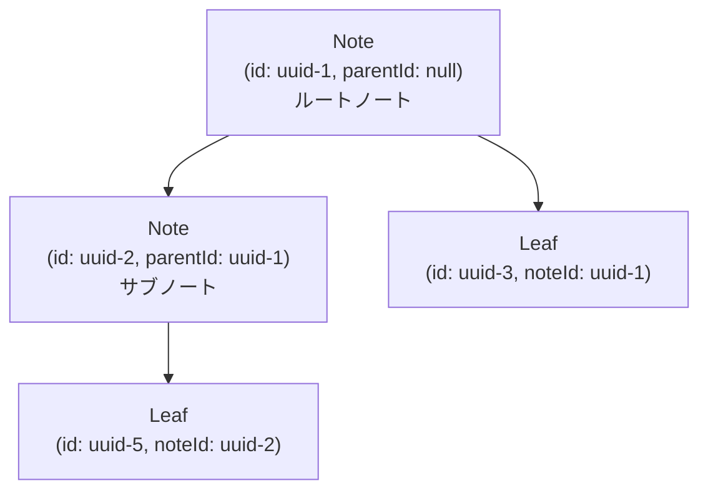

# データモデルと状態管理

Agasteerのデータモデル、型定義、状態管理について説明します。

## データモデルと型定義

### TypeScript型定義

#### `Settings`

ユーザー設定を保持。

| フィールド               | 型        | 説明                                                     |
| ------------------------ | --------- | -------------------------------------------------------- |
| token                    | string    | GitHub Personal Access Token                             |
| repoName                 | string    | "owner/repo"形式                                         |
| repoHistory              | string[]? | 過去に接続したリポジトリのリスト（ドロップダウン切替用） |
| theme                    | ThemeType | テーマ名                                                 |
| toolName                 | string    | アプリケーション名（タブタイトル）                       |
| locale                   | Locale    | 言語（'ja' / 'en'）                                      |
| linedMode                | boolean   | 罫線エディタモード                                       |
| vimMode                  | boolean   | Vimモード                                                |
| hasCustomFont            | boolean   | カスタムフォント適用フラグ                               |
| hasCustomBackgroundLeft  | boolean   | 左ペイン背景画像適用フラグ                               |
| hasCustomBackgroundRight | boolean   | 右ペイン背景画像適用フラグ                               |
| backgroundOpacityLeft    | number    | 左ペイン背景画像透明度                                   |
| backgroundOpacityRight   | number    | 右ペイン背景画像透明度                                   |

**注意**: コミット時のユーザー名とメールアドレスは固定値（`agasteer` / `agasteer@example.com`）を使用します。

#### `Note`

ノート（フォルダ相当）を表します。

| フィールド | 型          | 説明                                        |
| ---------- | ----------- | ------------------------------------------- |
| id         | string      | UUID（crypto.randomUUID()）                 |
| name       | string      | 表示名                                      |
| parentId   | string/null | 親ノートのID（ルートの場合null）            |
| order      | number      | 並び順（同階層内）                          |
| badgeIcon  | number/null | バッジアイコン（5×5グリッドのインデックス） |
| badgeColor | number/null | バッジ色（5色パレットのインデックス）       |

#### `Leaf`

リーフ（Markdownファイル）を表します。

| フィールド | 型          | 説明                                  |
| ---------- | ----------- | ------------------------------------- |
| id         | string      | UUID                                  |
| title      | string      | リーフタイトル（#見出しと双方向同期） |
| noteId     | string      | 所属ノートのID                        |
| content    | string      | Markdown本文                          |
| order      | number      | 並び順（同ノート内）                  |
| updatedAt  | number      | 最終更新タイムスタンプ（Unix time）   |
| isDirty    | boolean     | ローカル変更フラグ                    |
| badgeIcon  | number/null | バッジアイコン                        |
| badgeColor | number/null | バッジ色                              |

#### `View`

現在のビュー状態: `'home' | 'settings' | 'edit' | 'note' | 'preview'`

- **home**: ルートノート一覧
- **note**: ノート内のサブノートとリーフ一覧
- **edit**: リーフ編集画面
- **preview**: リーフプレビュー画面
- **settings**: 設定画面

#### `WorldType`

ワールド: `'home' | 'archive'`

- **home**: 通常のノート・リーフ（.agasteer/notes/）
- **archive**: アーカイブされたノート・リーフ（.agasteer/archive/）

### データの一意性とリレーション



**UUIDの使用理由:**

- 名前変更に対して安定した参照
- 衝突のないグローバルユニークID
- 追加ライブラリ不要（`crypto.randomUUID()`はモダンブラウザで利用可能）

---

## 状態管理とデータフロー

### Svelteストア

Agasteerは、Svelteの`writable`と`derived`ストアを使用して状態を管理します。

#### 基本ストア（グローバル）

| ストア名 | 型       | 説明                                 |
| -------- | -------- | ------------------------------------ |
| settings | Settings | ユーザー設定                         |
| notes    | Note[]   | 全ノート                             |
| leaves   | Leaf[]   | 全リーフ                             |
| metadata | Metadata | メタデータ（version, pushCount等）   |
| isDirty  | boolean  | GitHubにPushされていない変更があるか |

**重要な設計変更（Version 5.0）:**

- 表示状態（`currentView`, `currentNote`, `currentLeaf`）はローカル変数に変更
- 2ペイン対応のため、各ペインが独立した状態を持つ設計に変更
- グローバルストアは全体で共有するデータ（notes, leaves, settings等）のみ

#### ローカル変数（各ペイン独立）

左右それぞれのペインに`leftNote`/`rightNote`、`leftLeaf`/`rightLeaf`、`leftView`/`rightView`を持ちます。

**設計思想:**

- 左右のペインは完全に対等
- 各ペインが独立したナビゲーション状態を持つ
- URLルーティングで左右別々に状態を管理

#### App.svelteのリポ切替関連ローカル変数

| 変数名                     | 型      | 説明                                                                                              |
| -------------------------- | ------- | ------------------------------------------------------------------------------------------------- |
| `repoChangedInSettings`    | boolean | 設定画面内でリポジトリ名が変更されたかのフラグ。`handleCloseSettings()`でPull要否の判定に使用する |
| `importOccurredInSettings` | boolean | 設定画面内でインポートが行われたかのフラグ。`handleCloseSettings()`でPull要否の判定に使用する     |

#### 派生ストア

| ストア名         | 説明                                    |
| ---------------- | --------------------------------------- |
| rootNotes        | parentIdがないノート（order順でソート） |
| githubConfigured | tokenとrepoNameが設定されているか       |

**削除された派生ストア:**

- `subNotes` - インラインfilterに変更（各ペインで独立して計算）
- `currentNoteLeaves` - インラインfilterに変更（各ペインで独立して計算）

**理由:** 2ペイン表示では左右で異なるノートを表示できるため、グローバルな「currentNote」という概念が不適切

#### ワールドヘルパー関数（world-helpers.ts）

ペインとワールド（Home/Archive）に応じたデータ取得を行う純粋関数群。ストアに依存しないため、テストやモジュール間での再利用が容易です。

| 関数                       | 説明                                             |
| -------------------------- | ------------------------------------------------ |
| `getNotesForWorld`         | ワールドに応じたノート配列を取得                 |
| `getLeavesForWorld`        | ワールドに応じたリーフ配列を取得                 |
| `getWorldForPane`          | ペインに応じたワールドを取得                     |
| `getNotesForPane`          | ペインのワールドに応じたノート配列を取得         |
| `getLeavesForPane`         | ペインのワールドに応じたリーフ配列を取得         |
| `getWorldForNote`          | ノートが属するワールドを判定                     |
| `getWorldForLeaf`          | リーフが属するワールドを判定                     |
| `getDialogPositionForPane` | ペインに応じたダイアログ位置（left/right）を決定 |

**使用例:**

```typescript
import { getNotesForWorld, getDialogPositionForPane } from './lib/stores'

// 純粋関数として使用（引数で値を渡す）
const homeNotes = getNotesForWorld('home', allNotes, archiveNotes)

// ダイアログ位置の決定
const position = getDialogPositionForPane(pane) // 'bottom-left' | 'bottom-right'
```

**設計思想:**

- **純粋関数**: ストアを参照せず、引数のみで動作
- **再利用性**: App.svelte以外のモジュールでも使用可能
- **一貫性**: ワールド・ペイン判定ロジックを一箇所に集約

#### ダーティフラグ（isDirty）の管理

`isDirty`ストアは、GitHubにPushされていない変更があるかどうかを追跡します。

**ダーティフラグが立つタイミング:**

- エディタでリーフの内容を編集したとき
- ノートを作成・削除・名前変更・並び替えたとき（`updateNotes()`内で自動的に`isDirty.set(true)`）
- リーフを作成・削除・名前変更・並び替えたとき（`updateLeaves()`内で自動的に`isDirty.set(true)`）

**ダーティフラグがクリアされるタイミング:**

- Push成功時（GitHubとの同期完了）
- Pull成功時（GitHubから最新データを取得）

**ダーティ状態での動作:**

- 保存ボタンに赤い丸印（notification badge）が表示される
- Pull実行時に確認ダイアログが表示される
- ページ離脱時（タブを閉じる、リロード）にブラウザ標準の確認ダイアログが表示される

**アプリ内ナビゲーションは制限されない:**

このアプリは編集時に自動的にIndexedDBに保存されるため、アプリ内のナビゲーション（ホーム、ノート、リーフ間の移動）ではデータが失われません。ダーティフラグは「GitHubにPushしていない」という意味であり、GitHubとの同期を失う操作（Pullとページ離脱）のみ確認が必要です。

### データ永続化の仕様

Agasteerは、データを2つの異なるストレージに保存します。

#### LocalStorage

**保存対象:**

- 設定情報（Settings）のみ
  - GitHubトークン
  - リポジトリ名
  - コミット用ユーザー名・メールアドレス
  - テーマ設定
  - カスタムテーマ設定
  - ツール名

**保存タイミング:**

- 設定画面内での操作時に即座に反映

**重要:** 設定情報はGitHubには同期されません。デバイスローカルのみです。

#### IndexedDB

**役割:** GitHubからPullしたデータの一時キャッシュ

**重要な設計思想:**

- **GitHubが唯一の真実の情報源（Single Source of Truth）**
- IndexedDBは単なるキャッシュであり、GitHubから取得したデータを一時保存するだけ
- 前回終了時のIndexedDBデータは意味を持たない
- 毎回のPull成功時にIndexedDBは全削除→全作成される

**保存対象:**

- ノート（Note）データ
- リーフ（Leaf）データ

**保存タイミング:**

- ノート/リーフの作成・削除・編集時に即座に反映
- ノート名の変更時
- リーフタイトル・コンテンツの変更時
- ドラッグ&ドロップによる並び替え時
- **Pull成功時に全削除→全作成（最重要）**

#### GitHub（リモートリポジトリ）

**Push対象:**

- 全ノート
- 全リーフ

**Pushタイミング:**

1. 保存ボタンを押したとき
   - 全リーフをGitHubにPush
   - 処理フロー: 「Pushします」→ Push実行 → 結果表示
2. 設定ボタンを押したとき（設定画面を開くとき）
   - 全リーフをGitHubにPush
   - 処理フロー: 「Pushします」→ Push実行 → 結果表示

**Pullタイミング:**

1. 初回Pull（アプリ起動時）
   - 処理フロー: 「Pullします」→ Pull実行 → **IndexedDB全削除** → **IndexedDB全作成** → 画面表示 → 結果表示
   - **初回Pull成功まで、画面にノート・リーフは表示されない**
2. Pullテストボタンを押したとき
   - 処理フロー: 「Pullします」→ Pull実行 → **IndexedDB全削除** → **IndexedDB全作成** → 結果表示
3. 設定画面を閉じたとき
   - 処理フロー: 「Pullします」→ Pull実行 → **IndexedDB全削除** → **IndexedDB全作成** → 結果表示

**重要な仕様:**

- Pull成功のたびに、IndexedDBは完全にクリアされ、GitHubから取得したデータで再構築される
- 前回終了時のIndexedDBデータは使用されない（次のPullで必ず上書きされる）
- 設定情報（LocalStorage）はGitHubには含まれない
- ノートとリーフのMarkdownファイルのみが同期される

### データフローパターン

```
User Action
    ↓
Event Handler (e.g., createNote, updateLeafContent)
    ↓
State Update (notes = [...notes, newNote])
    ↓
Persist to IndexedDB (updateNotes, updateLeaves)
    ↓
Svelte Reactive System ($:)
    ↓
UI Re-render
```

**設定変更の場合:**

```
User Action (設定画面での操作)
    ↓
Event Handler (handleSettingsChange)
    ↓
State Update (settings = { ...settings, ...payload })
    ↓
Persist to LocalStorage (updateSettings)
    ↓
Svelte Reactive System ($:)
    ↓
UI Re-render
```

### 状態の初期化フロー

**onMount時の処理:**

1. LocalStorageから設定の読み込み
2. テーマ適用、タイトル設定
3. 初回Pull（GitHubからデータを取得） - **IndexedDBからは読み込まない**
4. Pull成功後、URLから状態を復元（ディープリンク対応）
5. popstateイベントリスナー設定（ブラウザの戻る/進む対応）

**重要な仕様:**

- アプリ起動時、IndexedDBからの読み込みは行わない
- 必ず最初にPullを実行し、GitHubから最新データを取得する
- Pull成功時に、IndexedDBを全削除→GitHubから取得したデータで全作成
- 初回Pull成功まで、画面にノート・リーフは表示されない（`isOperationsLocked = true`）
- Pull失敗時は、ユーザーに設定確認を促すアラートを表示

### CRUD操作のパターン

#### Create（作成）

**ノートの作成:**

- 階層制限チェック（サブノートの下にはサブノートを作成不可）
- `crypto.randomUUID()`でIDを生成
- `generateUniqueName()`で重複しない名前を生成
- `updateNotes()`でストア更新＆IndexedDB保存

**リーフの作成:**

- 対象ノートのリーフ一覧から順序を決定
- 新規リーフのcontentは`# タイトル\n\n`形式
- 作成後、自動的にリーフを選択

**重要:** すべてのナビゲーション関数は`pane: 'left' | 'right'`引数を取り、左右のペインを明示的に指定します。

#### Read（読み取り）

- **グローバル派生ストア**: `rootNotes`（parentIdがないノート）
- **ペイン固有の計算**: 各ペインでインラインfilter/sortを実行

**設計変更の理由:** 2ペイン表示では、左右で異なるノートを表示できるため、各ペインで独立してfilter/sortを実行する必要がある。

#### Update（更新）

- **ノート名の更新**: `updateNotes()`でストア更新
- **リーフコンテンツの更新**:
  - H1見出しからタイトルを自動抽出
  - グローバルストアを更新（左右ペイン両方に反映）
  - 同じリーフを左右で開いている場合は即座に同期

**重要:** leafIdベースの更新により、左右どちらのペインでも同じリーフを編集可能。

#### Delete（削除）

- **ノートの削除**: サブノートやリーフがある場合は削除不可。削除後は親ノートまたはホームに遷移
- **リーフの削除**: 確認ダイアログ後、削除して親ノートに遷移

**重要:** すべての削除操作でもpane引数を指定し、削除後のナビゲーションが適切なペインで行われるようにする。

### 並び替えのデータフロー

ドラッグ&ドロップによる並び替えの実装。

1. **ドラッグ開始**: ドラッグ対象を変数に保持
2. **ドロップ**:
   - 同一アイテムや異なる階層へのドロップは無視
   - 配列内での位置を入れ替え
   - orderフィールドを再計算
   - ストア更新＆永続化

---

## 命名規則と重複処理

### 命名規則

ノート・リーフの名前には統一されたサフィックス規則を適用。

**形式**: `{ベース名}_{番号}`

| 例                       | 説明                 |
| ------------------------ | -------------------- |
| `Note_1`, `Note_2`       | 英語での新規作成     |
| `ノート_1`, `ノート_2`   | 日本語での新規作成   |
| `My Task_2`, `My Task_3` | 重複時の自動リネーム |

**番号の採番ルール**:

- `1` から順に、存在しない番号を探す
- `{ベース名}_{番号}` の形式のみを検索対象とする
- `{ベース名}_{番号}_{サブ番号}` は無視される

例: 既存が `Note_1`, `Note_2_1` の場合 → 新規作成は `Note_2`（`Note_2_1`は無関係）

### 重複処理ポリシー

操作によって重複時の挙動が異なる。

| 操作                    | ノート重複時         | リーフ重複時         |
| ----------------------- | -------------------- | -------------------- |
| **作成**                | 拒否（アラート表示） | 拒否（アラート表示） |
| **移動**                | 拒否（アラート表示） | 拒否（アラート表示） |
| **アーカイブ/リストア** | 事前確認ダイアログ   | 事前確認ダイアログ   |
| **インポート**          | 事前確認ダイアログ   | 事前確認ダイアログ   |

### 事前確認ダイアログ

アーカイブ/リストア/インポート時、重複が検出された場合は**操作開始前**に確認ダイアログを表示。

**選択肢（3択）**:

| 選択           | ノートの場合                 | リーフの場合           |
| -------------- | ---------------------------- | ---------------------- |
| **スキップ**   | 既存を優先、移動しない       | 既存を優先、移動しない |
| **追加**       | 既存ノートの中にリーフを追加 | 自動リネームして追加   |
| **キャンセル** | 操作自体を中止               | 操作自体を中止         |

**設計思想**:

- **上書きは提供しない**: データ損失のリスクを回避
- **操作単位で統一決定**: 個別確認は行わず、その操作内の全アイテムに同じ処理を適用
- **事前確認**: 操作開始前に判断を求め、途中で中断しない
- **キャンセル可能**: ユーザーはいつでも操作を中止できる

### 汎用選択ダイアログ（choiceAsync）

既存の `Modal.svelte` を拡張し、任意の選択肢を表示できる汎用ダイアログを実装。

**インターフェース**:

```typescript
interface ChoiceOption {
  label: string // ボタンに表示するテキスト
  value: string // 戻り値として返す識別子
  variant?: 'primary' | 'secondary' | 'cancel' // スタイル（デフォルト: secondary）
}

function choiceAsync(
  message: string,
  options: ChoiceOption[],
  position: ModalPosition = 'center'
): Promise<string | null> // 選択されたvalue、×ボタン/背景クリックはnull
```

**使用例**:

```typescript
const result = await choiceAsync('同名のノート/リーフが存在します。どうしますか？', [
  { label: 'キャンセル', value: 'cancel', variant: 'cancel' },
  { label: 'スキップ', value: 'skip', variant: 'secondary' },
  { label: '追加', value: 'add', variant: 'primary' },
])

if (result === 'skip') {
  /* スキップ処理 */
} else if (result === 'add') {
  /* 追加処理 */
} else {
  /* キャンセルまたは×ボタン */
}
```

**表示位置**: ペイン中央（`position: 'center'`）

### 関連する関数

| 関数                 | ファイル         | 説明                       |
| -------------------- | ---------------- | -------------------------- |
| `generateUniqueName` | `utils/utils.ts` | 重複しない名前を生成       |
| `moveLeafTo`         | `data/leaves.ts` | リーフ移動（重複時は拒否） |
| `moveNoteTo`         | `data/notes.ts`  | ノート移動（重複時は拒否） |
| `moveLeafToWorld`    | `App.svelte`     | ワールド間リーフ移動       |
| `moveNoteToWorld`    | `App.svelte`     | ワールド間ノート移動       |
