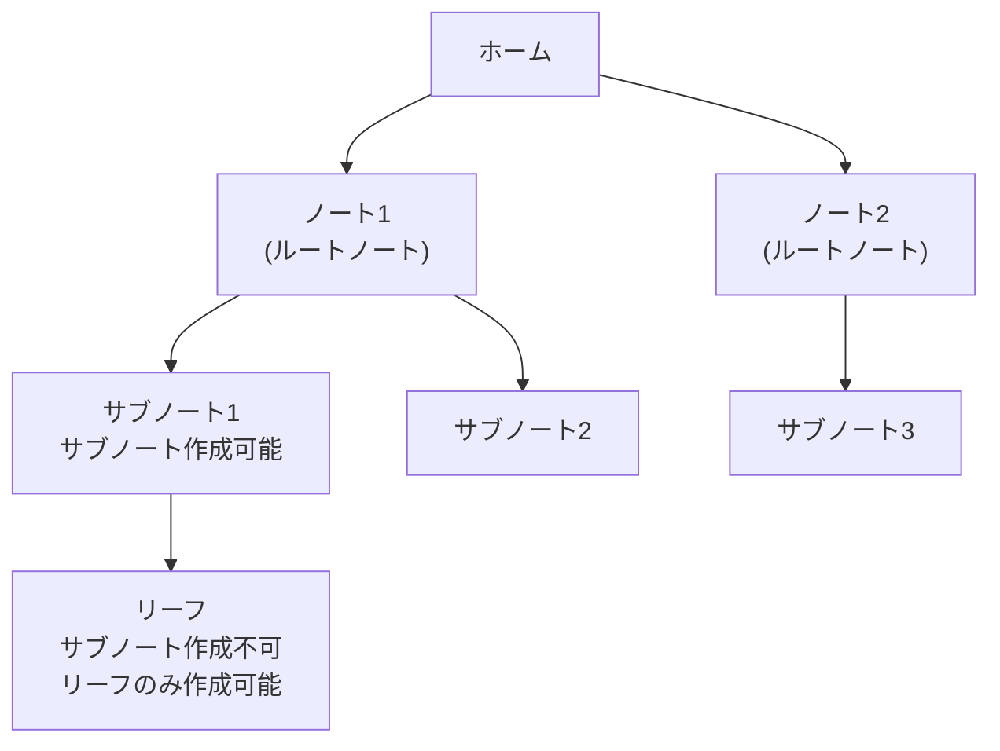

# 基本機能の実装

Agasteerの基本機能の実装詳細について説明します。

## エディタ管理

### 初期化

CodeMirrorのEditorStateとEditorViewを使用してエディタを初期化します。basicSetupの代わりに個別の拡張機能を追加し、テーマに応じたスタイルを適用します。

### モバイル互換性

#### basicSetup の代替

CodeMirrorの`basicSetup`は多くの便利な拡張機能をバンドルしていますが、モバイルデバイス（特にAndroid + Gboard）で問題を引き起こす拡張機能が含まれています。

**問題**: `highlightActiveLine()`拡張機能がGboardと相性が悪く、段落をまたぐ範囲選択を行うと選択が中断されてポップアップメニューが表示される。

**解決策**: `basicSetup`を使用せず、必要な拡張機能を個別にインポートする。Androidでは`highlightActiveLine()`を除外し、それ以外の環境では有効にする。

#### Gboard関連の既知の制約

Android端末でGboardを使用している場合、空行（段落と段落の間の空白行）をタップするとスクロール位置が意図しない場所にジャンプすることがあります。Agasteer側では、タップ直後のCodeMirror自動スクロールを抑制し、仮想キーボード表示後にカーソルを可視範囲へ戻す補正を行います。ただし、GboardがCodeMirrorのフォーカス処理に介入する空行タップの一部挙動はOS/IME側の影響が大きく、完全な制御は困難です。

**回避策**: 空行をタップする代わりに、テキストがある行をタップしてからカーソルを移動する。

詳細は[既知の課題](./future-plans.md#その他の既知の制約)を参照してください。

### コンテンツリセット

リーフ切り替え時は `PaneView.svelte` 側で `currentLeaf.id` をキーに `EditorView.svelte` を再生成し、旧リーフのエディタ状態を引きずらないようにします。既存リーフの本文更新は `MarkdownEditor.svelte` で `dispatch()` により差分適用し、スクロール位置を不必要に失わないようにします。

### 自動保存

EditorView.updateListenerでドキュメントの変更を検知し、自動的にストアを更新します。

### Ctrl+S / Cmd+S でPush

#### 概要

エディタでCtrl+S（Macでは Cmd+S）を押すとGitHubにPushする機能。ブラウザの標準「ページを保存」ダイアログをオーバーライドします。

#### 動作

- windowのkeydownイベントでCtrl+S / Cmd+Sを検出
- `e.preventDefault()`でブラウザの保存ダイアログを防止
- isDirtyフラグで変更がない場合はPushをスキップ（空コミット防止）

#### Vimモードとの共存

- Vimモードが有効でもCtrl+Sは動作
- Vimモードでは`:w`でもPush可能

---

### Vimモード

#### 概要

CodeMirror Vimプラグインを使用したVimキーバインディングをサポート。設定画面から有効/無効を切り替え可能。

#### 有効化方法

1. 設定画面を開く
2. 「エディタ」セクションの「Vimモードを有効にする」チェックボックスをオン
3. 設定はLocalStorageに保存され、次回起動時も維持される

#### カスタムコマンド

Vimモードでは、以下のカスタムコマンドが使用可能：

| コマンド  | 動作                   | 説明                                                   |
| --------- | ---------------------- | ------------------------------------------------------ |
| `:w`      | GitHub Push            | 現在のリーフをGitHubにプッシュ（保存）                 |
| `:wq`     | Push後に親ノートへ遷移 | 保存して編集画面を閉じる                               |
| `:q`      | 親ノートへ遷移         | 保存せずに編集画面を閉じる                             |
| `<Space>` | ペイン切り替え         | Normal modeで、もう一方のペインに切り替え（2ペイン時） |

#### 2ペイン対応

左右のペインで独立したVimコマンド実行が可能。**今フォーカスされているエディタのペインを判定**し、適切なコールバックを実行します。

**動作例**:

- 右ペインで `:q` → 右ペインのみ閉じる
- 左ペインで `:q` → 左ペインのみ閉じる
- 左ペインのNormal modeで `<Space>` → 右ペインに切り替え
- 右ペインのNormal modeで `<Space>` → 左ペインに切り替え
- IME変換中は親state更新・ダーティ行更新・カーソルトレイル更新を遅延し、変換を中断しない（ただし push 直前は `flushAllEditors()` で強制 flush して leaf に反映する／#186）
- Vimのカーソル移動後は、カーソル位置が表示範囲に残るよう`scrollIntoView`で補助する

#### メリット

- **キーボードのみで完結**: マウス操作不要
- **ブラウザのショートカットと競合しない**: Ctrl+Sなどと干渉しない
- **Vimユーザーにとって自然な操作**: 標準的なVimコマンドで保存・終了が可能
- **2ペイン対応**: 左右のペインで独立した操作が可能

#### 実装の仕組み

1. **ペイン情報の管理**: 各エディタのDOM要素に`data-pane`属性でペイン識別子（'left'/'right'）を付与
2. **グローバルコールバックマップ**: `window.editorCallbacks`にペイン別のコールバック（onSave, onClose, onSwitchPane）を登録
3. **フォーカス中のペイン判定**: `document.activeElement`から現在フォーカスされているエディタのペインを取得
4. **Vimコマンドの定義**: グローバルに1回だけ定義し、実行時にペインを判定して適切なコールバックを呼び出す

#### コマンドラインのスタイリング

Vimコマンドライン（`:` 入力部分）は`.cm-vim-panel`クラスでスタイリングされ、アプリのテーマ変数に連動します。

### メディア添付（#243）

画像・動画・音声・zip をリーフに添付し、専用プライベートリポ `{owner}/{repo}-media` に保存する機能（同期層は #242 の `api/media.ts`）。

#### 入口は3つ

| 入口       | 実装                                                                       | 挿入位置     |
| ---------- | -------------------------------------------------------------------------- | ------------ |
| 貼り付け   | `EditorView.domEventHandlers` の paste（`createMediaDomHandlers`）         | カーソル位置 |
| D&D        | 同 drop。`view.posAtCoords` でドロップ位置を解決                           | ドロップ位置 |
| 添付ボタン | `EditorFooter` の隠し `input[type=file]`（複数可）→ `attachFiles()` へ委譲 | カーソル位置 |

ファイルを含まない paste/drop は `false` を返し、CodeMirror 既定のテキスト処理に委ねます。

#### 添付フロー（`lib/editor/media-attach.ts`）

1. 画像自動最適化（設定 `mediaOptimizeImages` 既定ON、`lib/utils/image-optimize.ts`）
   - 最大辺 2048px 縮小 + WebP 再エンコード。対象は png/jpg/jpeg/webp のみ（gif/svg/非画像は無変換）
   - **uploadMedia に渡す前に適用**するため、ハッシュ・ファイル名・raw URL は最適化後の内容で確定する
   - デコード/エンコード失敗、および縮小なしで再エンコードだけ太る場合は原本にフォールバック（縮小が発生した場合はバイト数が増えても最適化版を採用。2048px 上限はバイト数でなく表示ポリシー）
2. `uploadMedia`（#242 同期層）: 検証（形式ホワイトリスト・100MB）→ URL 即時確定 → enqueue **で即返る**（#247）。実アップロードは待たず、背景タスク `uploadDone: Promise<boolean>` として返す。背景アップロードはグローバル直列チェーンで流す（Contents API は default branch へ直接コミットするため、同一リポへの並行 PUT は 409 になりうる。即返し＝並行化の衝突を回避）。チェーン経路の全 fetch にはタイムアウトがあり（#252: メタデータ系 30 秒・PUT は 60 秒 + 50KiB/s 換算のサイズ比例）、1 件のストールが以後の背景アップロードを止め続けること（head-of-line blocking）はない。タイムアウトしたアイテムは pending に残り、online 復帰・次回起動の `initMediaOnlineRetry` が回収する
3. 記法挿入: 画像は ``、動画/音声/zip は `[name](rawURL)`。**enqueue 直後・背景アップロードを待つ前に挿入する**（#247）。URL は enqueue 時点で IndexedDB に永続化済みなので、挿入直後にリーフ切替や edit/preview トグルで editorView が破棄されても挿入は消えず、URL も孤児化しない（アップロード完了を待っていた旧実装で数分の消失窓があった問題の解消）。複数ファイルは成功分だけを改行で join してまとめて挿入する（失敗ファイル分の余分な改行が残らない）
4. トースト通知（既存 `showPushToast` 再利用、i18n キーは `media.*`）: 事前検証（形式・サイズ）を通った直後・最適化の前に「アップロード中」を出し（大きい画像の最適化中の無反応を避ける）→ 背景 `uploadDone` 解決後に 完了 / オフライン保留 / 失敗（キューに残り自動再試行）。拒否（形式外・100MB超）は「アップロード中」を出す前に打ち切り

`MarkdownEditor.svelte` 側は domEventHandlers 拡張の追加と insert/notify コールバックの薄い配線のみで、ロジックは `media-attach.ts` に置いています（純粋部分は node 環境の vitest でテスト）。

プレビューでの表示解決（Blob URL 差し替え・video/audio/DL 振り分け）は #244 で実装（[preview/markdown.md](./preview/markdown.md) の「添付メディアの表示解決」参照）。

#### メディアライブラリ画面（#250・初版: 一覧＋削除のみ）

添付済みメディアを一覧・削除する画面。**メディアは WorldType（Home/Archive）ではなく View** として実装する（`WorldType` を 3 値化しない設計境界。media は note/leaf/metadata/dirty/push のどの契約も持たない）。

- **View**: `View` union に `'media'` を追加。`PaneView` が `currentView === 'media'` のとき `MediaLibraryView` をペインにフルスクリーン描画する（footer は出さない）。
- **ナビ入口**: パンくず左端のワールドドロップダウン（Home/Archive）に 3 つめ「メディア」を追加。Home/Archive は従来どおり world 切替、「メディア」だけは world を変えず `navigateToMediaLibrary(pane)`（`handleWorldChange` とは別ハンドラ）で `View='media'` へ遷移する。戻りはパンくずの Home アイコン、またはドロップダウンで Home/Archive を選ぶ（メディア表示中は Home 選択でも View を home へ戻す）。
- **同期層**（結果オブジェクト契約・throw しない）:
  - 純粋層 `api/media/library.ts`: Git Trees API のツリーエントリ→`MediaAsset` 変換・対応形式フィルタ（非 blob・ネストしたパス・`.gitkeep`・非ホワイトリストを除外）・サイズ整形。
  - 副作用層 `api/media-library.ts`（media.ts が 400 行超のため sibling に分離）: `listMediaAssets`（`GET /repos/{repo}-media/git/trees/HEAD`、非 recursive＝ルートツリーのみ。**409＝空リポは成功扱いで空配列。404 はリポ実在を確認して未作成のときだけ空**（ref 解決失敗を空一覧に見せかけない））、`deleteMediaAsset`（Contents API `DELETE`、sha 必須。成功後 mediaCache/mediaPending を evict）。いずれも 30 秒タイムアウト（#262）。
  - **#258**: 一覧は当初 Contents API（ディレクトリあたり 1000 件で silent cap）だったが、Git Trees API に切り替えて全件取得に対応した。Trees API 自体の上限（エントリ 100,000 件 / 7MB 応答）に達した場合は `truncated` フラグで検知し、UI が「一部のみ表示」を明示する（silent cap 禁止）。
- **画面** `components/views/MediaLibraryView.svelte`: loading/空/エラー再試行を出し、画像は `resolveMedia`→Blob URL で遅延サムネイル（IntersectionObserver で表示領域に入ったものだけ解決）、動画/音声/zip は拡張子ラベル。削除は確認ダイアログ（参照中ノートが壊れる旨を警告）→ 成功で一覧から除去＋Blob URL revoke。Blob URL は画面破棄時に全 revoke。
- **孤児（未参照）検出**（#250）: 一覧確定時に Home + Archive + オフラインリーフの全本文から raw メディア URL を抽出（純粋層 `collectMediaReferenceUrls`。`parseRawMediaUrl` で構造検証した URL のみ）し、集合に無いアセットへ「未参照」バッジを表示する。**Archive 未ロード時は判定を保留**し（誤った未参照バッジが削除を誘発しないため。部分判定はしない）、案内文を出す。検出のみで自動削除はしない。
- **やらないこと（follow-up）**: 容量 squash メンテ（履歴 squash → force push）。

---

## パンくずナビゲーション

現在位置を階層的に表示。各要素は`label`、`action`（クリック時の遷移先）、`id`、`type`（home/folder/note/settings）を持ちます。

- 常にホームを先頭に追加
- 設定画面の場合は「設定」のみ
- ノート画面ではフォルダ階層（親→子）を表示
- リーフ編集中はノートタイトルも表示

### インライン編集

パンくずリストから直接名前を変更可能。編集アイコンをクリックするとinput要素に切り替わり、その場で名前を編集できます。

---

## モーダルシステム

確認ダイアログ、アラートダイアログ、入力ダイアログを統一的に管理。

### モーダルの種類

| 種類    | 関数          | 説明                                 |
| ------- | ------------- | ------------------------------------ |
| confirm | showConfirm() | はい/いいえの確認ダイアログ          |
| alert   | showAlert()   | OKボタンのみの通知ダイアログ         |
| prompt  | showPrompt()  | テキスト入力フィールド付きダイアログ |

### 表示位置

`position`パラメータで表示位置を指定可能（center, bottom-left, bottom-right）。2ペイン表示時は左ペインのモーダルをbottom-left、右ペインをbottom-rightに表示します。

### 新規ノート/リーフ作成フロー

フッターの新規ノート/リーフボタンをクリックすると、入力モーダルが表示される：

1. ボタンクリックで `showPrompt` を呼び出し
2. モーダルで名前を入力
3. OK（またはEnter）で作成実行、キャンセル（またはEsc）で中止
4. 左ペインは `bottom-left`、右ペインは `bottom-right` に表示

---

## ノート階層制限

### 2階層制限の実装

ルートノート→サブノートの2階層までに制限。ノート作成時に`parentId`を持つノートの下には新しいノートを作成できないようチェックします。

### UIでの制御

`canHaveSubNote`フラグで「新規サブノート」ボタンの表示を制御。サブノートの下にはサブノートを作成できないため、ボタンを非表示にします。

### 階層構造

---

## 関連ドキュメント

- [UI/UX機能](./ui/) - 2ペイン表示、カスタマイズ
- [コンテンツ同期機能](./content-sync.md) - リーフのタイトルと#見出しの同期
- [プレビュー機能](./preview/) - マークダウンプレビュー、スクロール同期
- [データ保護機能](./sync/dirty-tracking.md) - 未保存変更の追跡
- [Stale検出](./sync/stale-detection.md) - 同時編集対応
