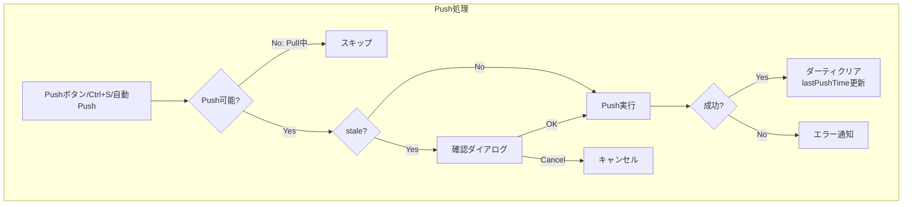
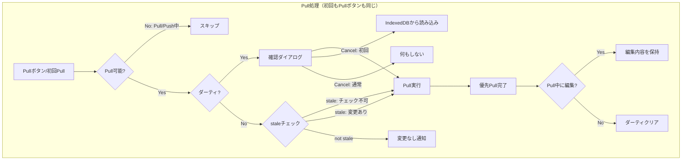
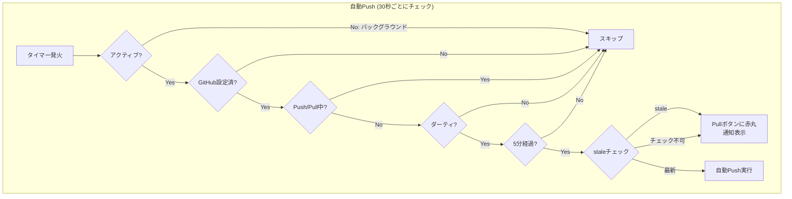

## 全体フローチャート

### Push処理フロー



### Pull処理フロー

初回PullとPullボタンは完全に同じロジックで動作します。起動時は「自動的にPullボタンを押す」のと同じです。



**staleチェックの判定:**

- 空リポジトリ（metadata.jsonなし）→ チェック不可（-1）→ stale扱い → Pull実行
- 設定無効・認証エラー・ネットワークエラー → チェック不可（-1）→ stale扱い → Pull実行（適切なエラー表示）
- リモートpushCount > ローカル → stale → Pull実行
- リモートpushCount <= ローカル → not stale → 「変更なし」通知

### 自動Push処理フロー



---

## Push回数カウント機能

### 概要

アプリの使用状況を可視化するため、GitHub Push回数をカウントして統計情報として表示します。ユーザーがアプリを使い続けてきた長さを示し、楽しみを提供する機能です。

### データ構造

Push回数は `metadata.json` の `pushCount` フィールドに保存されます。

```typescript
export interface Metadata {
  version: number
  notes: Record<string, { id: string; order: number }>
  leaves: Record<string, { id: string; updatedAt: number; order: number }>
  pushCount: number // Push回数
}
```

### Push時の自動インクリメント

`pushAllWithTreeAPI` 関数内で、Push実行前に既存の `pushCount` を取得し、インクリメントします。

```typescript
// 既存のmetadata.jsonからpushCountを取得
let currentPushCount = 0
try {
  const metadataRes = await fetch(
    `https://api.github.com/repos/${settings.repoName}/contents/notes/metadata.json`,
    { headers }
  )
  if (metadataRes.ok) {
    const metadataData = await metadataRes.json()
    if (metadataData.content) {
      const base64 = metadataData.content.replace(/\n/g, '')
      const decoded = atob(base64)
      const existingMetadata: Metadata = JSON.parse(decoded)
      currentPushCount = existingMetadata.pushCount || 0
    }
  }
} catch (e) {
  // エラーは無視（初回Pushの場合）
}

// metadata.jsonを生成
const metadata: Metadata = {
  version: 1,
  notes: {},
  leaves: {},
  pushCount: currentPushCount + 1, // インクリメント
}
```

### Pull時のデータ取得

`pullFromGitHub` 関数内で、metadata.jsonから `pushCount` を取得し、Svelteストアに保存します。

```typescript
// notes/metadata.jsonを取得
let metadata: Metadata = { version: 1, notes: {}, leaves: {}, pushCount: 0 }
try {
  const metadataRes = await fetch(
    `https://api.github.com/repos/${settings.repoName}/contents/notes/metadata.json`,
    { headers }
  )
  if (metadataRes.ok) {
    const metadataData = await metadataRes.json()
    if (metadataData.content) {
      const base64 = metadataData.content.replace(/\n/g, '')
      const jsonText = decodeURIComponent(escape(atob(base64)))
      const parsed = JSON.parse(jsonText)
      // 古いmetadata.jsonにはpushCountがない可能性があるので、デフォルト値を設定
      metadata = {
        version: parsed.version || 1,
        notes: parsed.notes || {},
        leaves: parsed.leaves || {},
        pushCount: parsed.pushCount || 0,
      }
    }
  }
} catch (e) {
  console.warn('notes/metadata.json not found or invalid, using defaults')
}

return {
  success: true,
  message: '✅ Pull OK',
  notes: sortedNotes,
  leaves: sortedLeaves,
  metadata, // metadataを返す
}
```

### ストア管理

`stores.ts` に metadata ストアを追加。

```typescript
export const metadata = writable<Metadata>({
  version: 1,
  notes: {},
  leaves: {},
  pushCount: 0,
})
```

App.svelte でPull時にmetadataをストアに保存：

```typescript
// GitHubから取得したデータでIndexedDBを再作成
updateNotes(result.notes)
updateLeaves(result.leaves)
metadata.set(result.metadata) // metadataを保存
```

### UI表示

HomeView.svelte でホーム画面の右下に統計情報を表示。

```svelte
<div class="statistics">
  <div class="stat-item">
    <div class="stat-label">Push回数</div>
    <div class="stat-value">{$metadata.pushCount}</div>
  </div>
</div>
```

```css
.statistics {
  position: absolute;
  bottom: 1rem;
  right: 1rem;
  z-index: 0; /* ノート・リーフカードの背面 */
  opacity: 0.5; /* 半透明で控えめに */
  pointer-events: none; /* クリック不可 */
}

.stat-value {
  font-size: 2rem;
  font-weight: bold;
  color: var(--accent-color);
}
```

### 後方互換性

古いバージョンで作成された `metadata.json` には `pushCount` フィールドがない可能性があります。そのため、Pull時にフォールバック処理を実装：

```typescript
pushCount: parsed.pushCount || 0
```

フィールドが存在しない場合は `0` として扱われます。

### 動作フロー

1. **初回Pull**: metadata.jsonから `pushCount: 0` を取得
2. **初回Push**: `pushCount` を1にインクリメントしてGitHubに保存
3. **2回目Pull**: `pushCount: 1` を取得してホーム画面に表示
4. **2回目Push**: `pushCount` を2にインクリメント
5. **以降同様に継続**

### 表示位置とデザイン

- **表示位置**: ホーム画面の右下
- **z-index**: 0（ノート・リーフカードの背面）
- **opacity**: 0.5（半透明で控えめ）
- **ラベル**: 小さなグレーのテキスト
- **数値**: 大きく太字でアクセントカラー

これにより、ユーザーの視線を邪魔せず、かつアプリを使い続けてきた実績を可視化できます。

---

## Pull中の編集保護

### 概要

Pull処理中（優先Pullでエディタが開けるようになった後）にユーザーが編集を行った場合、その編集内容とダーティ状態を保持します。

### 問題

Pull処理の最後で`leaves.set(sortedLeaves)`を呼ぶと、GitHubから取得したデータでストア全体が上書きされ、ユーザーがPull中に編集した内容（`content`と`isDirty`）が失われていました。

### 解決策

Pull完了時に、現在のダーティなリーフを保存し、GitHubのデータとマージします。

```typescript
// Pull完了時の処理
const currentLeaves = get(leaves)
const dirtyLeafMap = new Map(currentLeaves.filter((l) => l.isDirty).map((l) => [l.id, l]))
const sortedLeaves = result.leaves
  .sort((a, b) => a.order - b.order)
  .map((leaf) => {
    const dirtyLeaf = dirtyLeafMap.get(leaf.id)
    if (dirtyLeaf) {
      // ユーザーが編集したリーフは、編集内容とダーティ状態を保持
      return { ...leaf, content: dirtyLeaf.content, isDirty: true }
    }
    return leaf
  })
leaves.set(sortedLeaves)
```

### ダーティフラグのクリア

Pull完了後、ダーティな変更がない場合のみ`clearAllChanges()`を呼びます。

```typescript
await tick()
if (!get(hasAnyChanges)) {
  clearAllChanges()
}
```

### handlePullのチェック順序（統一ロジック）

初回PullとPullボタンは完全に同じロジックで動作します。チェック順序:

1. **交通整理**: Pull/Push中は不可
2. **ダーティチェック**: 未保存変更があれば確認ダイアログ
3. **staleチェック**: リモートに変更がなければスキップ
4. **Pull実行**

```typescript
async function handlePull(isInitialStartup = false, onCancel?: () => void) {
  // 1. 交通整理: Pull/Push中は不可
  if (!canSync($isPulling, $isPushing).canPull) return

  // 2. 未保存の変更がある場合は確認
  if (get(hasAnyChanges) || getPersistedDirtyFlag()) {
    const message = isInitialStartup
      ? $_('modal.unsavedChangesOnStartup')
      : $_('modal.unsavedChanges')
    showConfirm(message, () => executePullInternal(isInitialStartup), onCancel)
    return
  }

  // 3. staleチェック（比較対象は常にある：初期値0 vs リモート）
  // 空リポジトリ(metadata.jsonなし)の場合は-1が返り、stale=trueになる
  const isStale = await checkIfStaleEdit($settings, get(lastPulledPushCount))
  if (!isStale) {
    showPullToast($_('github.noRemoteChanges'), 'success')
    return
  }

  // 4. Pull実行
  await executePullInternal(isInitialStartup)
}
```

**設計のポイント:**

- 初回Pullでも通常Pullでも同じチェックを通る
- 空リポジトリ初回アクセス時は、metadata.jsonがないためstale判定（-1）→ Pull実行 → UI初期化
- キャンセル時の動作は呼び出し元がonCancelで制御

### 動作フロー

```
Pull開始
    ↓
優先Pull完了 → エディタで開ける
    ↓
ユーザーが編集 → setLeafDirty(leafId) → isDirty = true
    ↓
残りのPull完了
    ↓
leaves.set()前にダーティリーフを保存
    ↓
GitHubデータとマージ（ダーティリーフは編集内容を保持）
    ↓
hasAnyChanges = true → clearAllChanges()をスキップ
    ↓
ダーティ状態が保持される
```
