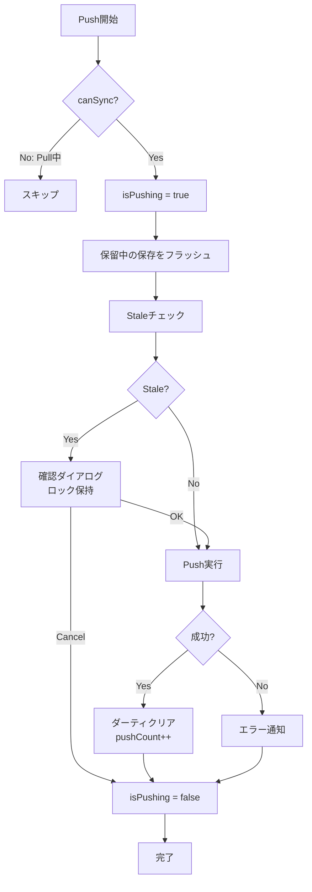
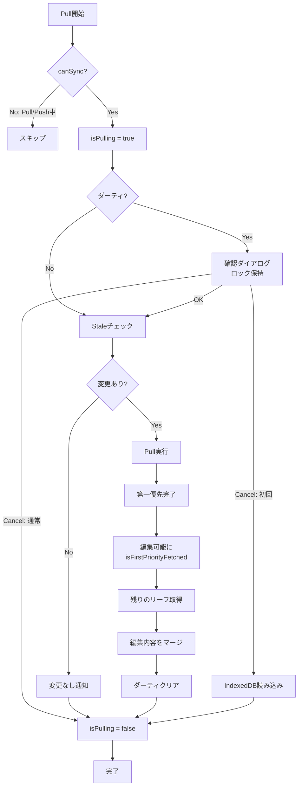
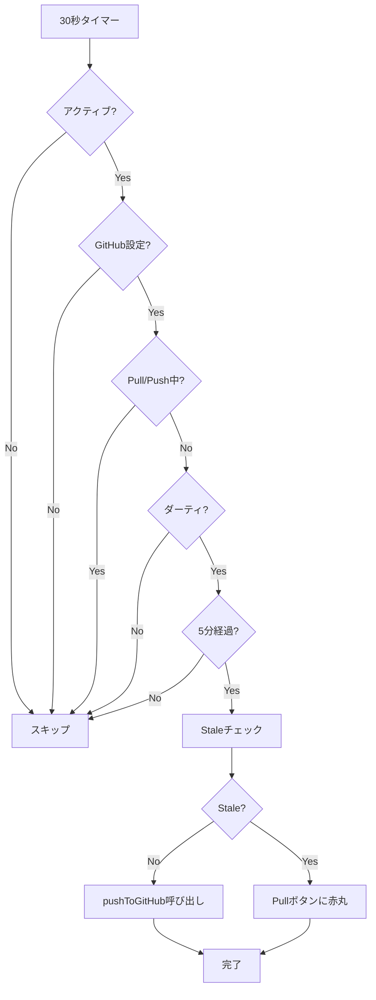

# Push/Pull処理

## 設計思想

### 1つの統合関数による排他制御

Push/Pull処理は、それぞれ**1つの統合関数**に集約されています：

- **Push**: `pushToGitHub()` - すべてのPush操作がこの関数を通る
- **Pull**: `pullFromGitHub()` - すべてのPull操作がこの関数を通る

この設計により、以下を実現しています：

1. **自動的な排他制御**: 各関数の冒頭で即座にロック（`$isPushing` / `$isPulling`）を取得し、finally句で必ず解放
2. **データ損失の防止**: 非同期処理の最中に他の操作が割り込むことを根本的に防止
3. **コードの可読性**: 分散していたロジックが1箇所に集約され、動作を理解しやすい

### Promise版ダイアログによるロック保持

確認ダイアログ表示中もロックを保持するため、Promise版のダイアログ関数を使用：

- `confirmAsync(message)` - 確認ダイアログ（true/false を返す）
- `promptAsync(message, placeholder)` - 入力ダイアログ（string/null を返す）

従来のコールバック版（`showConfirm`）では、ダイアログ表示中にロックを解放する必要がありましたが、Promise版では`await`で待機することでロックを保持したまま処理を継続できます。

---

## Push処理

### pushToGitHub() - 統合関数

すべてのPush操作（ボタンクリック、Ctrl+S、自動Push、Vim `:w`）は、この1つの関数を通ります。

```typescript
async function pushToGitHub() {
  // 1. 交通整理: Pull/Push中は不可
  if (!canSync($isPulling, $isPushing).canPush) return

  // 2. 即座にロック取得（非同期処理の前に取得することが重要）
  $isPushing = true
  try {
    // 3. 保留中の自動保存をフラッシュ
    await flushPendingSaves()

    // 4. Staleチェック（共通関数で時刻も更新）
    const staleResult = await executeStaleCheck($settings, get(lastPulledPushCount))

    // 5. Stale編集の場合は確認（ロックを保持したまま await）
    if (staleResult.status === 'stale') {
      const confirmed = await confirmAsync($_('modal.staleEdit'))
      if (!confirmed) return
    }

    // 6. Push実行
    showPushToast($_('loading.pushing'))
    const result = await executePush({...})

    // 7. 結果処理
    if (result.variant === 'success') {
      clearAllChanges()
      lastPulledPushCount.update((n) => n + 1)
    }
  } finally {
    // 8. ロック解放（必ず実行される）
    $isPushing = false
  }
}
```

### Push処理フロー



### 排他制御のポイント

1. **ロック取得は最初**: `canSync`チェック直後、すべての非同期処理の前にロックを取得
2. **finally句で解放**: 成功・失敗・エラー・キャンセルに関わらず、必ずロックを解放
3. **ダイアログ中もロック保持**: `await confirmAsync()`でロックを保持したまま待機

### データ損失が起きる可能性があった箇所（修正済み）

**修正前の問題:**

```typescript
// ❌ ロック取得が遅い
async function handlePushToGitHub() {
  await flushPendingSaves() // ← この間にPullが開始される可能性
  $isPushing = true // ← ロック取得が遅すぎる
}
```

**修正後:**

```typescript
// ✅ ロック取得が早い
async function pushToGitHub() {
  if (!canSync().canPush) return
  $isPushing = true // ← 即座にロック取得
  try {
    await flushPendingSaves() // ← この間はロック保持
  } finally {
    $isPushing = false
  }
}
```

---

## Pull処理

### pullFromGitHub() - 統合関数

すべてのPull操作（ボタンクリック、初回Pull、設定画面閉じる）は、この1つの関数を通ります。

```typescript
async function pullFromGitHub(isInitialStartup = false, onCancel?: () => void | Promise<void>) {
  // 1. 交通整理: Pull/Push中は不可
  if (!canSync($isPulling, $isPushing).canPull) return

  // 2. 即座にロック取得
  $isPulling = true
  try {
    // 3. ダーティチェック（ロックを保持したまま await）
    if (get(isDirty) || getPersistedDirtyFlag()) {
      const confirmed = await confirmAsync(message)
      if (!confirmed) {
        await onCancel?.()
        return
      }
    }

    // 4. Staleチェック
    const staleResult = await executeStaleCheck($settings, get(lastPulledPushCount))
    switch (staleResult.status) {
      case 'up_to_date':
        showPullToast($_('github.noRemoteChanges'), 'success')
        return
      case 'stale':
      case 'check_failed':
        // Pull実行へ
        break
    }

    // 5. Pull実行（第一優先で編集可能に、残りはバックグラウンド）
    const result = await executePull($settings, options)

    // 6. 結果処理
    if (result.success) {
      lastPulledPushCount.set(result.metadata.pushCount)
      clearAllChanges()
    }
  } finally {
    // 7. ロック解放（必ず実行される）
    $isPulling = false
  }
}
```

### Pull処理フロー



### 第一優先Pull - 段階的ローディング

Pull処理は、ユーザーが早く編集を開始できるよう、優先度ベースで段階的に実行されます：

1. **構造取得**: ノート構造とリーフスケルトンを取得
2. **第一優先リーフ取得**: URLで指定されたリーフを最優先で取得
3. **編集可能に**: `isFirstPriorityFetched = true`, `isLoadingUI = false`（ガラス効果解除）
4. **残りのリーフ取得**: バックグラウンドで10並列取得（`CONTENT_FETCH_CONCURRENCY = 10`）

```typescript
const options: PullOptions = {
  onStructure: (notes, metadata, skeletons) => {
    notes.set(notes)
    metadata.set(metadata)
    loadingLeafIds = new Set(skeletons.map((s) => s.id))
    return nav.getPriorityFromUrl(notes) // URLから優先情報を計算
  },
  onLeaf: (leaf) => {
    leaves.update((current) => [...current, leaf])
    loadingLeafIds.delete(leaf.id)
  },
  onPriorityComplete: () => {
    isFirstPriorityFetched = true // 作成・削除操作を許可
    isLoadingUI = false // ガラス効果を解除
    restoreStateFromUrl() // URL復元
  },
}
```

### Pull中の編集保護

Pull処理中（第一優先完了後）にユーザーが編集を行った場合、その編集内容を保護します：

```typescript
// Pull完了時の処理
const currentLeaves = get(leaves)
const dirtyLeafMap = new Map(currentLeaves.filter((l) => l.isDirty).map((l) => [l.id, l]))
const sortedLeaves = result.leaves
  .sort((a, b) => a.order - b.order)
  .map((leaf) => {
    const dirtyLeaf = dirtyLeafMap.get(leaf.id)
    if (dirtyLeaf) {
      // ユーザーが編集したリーフは、編集内容とダーティ状態を保持
      return { ...leaf, content: dirtyLeaf.content, isDirty: true }
    }
    return leaf
  })
leaves.set(sortedLeaves)

// Pull完了後、ダーティな変更がない場合のみクリア
await tick()
if (!get(isDirty)) {
  clearAllChanges()
}
```

---

## 自動Push処理

### 自動Pushの条件

30秒ごとに以下の条件をチェックし、すべて満たす場合のみ`pushToGitHub()`を呼び出します：

1. タブがアクティブ（`document.visibilityState === 'visible'`）
2. GitHub設定済み
3. Pull/Push中でない
4. ダーティフラグが立っている
5. 最後のPushから5分経過

```typescript
autoSaveSubscription = autoSaveState.subscribe(async (state) => {
  if (state.condition === 'auto_push') {
    await pushToGitHub() // 統合関数を呼ぶだけ
  }
})
```

### 自動Pushフロー



自動Pushも`pushToGitHub()`を呼ぶため、手動Pushと完全に同じ排他制御が適用されます。

---

## Push回数カウント機能

### 概要

アプリの使用状況を可視化するため、GitHub Push回数をカウントして統計情報として表示します。

### データ構造

Push回数は `metadata.json` の `pushCount` フィールドに保存されます。

```typescript
export interface Metadata {
  version: number
  notes: Record<string, { id: string; order: number }>
  leaves: Record<string, { id: string; updatedAt: number; order: number }>
  pushCount: number // Push回数
}
```

### Push時の自動インクリメント

`executePush` 関数内で、Push実行前に既存の `pushCount` を取得し、インクリメントします。

```typescript
// 既存のmetadata.jsonからpushCountを取得
let currentPushCount = 0
try {
  const metadataRes = await fetch(
    `https://api.github.com/repos/${settings.repoName}/contents/.agasteer/notes/metadata.json`,
    { headers }
  )
  if (metadataRes.ok) {
    const metadataData = await metadataRes.json()
    if (metadataData.content) {
      const base64 = metadataData.content.replace(/\n/g, '')
      const decoded = atob(base64)
      const existingMetadata: Metadata = JSON.parse(decoded)
      currentPushCount = existingMetadata.pushCount || 0
    }
  }
} catch (e) {
  // エラーは無視（初回Pushの場合）
}

// metadata.jsonを生成
const metadata: Metadata = {
  version: 1,
  notes: {},
  leaves: {},
  pushCount: currentPushCount + 1, // インクリメント
}
```

### Pull時のデータ取得

`executePull` 関数内で、metadata.jsonから `pushCount` を取得し、Svelteストアに保存します。

```typescript
// .agasteer/notes/metadata.jsonを取得
let metadata: Metadata = { version: 1, notes: {}, leaves: {}, pushCount: 0 }
try {
  const metadataRes = await fetch(
    `https://api.github.com/repos/${settings.repoName}/contents/.agasteer/notes/metadata.json`,
    { headers }
  )
  if (metadataRes.ok) {
    const metadataData = await metadataRes.json()
    if (metadataData.content) {
      const base64 = metadataData.content.replace(/\n/g, '')
      const jsonText = decodeURIComponent(escape(atob(base64)))
      const parsed = JSON.parse(jsonText)
      metadata = {
        version: parsed.version || 1,
        notes: parsed.notes || {},
        leaves: parsed.leaves || {},
        pushCount: parsed.pushCount || 0, // 後方互換性
      }
    }
  }
} catch (e) {
  console.warn('.agasteer/notes/metadata.json not found or invalid, using defaults')
}

return {
  success: true,
  message: '✅ Pull OK',
  notes: sortedNotes,
  leaves: sortedLeaves,
  metadata, // metadataを返す
}
```

### UI表示

HomeView.svelte でホーム画面の右下に統計情報を表示。

```svelte
<div class="statistics">
  <div class="stat-item">
    <div class="stat-label">Push回数</div>
    <div class="stat-value">{$metadata.pushCount}</div>
  </div>
</div>
```

---

## データ損失バグの撲滅

### 発生していた問題

Pull実行中にPushが開始されると、以下のような順序でデータ損失が発生していました：

```
1. Pull開始
2. Pull中にPushボタンをクリック
3. Push処理がロック取得前の非同期処理（flushPendingSaves等）を実行
4. その間にPullが完了し、leaves.set([]) でデータをクリア
5. Pushが実行され、空のデータをGitHubにPush
6. リーフが消失 💥
```

### 解決方法

1. **ロック取得を最初に**: すべての非同期処理の前にロックを取得
2. **finally句で解放**: 必ずロックを解放
3. **Promise版ダイアログ**: ダイアログ表示中もロックを保持
4. **統合関数**: すべての操作が1つの関数を通るため、抜け穴がない

### 修正箇所

| 修正前                                                         | 修正後                                                         |
| -------------------------------------------------------------- | -------------------------------------------------------------- |
| `handlePushToGitHub()` + `executePushInternal()`（2関数）      | `pushToGitHub()`（1関数）                                      |
| `handlePull()` + `executePullInternal()`（2関数）              | `pullFromGitHub()`（1関数）                                    |
| `showConfirm(message, onOK, onCancel)`（コールバック版）       | `await confirmAsync(message)`（Promise版）                     |
| `await flushPendingSaves(); $isPushing = true`（ロックが遅い） | `$isPushing = true; await flushPendingSaves()`（ロックが早い） |

### 動作フロー（例：自動Push中にPullボタンをクリック）

```
1. 自動Push開始
2. pushToGitHub() → canSync OK → $isPushing = true（即座にロック）
3. flushPendingSaves() 実行中...
4. Pullボタンをクリック
5. pullFromGitHub() → canSync → $isPushing = true を検出 → return
6. Pull は実行されない ✅
7. Push処理が完了
8. $isPushing = false（ロック解放）
```

---

## まとめ

- **Push処理**: `pushToGitHub()` - 1つの統合関数
- **Pull処理**: `pullFromGitHub()` - 1つの統合関数
- **ロック管理**: 最初に取得、finally句で解放、Promise版ダイアログでロック保持
- **データ損失**: 排他制御の強化により撲滅
- **第一優先Pull**: 段階的ローディングで早期編集開始
- **編集保護**: Pull中の編集内容を保持
