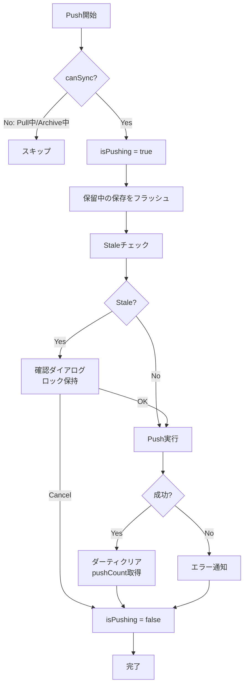
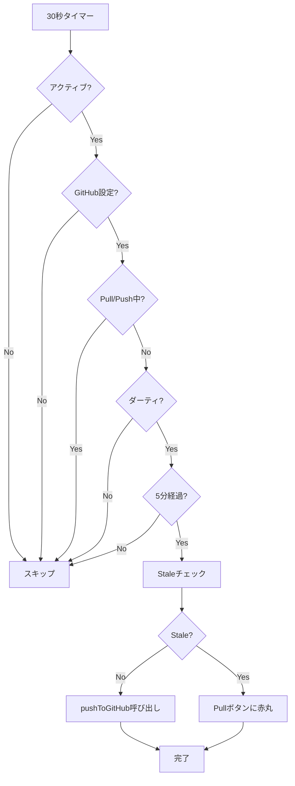
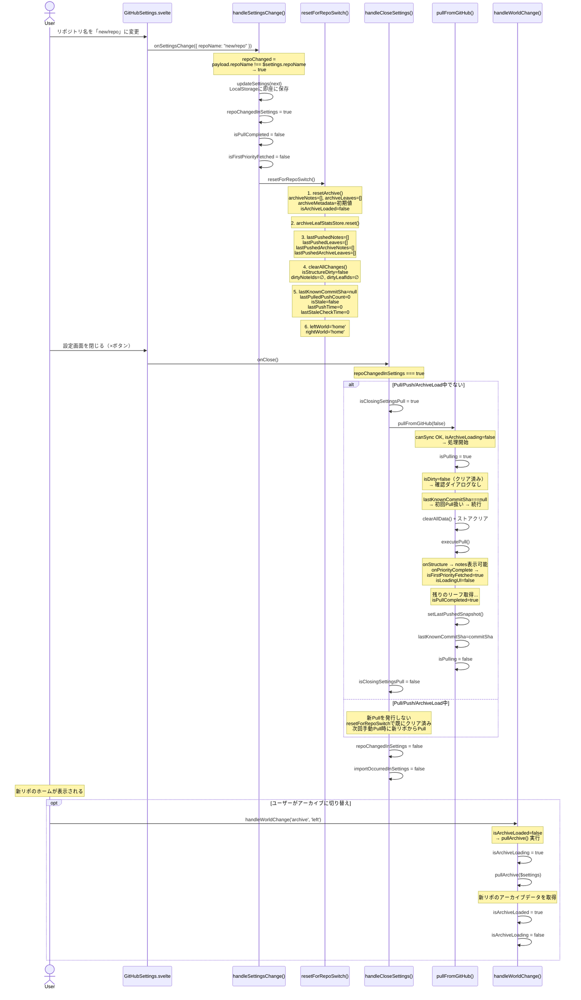
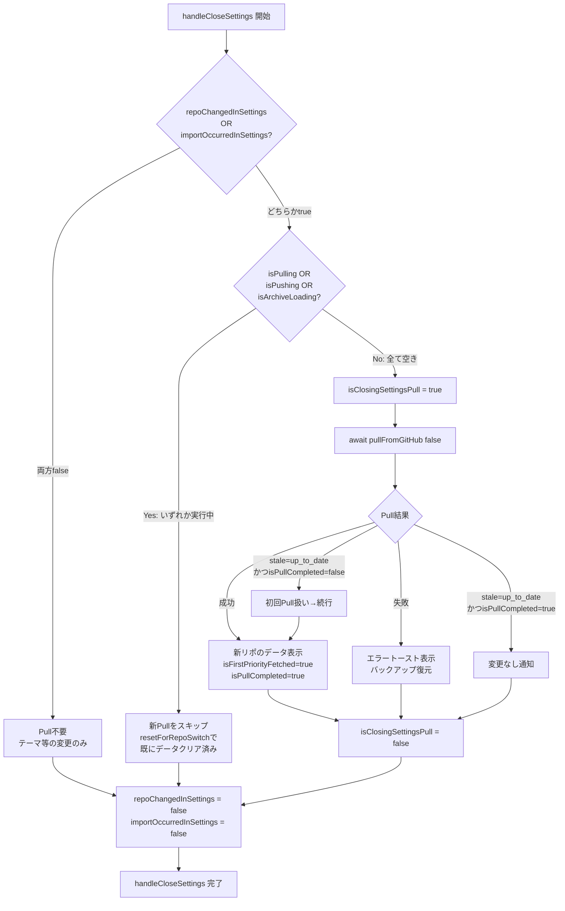
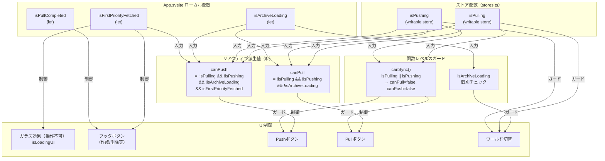

# Push/Pull処理

## 設計思想

### 1つの統合関数による排他制御

Push/Pull処理は、それぞれ**1つの統合関数**に集約されています：

- **Push**: `pushToGitHub()` - すべてのPush操作がこの関数を通る
- **Pull**: `pullFromGitHub()` - すべてのPull操作がこの関数を通る

この設計により、以下を実現しています：

1. **自動的な排他制御**: 各関数の冒頭で即座にロック（`$isPushing` / `$isPulling`）を取得し、finally句で必ず解放
2. **データ損失の防止**: 非同期処理の最中に他の操作が割り込むことを根本的に防止
3. **コードの可読性**: 分散していたロジックが1箇所に集約され、動作を理解しやすい

### Promise版ダイアログによるロック保持

確認ダイアログ表示中もロックを保持するため、Promise版のダイアログ関数を使用：

- `confirmAsync(message)` - 確認ダイアログ（true/false を返す）
- `promptAsync(message, placeholder)` - 入力ダイアログ（string/null を返す）

従来のコールバック版（`showConfirm`）では、ダイアログ表示中にロックを解放する必要がありましたが、Promise版では`await`で待機することでロックを保持したまま処理を継続できます。

---

## Push処理

### pushToGitHub() - 統合関数

すべてのPush操作（ボタンクリック、Ctrl+S、自動Push、Vim `:w`）は、この1つの関数を通ります。

**処理ステップ:**

1. 交通整理: Pull/Push中またはアーカイブロード中は不可
2. 即座にロック取得（非同期処理の前に取得することが重要）
3. 保留中の自動保存をフラッシュ
4. Staleチェック（共通関数で時刻も更新）
5. Stale編集の場合は確認（ロックを保持したまま await）
6. Push実行
7. 結果処理（成功時はダーティクリア、リモートからpushCount取得）
8. ロック解放（finallyで必ず実行）

### Push処理フロー



### 排他制御のポイント

1. **ロック取得は最初**: `canSync`チェック直後、すべての非同期処理の前にロックを取得
2. **finally句で解放**: 成功・失敗・エラー・キャンセルに関わらず、必ずロックを解放
3. **ダイアログ中もロック保持**: `await confirmAsync()`でロックを保持したまま待機

### データ損失が起きる可能性があった箇所（修正済み）

**修正前の問題:**

ロック取得が遅く、`flushPendingSaves()`の間にPullが開始される可能性がありました。

**修正後:**

即座にロック取得し、try-finallyで確実に解放します。

### Push処理の原子性と失敗時の安全性

**PullとPushの構造的な違い:**

| 処理 | 構造                 | API呼び出し数                  | 部分的失敗                     |
| ---- | -------------------- | ------------------------------ | ------------------------------ |
| Pull | 並列処理             | リーフ数だけ（100個なら100回） | あり得る（一部成功、一部失敗） |
| Push | 単一トランザクション | 固定3回（Tree→Commit→Ref）     | なし（全成功か全失敗）         |

**Push処理の3段階:**

1. **Tree作成**: 全ファイルを1つのJSONで送信
2. **Commit作成**: 上記Treeを指すCommitオブジェクトを作成
3. **Ref更新**: ブランチのHEADを新Commitに向ける

**各段階での失敗時の挙動:**

```typescript
// どの段階で失敗しても success: false を返す
if (!newTreeRes.ok) {
  return { success: false, message: 'github.treeCreateFailed' }
}
if (!newCommitRes.ok) {
  return { success: false, message: 'github.commitCreateFailed' }
}
if (!updateRefRes.ok) {
  return { success: false, message: 'github.branchUpdateFailed' }
}
```

**ダーティフラグの扱い:**

```typescript
// App.svelte: 成功時のみダーティクリア
if (result.variant === 'success') {
  setLastPushedSnapshot(...)
  clearAllChanges()  // ← 成功時のみ
  lastPushTime.set(Date.now())
}
```

失敗時はダーティフラグが維持されるため、ユーザーが再度Pushボタンを押すと全データが再送信されます（冪等性あり）。

**Orphan Commitの扱い:**

Commit作成は成功したがRef更新で失敗した場合、Commitオブジェクトは作られますがブランチから到達不可能（orphan）になります。

- 次回Push時に別の新しいCommitを作成（重複するが無害）
- GitHubのGC（garbage collection）で自動削除される
- 実害がないため、特別な処理は不要

**結論:**

Push処理は単一のトランザクション的処理であり、「一部だけ送信成功」という状態は起きません。Pullのような並列処理特有の問題（一部失敗での全体失敗処理）は存在せず、現在の実装で十分安全です。

---

## Pull処理

### pullFromGitHub() - 統合関数

すべてのPull操作（ボタンクリック、初回Pull、設定画面閉じる）は、この1つの関数を通ります。

**処理ステップ:**

1. 交通整理: Pull/Push中またはアーカイブロード中は不可
2. 即座にロック取得
3. ダーティチェック（ロックを保持したまま確認ダイアログ）
4. Staleチェック（up_to_dateなら早期リターン）
5. Pull実行（第一優先で編集可能に、残りはバックグラウンド）
6. 結果処理（成功時はpushCount更新、ダーティクリア）
7. ロック解放（finallyで必ず実行）

### Pull処理フロー


### 第一優先Pull - 段階的ローディング

Pull処理は、ユーザーが早く編集を開始できるよう、優先度ベースで段階的に実行されます：

1. **構造取得**: ノート構造とリーフスケルトンを取得
2. **第一優先リーフ取得**: URLで指定されたリーフを最優先で取得
3. **閲覧・編集可能に**: `isFirstPriorityFetched = true`, `isLoadingUI = false`（全体のガラス効果解除）
4. **残りのリーフ取得**: バックグラウンドで10並列取得（`CONTENT_FETCH_CONCURRENCY = 10`）
5. **全操作可能に**: `isPullCompleted = true`（フッタのボタン有効化）

**UI制御の段階:**

- **第1段階完了まで**: 全体がガラス効果（`isLoadingUI = true`）で完全に操作不可
- **第1段階完了後**: ガラス効果解除、リーフの閲覧・編集が可能、ただしフッタのボタン（作成・削除・移動など）は無効化（`!isPullCompleted`）
- **第2段階完了後**: すべての操作が可能

これにより、残りのリーフ取得中にユーザーが同名リーフを作成したり、まだ取得していないノートを削除するなどの矛盾を防ぎます。

**PullOptionsコールバック:**

- `onStructure`: ノートとメタデータをストアに設定し、URLから優先情報を返す
- `onLeaf`: 各リーフをストアに追加
- `onPriorityComplete`: 閲覧・編集許可、ガラス効果解除、URL復元

### Pull中の編集保護

Pull処理中（第一優先完了後）にユーザーが編集を行った場合、その編集内容を保護します：

- ダーティなリーフを識別してMapに保持
- Pull結果とマージ時、ダーティなリーフは編集内容とダーティ状態を維持
- Pull完了後、ダーティな変更がない場合のみクリア

---

## 自動Push処理

### 自動Pushの条件

30秒ごとに以下の条件をチェックし、すべて満たす場合のみ`pushToGitHub()`を呼び出します：

1. タブがアクティブ（`document.visibilityState === 'visible'`）
2. GitHub設定済み
3. Pull/Push中でない
4. ダーティフラグが立っている
5. 最後のPushから5分経過

自動Pushも`pushToGitHub()`を呼ぶため、手動Pushと完全に同じ排他制御が適用されます。

### 自動Pushフロー



自動Pushも`pushToGitHub()`を呼ぶため、手動Pushと完全に同じ排他制御が適用されます。

---

## Push回数カウント機能

### 概要

アプリの使用状況を可視化するため、GitHub Push回数をカウントして統計情報として表示します。

### データ構造

Push回数は `metadata.json` の `pushCount` フィールドに保存されます。

### Push時の自動インクリメント

`pushAllWithTreeAPI` 関数内で、既存ツリーのblob SHAからBlob APIでmetadata.jsonを読み取り、`pushCount` を+1してmetadata.jsonに保存します。
Contents APIではなくBlob APIを使うことで、同一commitのtreeから確実に読み取り、race conditionによるpushCountリセットを防止しています。

- treeにmetadata.jsonがない場合 = 初回Push → pushCount=0から開始（正常）
- Blob API失敗時 = APIエラー → pushをabortしてユーザーに再試行を促す

### Pull時のデータ取得

`executePull` 関数内で、metadata.jsonから `pushCount` を取得し、Svelteストアに保存します。後方互換性のため、フィールドが存在しない場合は0として扱います。

### UI表示

StatsPanel.svelte でホーム画面の右下に`lastPulledPushCount`を統計情報として表示します。Push成功後はリモートから最新の`pushCount`を取得して更新するため、常に正確な値が表示されます。

なお、stale検出は`pushCount`ではなくcommit SHA比較で行われます（`lastKnownCommitSha`ストア）。詳細は[stale-detection.md](./stale-detection.md)を参照。

---

## データ損失バグの撲滅

### 発生していた問題

Pull実行中にPushが開始されると、以下のような順序でデータ損失が発生していました：

1. Pull開始
2. Pull中にPushボタンをクリック
3. Push処理がロック取得前の非同期処理（flushPendingSaves等）を実行
4. その間にPullが完了し、leaves.set([]) でデータをクリア
5. Pushが実行され、空のデータをGitHubにPush
6. リーフが消失

### 解決方法

1. **ロック取得を最初に**: すべての非同期処理の前にロックを取得
2. **finally句で解放**: 必ずロックを解放
3. **Promise版ダイアログ**: ダイアログ表示中もロックを保持
4. **統合関数**: すべての操作が1つの関数を通るため、抜け穴がない

### 修正箇所

| 修正前                                                         | 修正後                                                         |
| -------------------------------------------------------------- | -------------------------------------------------------------- |
| `handlePushToGitHub()` + `executePushInternal()`（2関数）      | `pushToGitHub()`（1関数）                                      |
| `handlePull()` + `executePullInternal()`（2関数）              | `pullFromGitHub()`（1関数）                                    |
| `showConfirm(message, onOK, onCancel)`（コールバック版）       | `await confirmAsync(message)`（Promise版）                     |
| `await flushPendingSaves(); $isPushing = true`（ロックが遅い） | `$isPushing = true; await flushPendingSaves()`（ロックが早い） |

### 動作フロー（例：自動Push中にPullボタンをクリック）

1. 自動Push開始
2. pushToGitHub() → canSync OK → $isPushing = true（即座にロック）
3. flushPendingSaves() 実行中...
4. Pullボタンをクリック
5. pullFromGitHub() → canSync → $isPushing = true を検出 → return
6. Pull は実行されない ✅
7. Push処理が完了
8. $isPushing = false（ロック解放）

---

## 不完全Pull時のデータ保護

### 発生していた問題

Pull中に一部のリーフ取得が失敗すると、不完全な状態でPull成功と判定され、次のPushでデータが消失する可能性がありました：

1. Pull開始、10並列でリーフ取得
2. 一部のリーフで取得失敗（ネットワーク遅延等）→ `return null`で除外
3. Pull成功として処理、不完全なリーフリストがIndexedDBに保存
4. ユーザーがPush
5. GitHubにあるが、IndexedDBにないリーフが「削除された」と判定
6. リーフ消失

### 解決方法

1. **失敗検出**: リーフ取得失敗を`failedLeafPaths`配列に記録
2. **Pull全体を失敗扱い**: 1件でも失敗があれば`success: false`を返す
3. **UIロック維持**: `isFirstPriorityFetched = false`でガラス効果を維持
4. **ストアクリア**: 不完全なデータでのPushを防ぐ

### 不完全Pull時の動作

- UIはガラス効果でロック（初回Pull前と同じ状態）
- オフラインリーフのみ編集可能
- ノート・リーフの作成・編集・削除は不可
- Pushボタンは機能しない（`canSync`チェックで弾かれる）
- 再度Pullを試行してすべてのリーフを取得する必要がある

---

## アーカイブロード中の操作制限

### 発生していた問題

ホームのPull中にアーカイブビューに切り替えると、アーカイブのPullが並行で走り始めます。ホームのPull完了時にアーカイブのPullが未完了でもPushボタンが有効になり、不完全なアーカイブデータがPushされる可能性がありました。

### 解決方法

`isArchiveLoading`フラグを既存の`isPulling`/`isPushing`と同列の排他条件に追加しました。

**ブロックされる操作:**

| 操作                                    | ブロック条件                                     |
| --------------------------------------- | ------------------------------------------------ |
| ワールド切り替え（`handleWorldChange`） | `isPulling \|\| isPushing \|\| isArchiveLoading` |
| Pull実行（`pullFromGitHub`）            | `canSync`失敗 \|\| `isArchiveLoading`            |
| Push実行（`pushToGitHub`）              | `canSync`失敗 \|\| `isArchiveLoading`            |
| ノート移動（`moveNoteToWorld`）         | `isPulling \|\| isPushing \|\| isArchiveLoading` |
| リーフ移動（`moveLeafToWorld`）         | `isPulling \|\| isPushing \|\| isArchiveLoading` |
| 自動Push/自動Pull                       | `isPulling \|\| isPushing \|\| isArchiveLoading` |

**UIの制御:**

- `canPull`/`canPush`リアクティブ宣言に`!isArchiveLoading`条件を追加
- Breadcrumbsコンポーネントに`isSyncing`プロパティを追加し、Pull/Push中はワールド切替ドロップダウンを無効化

---

## 設定画面でのPush/Pull

### 設定画面を開くとき

設定画面を開くときに**Pushは実行しない**。以前はリポジトリ変更前のデータ保全のために強制Pushを行っていたが、リポジトリを変更する＝新しい環境で作業したいユースケースであり、旧データの保全は不要と判断して廃止した。

### 設定画面を閉じるとき

設定画面を閉じるときに**Pullが実行されるのは、リポジトリが変更された場合またはインポートが行われた場合のみ**（`handleCloseSettings()`）。テーマやツール名だけの変更ではPullは実行されない。

Pull/Push/アーカイブロード中に設定画面を閉じた場合は、新しいPullを発行せずリセット済みの状態で閉じる（`resetForRepoSwitch()`で既にデータがクリアされているため、次回操作時に新リポからPullされる）。

### リポジトリ変更時の注意表示

リポジトリ名（`settings.repoName`）が設定画面内で変更された場合、赤い警告メッセージを表示する。これは設定を閉じると新しいリポジトリからPullされることをユーザーに明示するため。

- 初回設定（空欄→入力）の場合は警告不要
- 変更を元に戻した場合は警告が消える

---

## リポジトリ切替時の状態リセット

### 背景

リポジトリを切り替えた際、旧リポの状態（アーカイブデータ、commit SHA、ダーティスナップショット等）が残っていると、新リポに対して誤ったデータがPushされたり、stale検出が誤動作する可能性がある。これを防ぐため、リポ切替時に全リポ固有状態を一括リセットする。

### トリガー

`handleSettingsChange()`内で`repoName`の変更を検知すると、以下を即座に実行する：

1. `repoChangedInSettings = true`（設定画面閉じる時のPull判定用フラグ）
2. `isPullCompleted = false` / `isFirstPriorityFetched = false`（操作ロック）
3. `resetForRepoSwitch()`（stores.tsの一括リセット関数）

```typescript
// App.svelte handleSettingsChange() 内
const repoChanged = payload.repoName !== undefined && payload.repoName !== $settings.repoName
const next = { ...$settings, ...payload }
updateSettings(next)
if (repoChanged) {
  repoChangedInSettings = true
  isPullCompleted = false
  isFirstPriorityFetched = false
  resetForRepoSwitch()
}
```

---

### 図1: 操作排他マトリクス

横軸は現在のアプリ状態、縦軸は試みる操作。5つの主要操作（Pull / Push / ArchiveLoad / WorldSwitch / RepoSwitch）の排他関係を示す。

#### 操作 × 状態 の排他表

|                                         | 通常 | Pull中        | Push中      | ArchiveLoad中 | リポ切替直後（Pull前） |
| --------------------------------------- | ---- | ------------- | ----------- | ------------- | ---------------------- |
| **手動Pull**                            | 許可 | ブロック      | ブロック    | ブロック      | 許可（自動実行）       |
| **手動Push**                            | 許可 | ブロック      | ブロック    | ブロック      | ブロック（注1）        |
| **自動Push（42秒）**                    | 許可 | ブロック      | ブロック    | ブロック      | ブロック（注2）        |
| **自動Pull（stale検出）**               | 許可 | ブロック      | ブロック    | ブロック      | ブロック（注3）        |
| **ワールド切替（Home↔Archive）**        | 許可 | ブロック      | ブロック    | ブロック      | ブロック（注4）        |
| **ノート/リーフ移動（World間）**        | 許可 | ブロック      | ブロック    | ブロック      | ブロック（注4）        |
| **ノート/リーフ作成・削除**             | 許可 | 条件付き(注5) | 許可        | 許可          | ブロック（注4）        |
| **リーフ編集**                          | 許可 | 条件付き(注6) | 許可        | 許可          | ブロック（注4）        |
| **設定画面を開く**                      | 許可 | 許可          | 許可        | 許可          | 許可                   |
| **リポ切替（設定画面内）**              | 許可 | 許可（注7）   | 許可（注7） | 許可（注7）   | 許可                   |
| **アーカイブPull（handleWorldChange）** | 許可 | ブロック      | ブロック    | ブロック      | ブロック（注4）        |

**注釈:**

1. `isFirstPriorityFetched = false`により`canPush`が`false`→Pushボタン無効
2. `isDirty = false`（resetForRepoSwitchでクリア済み）→自動Push条件不成立
3. `lastStaleCheckTime = 0`→`canPerformCheck()`が`false`→チェック自体が実行されない
4. `isFirstPriorityFetched = false`によりUIガラス効果で操作不可
5. `isPullCompleted = false`の間はフッタボタンが無効。`isFirstPriorityFetched = true`後は作成/削除可能
6. `isFirstPriorityFetched = true`後のみ編集可能（第一優先リーフ取得完了後）
7. 設定画面は常に開ける。リポ切替を実行すると`resetForRepoSwitch()`が即座に呼ばれ、進行中のPull/Pushには影響しない（完了しても`isArchiveLoaded`等がリセット済みのため無害）

#### 5操作間の排他関係（クロスリファレンス）

以下の表は、行の操作が実行中に列の操作を開始しようとした場合の結果を示す。

|            | Pull開始 | Push開始 | ArchiveLoad開始 | WorldSwitch開始 | RepoSwitch開始 |
| ---------- | -------- | -------- | --------------- | --------------- | -------------- |
| **Pull中** | -        | ブロック | ブロック        | ブロック        | 許可（注7）    |
| **Push中** | ブロック | -        | ブロック        | ブロック        | 許可（注7）    |
| **AL中**   | ブロック | ブロック | -               | ブロック        | 許可（注7）    |
| **WS中**   | 条件付き | 条件付き | 条件付き        | -               | 許可           |
| **RS中**   | 自動実行 | ブロック | ブロック        | ブロック        | -              |

※ AL = ArchiveLoad、WS = WorldSwitch、RS = RepoSwitch

**ブロック機構の実装箇所:**

| ガード条件                   | チェック箇所                        | 影響する操作           |
| ---------------------------- | ----------------------------------- | ---------------------- |
| `$isPulling \|\| $isPushing` | `canSync()` in `sync-handlers.ts`   | Pull, Push             |
| `isArchiveLoading`           | 各関数の冒頭で個別チェック          | Pull, Push, WS, 移動   |
| `!isFirstPriorityFetched`    | UI側: `isLoadingUI`によるガラス効果 | 編集, 作成, 削除, 移動 |
| `!isPullCompleted`           | フッタボタンの`disabled`属性        | 作成, 削除             |

---

### 図2: リポ切替シーケンス図

ユーザーが設定画面でリポを変更してから、新リポのデータが表示されるまでの時系列。



---

### 図3: 状態変数のライフサイクル

全リポ固有変数について、各操作でどう変化するかの完全な一覧。

#### stores.ts 内の変数

| 変数名                     | 型                         | 初期値                        | Pull時の変化                                  | Push時の変化                                  | リポ切替時のリセット値        | リセットしないと何が起きるか                                                  |
| -------------------------- | -------------------------- | ----------------------------- | --------------------------------------------- | --------------------------------------------- | ----------------------------- | ----------------------------------------------------------------------------- |
| `archiveNotes`             | `writable<Note[]>`         | `[]`                          | 変化なし（Pull対象外）                        | そのままPush                                  | `[]`                          | 旧リポのアーカイブノートが新リポにPushされる（**データ破壊**）                |
| `archiveLeaves`            | `writable<Leaf[]>`         | `[]`                          | 変化なし                                      | そのままPush                                  | `[]`                          | 旧リポのアーカイブリーフが新リポにPushされる（**データ破壊**）                |
| `archiveMetadata`          | `writable<Metadata>`       | `{version:1,...,pushCount:0}` | 変化なし                                      | そのままPush                                  | `{version:1,...,pushCount:0}` | 旧リポのメタデータで新リポが上書きされる                                      |
| `isArchiveLoaded`          | `writable<boolean>`        | `false`                       | 変化なし                                      | 変化なし                                      | `false`                       | `true`のまま残ると、アーカイブ表示時にPullがスキップされ旧データが表示される  |
| `lastPushedNotes`          | `Note[]`（モジュール変数） | `[]`                          | `setLastPushedSnapshot()`でディープコピー保存 | `setLastPushedSnapshot()`でディープコピー保存 | `[]`                          | 新リポのノートと旧リポのスナップショットを比較し、全ノートが「dirty」と誤判定 |
| `lastPushedLeaves`         | `Leaf[]`（モジュール変数） | `[]`                          | 同上                                          | 同上                                          | `[]`                          | 同上（リーフ側）                                                              |
| `lastPushedArchiveNotes`   | `Note[]`（モジュール変数） | `[]`                          | 変化なし                                      | 同上                                          | `[]`                          | 同上（アーカイブ側）                                                          |
| `lastPushedArchiveLeaves`  | `Leaf[]`（モジュール変数） | `[]`                          | 変化なし                                      | 同上                                          | `[]`                          | 同上（アーカイブ側）                                                          |
| `dirtyNoteIds`             | `writable<Set<string>>`    | `new Set()`                   | 変化なし（isDirty=falseならクリア）           | `clearAllChanges()`でクリア                   | `new Set()`                   | 旧リポのdirtyフラグが残りPushボタンに赤丸が表示される                         |
| `dirtyLeafIds`             | `writable<Set<string>>`    | `new Set()`                   | 同上                                          | 同上                                          | `new Set()`                   | 同上（リーフ側）                                                              |
| `isStructureDirty`         | `writable<boolean>`        | `false`                       | 同上                                          | `clearAllChanges()`で`false`                  | `false`                       | 旧リポの構造変更フラグが残り不要なdirty判定が発生                             |
| `lastKnownCommitSha`       | `writable<string\|null>`   | `null`                        | `result.commitSha`をセット                    | `result.commitSha`をセット                    | `null`                        | 旧リポのSHAと新リポのHEADが比較され、必ず「stale」と誤判定                    |
| `lastPulledPushCount`      | `writable<number>`         | `0`                           | `result.metadata.pushCount`をセット           | `fetchRemotePushCount()`で更新                | `0`                           | 旧リポのPush回数が統計画面に表示される                                        |
| `isStale`                  | `writable<boolean>`        | `false`                       | `false`にセット                               | 変化なし                                      | `false`                       | Pullボタンに赤丸（staleバッジ）が残る                                         |
| `lastPushTime`             | `writable<number>`         | `0`                           | 変化なし                                      | `Date.now()`をセット                          | `0`                           | 旧リポの最終Push時刻が残り自動Push間隔の計算が狂う                            |
| `lastStaleCheckTime`       | `writable<number>`         | `0`                           | 変化なし                                      | 変化なし                                      | `0`                           | 0にすることで`canPerformCheck()`がfalse→新Pull完了までstaleチェック抑制       |
| `leftWorld` / `rightWorld` | `writable<WorldType>`      | `'home'`                      | 変化なし                                      | 変化なし                                      | `'home'`                      | `'archive'`のまま残るとクリア済みアーカイブストアを参照し空画面になる         |
| `archiveLeafStatsStore`    | カスタムStore              | `reset()済み`                 | 変化なし                                      | 変化なし                                      | `.reset()`                    | 旧リポのリーフ統計（文字数等）がアーカイブ画面に表示される                    |

#### App.svelte 内の変数

| 変数名                     | 型        | 初期値  | Pull時の変化                           | Push時の変化 | リポ切替時のリセット値                               | リセットしないと何が起きるか                                                        |
| -------------------------- | --------- | ------- | -------------------------------------- | ------------ | ---------------------------------------------------- | ----------------------------------------------------------------------------------- |
| `isFirstPriorityFetched`   | `boolean` | `false` | `false`→`true`（onPriorityComplete時） | 変化なし     | `false`                                              | ガラス効果が解除されたまま残り空データで操作してしまう                              |
| `isPullCompleted`          | `boolean` | `false` | `false`→`true`（全リーフ取得完了時）   | 変化なし     | `false`                                              | フッタの作成/削除ボタンが有効なまま残り空データで操作してしまう                     |
| `repoChangedInSettings`    | `boolean` | `false` | 変化なし                               | 変化なし     | `true`                                               | `false`のままだと`handleCloseSettings()`でPullが実行されない                        |
| `importOccurredInSettings` | `boolean` | `false` | 変化なし                               | 変化なし     | 変化なし（リポ切替とは独立）                         | インポート後にPullが走らない（リポ切替とは無関係）                                  |
| `isClosingSettingsPull`    | `boolean` | `false` | 変化なし                               | 変化なし     | 変化なし                                             | 設定画面閉じ時のPull中表示の管理用（リポ切替と直接の関係なし）                      |
| `isArchiveLoading`         | `boolean` | `false` | 変化なし                               | 変化なし     | 変化なし（resetForRepoSwitchでは直接リセットしない） | 進行中のアーカイブPullが完了しても`isArchiveLoaded=false`なので再Pull必要。実害なし |

---

### 図4: エッジケース一覧

リポ切替・Pull/Push・アーカイブ・外部要因が絡む全29エッジケースと対策の一覧。

#### Sランク（最重大 — データ破壊の可能性）

| #   | 操作シナリオ                                    | 期待動作                                       | 対応するガード/関数                                                                             | 深刻度 |
| --- | ----------------------------------------------- | ---------------------------------------------- | ----------------------------------------------------------------------------------------------- | :----: |
| 1   | ホーム表示中にリポ切替                          | 旧データがクリアされ新リポからPullされる       | `resetForRepoSwitch()` → `handleCloseSettings()` → `pullFromGitHub()`                           |   S    |
| 2   | アーカイブ表示中にリポ切替                      | 旧アーカイブがクリアされ、ワールドがhomeに戻る | `resetForRepoSwitch()` → `resetArchive()` + `leftWorld/rightWorld='home'`                       |   S    |
| 3   | リポ切替直後にPush（旧dirty data）              | 旧データが新リポにPushされない                 | `resetForRepoSwitch()` → `clearAllChanges()` + `isFirstPriorityFetched=false` → `canPush=false` |   S    |
| 4   | アーカイブ取得済み→リポ切替→Push                | 旧アーカイブが新リポにPushされない             | `resetForRepoSwitch()` → `resetArchive()` + `isArchiveLoaded=false`                             |   S    |
| 5   | リポ切替後に未保存変更のconfirmが旧データで出る | confirmダイアログが出ない                      | `resetForRepoSwitch()` → `clearAllChanges()` → `isDirty=false`                                  |   S    |

#### Aランク（重大 — 誤動作の可能性）

| #   | 操作シナリオ                               | 期待動作                                 | 対応するガード/関数                                                                                        | 深刻度 |
| --- | ------------------------------------------ | ---------------------------------------- | ---------------------------------------------------------------------------------------------------------- | :----: |
| 6   | Pull中にリポ切替                           | 進行中Pullが旧リポデータを注入しない     | `handleCloseSettings()` → `isPulling`チェック → 新Pullスキップ                                             |   A    |
| 7   | Push中にリポ切替                           | 旧リポへのPushは完了し新リポに影響しない | `handleCloseSettings()` → `isPushing`チェック → 新Pullスキップ                                             |   A    |
| 8   | アーカイブロード中にリポ切替               | アーカイブPullの結果が破棄される         | `handleCloseSettings()` → `isArchiveLoading`チェック → 新Pullスキップ。`isArchiveLoaded=false`で再Pull必要 |   A    |
| 9   | lastKnownCommitShaが旧リポのまま残る       | staleチェックが新リポのSHAと比較する     | `resetForRepoSwitch()` → `lastKnownCommitSha.set(null)` → 初回Pull扱い                                     |   A    |
| 10  | lastPushedSnapshotが旧リポのまま残る       | dirty検出が新リポ基準で動作する          | `resetForRepoSwitch()` → 全スナップショット配列を`[]`にクリア                                              |   A    |
| 11  | 自動Push（42秒タイマー）がリポ切替後に発火 | 旧データを新リポにPushしない             | `resetForRepoSwitch()` → `clearAllChanges()` → `isDirty=false` → 自動Push条件不成立                        |   A    |
| 12  | staleチェックがリポ切替をまたぐ            | 旧リポのSHAでstale判定しない             | `lastStaleCheckTime=0` → `canPerformCheck()=false` → 新Pull完了までチェック抑制                            |   A    |

#### Bランク（UX問題 — 動作はするが改善が望ましい）

| #   | 操作シナリオ                           | 期待動作                          | 対応するガード/関数                                                                                     | 深刻度 |
| --- | -------------------------------------- | --------------------------------- | ------------------------------------------------------------------------------------------------------- | :----: |
| 13  | リポ切替直後にアーカイブ切替           | 新リポのアーカイブがPullされる    | `isArchiveLoaded=false` → `handleWorldChange()` → `pullArchive()`                                       |   B    |
| 14  | リポ切替連打（A→B→A）                  | 最終的にAのデータが表示される     | 各変更で`resetForRepoSwitch()`が呼ばれ最後の設定が残る。閉じる時に1回だけPull                           |   B    |
| 15  | 同じリポ名を再設定                     | 何も起きない（リセット/Pullなし） | `repoChanged`判定で`false` → `handleCloseSettings()`でスキップ                                          |   B    |
| 16  | テーマだけ変更して閉じる               | Pullされない                      | `repoChangedInSettings=false` かつ `importOccurredInSettings=false` → `handleCloseSettings()`でスキップ |   B    |
| 17  | インポート後にリポ切替なしで閉じる     | インポートデータの同期Pullが走る  | `importOccurredInSettings=true` → `handleCloseSettings()` → `pullFromGitHub()`                          |   B    |
| 18  | リポ切替＋インポート両方実行して閉じる | Pullは1回だけ実行される           | `repoChangedInSettings \|\| importOccurredInSettings` → 1回の`pullFromGitHub()`                         |   B    |
| 19  | URL状態が旧リポのID参照                | ホームにフォールバック            | `restoreStateFromUrl()` → ID不一致 → ホーム表示                                                         |   B    |
| 20  | IndexedDB自動保存が旧データで上書き    | 新リポデータが保持される          | `pullFromGitHub()` → `clearAllData()` → 新データ保存                                                    |   B    |

#### Cランク（軽微 — 現在の動作で問題なし）

| #   | 操作シナリオ                             | 期待動作                         | 対応するガード/関数                                               | 深刻度 |
| --- | ---------------------------------------- | -------------------------------- | ----------------------------------------------------------------- | :----: |
| 21  | リポ切替後にワールド切替（Home→Archive） | 新リポのアーカイブがPullされる   | `isArchiveLoaded=false` → `handleWorldChange()` → `pullArchive()` |   C    |
| 22  | 空のリポ名を設定                         | エラー表示                       | GitHub API呼び出しが失敗→エラートースト                           |   C    |
| 23  | 存在しないリポ名を設定                   | 404エラー表示                    | `pullFromGitHub()` → `executePull()` → エラーハンドリング         |   C    |
| 24  | アーカイブが空のリポに切替               | 空のアーカイブが表示される       | `pullArchive()`が空データで成功返却                               |   C    |
| 25  | 別端末でPush済み→リポ切替→Pull           | 最新データが取得される           | `lastKnownCommitSha=null` → staleチェックスキップ → 初回Pull扱い  |   C    |
| 26  | ネットワーク切断中にリポ切替             | エラー表示、バックアップから復元 | `pullFromGitHub()` → エラーハンドリング + バックアップ復元        |   C    |
| 27  | APIレート制限中にリポ切替                | レート制限メッセージ表示         | `rateLimitInfo`をトーストに表示                                   |   C    |
| 28  | トークン変更のみ（リポ名同じ）           | 新トークンで接続（Pullなし）     | `repoChanged=false` → リセットなし、Pullなし                      |   C    |
| 29  | トークンとリポの組み合わせが不正         | 認証エラー表示                   | GitHub API 401→エラートースト                                     |   C    |

---

### 図5: Before/After 比較

修正前（resetForRepoSwitch導入前）と修正後の動作を主要シナリオごとに対比する。

#### シナリオ1: アーカイブ表示中にリポ切替

**修正前（BUG）:**

- アーカイブストア（`archiveNotes`, `archiveLeaves`）が旧リポのデータを保持したまま
- `isArchiveLoaded = true`のまま残る
- 新リポでPush実行すると、旧リポのアーカイブデータが新リポにPushされる
- **結果: データ破壊**

**修正後:**

- `resetForRepoSwitch()` → `resetArchive()`でアーカイブストア全クリア
- `isArchiveLoaded = false`にリセット
- `leftWorld/rightWorld = 'home'`でホームに戻す
- 新リポでアーカイブ表示時に`handleWorldChange()`が`pullArchive()`を実行
- **結果: 安全。新リポのアーカイブが正しく取得される**

#### シナリオ2: リポ切替直後のPush

**修正前（BUG）:**

- `lastPushedNotes/Leaves`が旧リポのスナップショットを保持
- 新リポのPull完了後、旧スナップショットとの差分で全データが「dirty」と判定
- Push実行で旧リポと新リポのデータが混在してPushされる可能性
- **結果: 意図しないdirty判定、最悪の場合データ不整合**

**修正後:**

- `resetForRepoSwitch()`で`lastPushedNotes/Leaves = []`にクリア
- `clearAllChanges()`で`dirtyNoteIds/dirtyLeafIds = new Set()`にクリア
- `isFirstPriorityFetched = false`により`canPush = false`→Pushボタン無効
- Pull完了時に`setLastPushedSnapshot()`で新リポのスナップショットが正しく設定される
- **結果: 安全。Pull完了まではPush不可、Pull後は新リポ基準でdirty検出**

#### シナリオ3: staleチェックがリポ切替をまたぐ

**修正前（BUG）:**

- `lastKnownCommitSha`が旧リポのSHAを保持
- 新リポのHEADと比較され、必ず「stale」と判定される
- 自動Pullが不必要に発火する
- **結果: 不要なAPI呼び出し、最悪の場合は旧リポのstaleバッジが残る**

**修正後:**

- `resetForRepoSwitch()`で`lastKnownCommitSha = null`にリセット
- `lastStaleCheckTime = 0`にリセット → `canPerformCheck() = false`
- 新Pull完了までstaleチェックが抑制される
- Pull成功時に`lastKnownCommitSha`が新リポのSHAで更新される
- **結果: 安全。staleチェックは新Pull完了後に新リポ基準で正しく動作**

#### シナリオ4: 自動Pushがリポ切替後に発火

**修正前（BUG）:**

- `isDirty = true`が残ったまま（旧リポでの編集由来）
- `lastPushTime`が旧リポの時刻のまま → 5分経過判定がずれる
- 自動Push条件が成立し、空データまたは旧データが新リポにPushされる
- **結果: データ消失または不正データのPush**

**修正後:**

- `resetForRepoSwitch()`で`clearAllChanges()` → `isDirty = false`
- `lastPushTime = 0`にリセット
- `isFirstPriorityFetched = false` → `canPush = false`
- 自動Push条件が成立しない（isDirty=false かつ canPush=false）
- **結果: 安全。自動PushはPull完了・編集発生後にのみ動作**

#### シナリオ5: Pull中にリポ切替して閉じる

**修正前（BUG）:**

- 設定画面を閉じると`handleCloseSettings()`がPull中チェックなしで`pullFromGitHub()`を呼ぶ
- `canSync()`で`isPulling = true`のためブロックされるが、旧Pullの結果が新リポ設定のUIに表示される可能性
- **結果: 旧リポのデータが表示される混乱状態**

**修正後:**

- `handleCloseSettings()`で`$isPulling || $isPushing || isArchiveLoading`をチェック
- いずれかがtrueの場合、新Pullを発行しない
- `resetForRepoSwitch()`で既にデータクリア済みなので、旧Pullの結果は無害
  - 旧Pullが`notes.set()`等を呼んでも、すぐ後に`handleCloseSettings()`でPullが走らないため混在しない
  - ユーザーが手動でPullを実行すれば新リポからデータ取得される
- **結果: 安全。クリア済み状態で閉じ、次回操作時に新リポからPull**

---

### 図6: handleCloseSettings の判定フロー

`importOccurredInSettings`の分岐を含む完全なフローチャート。



#### handleCloseSettings() の条件分岐表

| repoChanged | importOccurred | isPulling | isPushing | isArchiveLoading | 結果                                           |
| :---------: | :------------: | :-------: | :-------: | :--------------: | ---------------------------------------------- |
|    true     |     false      |   false   |   false   |      false       | Pull実行（新リポからデータ取得）               |
|    true     |     false      | **true**  |   false   |      false       | スキップ（リセット済み、次回手動Pull時に取得） |
|    true     |     false      |   false   | **true**  |      false       | スキップ（同上）                               |
|    true     |     false      |   false   |   false   |     **true**     | スキップ（同上）                               |
|    false    |      true      |   false   |   false   |      false       | Pull実行（インポート後のデータ同期）           |
|    false    |      true      | **true**  |   false   |      false       | スキップ                                       |
|    true     |      true      |   false   |   false   |      false       | Pull実行（両方trueでも1回のみ）                |
|    false    |     false      |   false   |   false   |      false       | スキップ（テーマ等の変更のみ → Pullなし）      |
|    false    |     false      | **true**  |   false   |      false       | スキップ（操作なし）                           |

**補足**: `repoChanged`も`importOccurred`も`false`の場合（テーマ変更のみ等）、外側のif文で弾かれるためPullは実行されない。これにより不要なAPI呼び出しとトースト通知を回避する。

---

### 図7: ガード変数の依存グラフ

`isPulling`, `isPushing`, `isArchiveLoading`, `isPullCompleted`, `isFirstPriorityFetched`, `canPull`, `canPush` の依存関係を示す。どの変数がどの変数に影響するかの全体図。



#### 各ガード変数の書き込みタイミング

| 変数                     | trueにするタイミング                                  | falseにするタイミング                            |
| ------------------------ | ----------------------------------------------------- | ------------------------------------------------ |
| `isPulling`              | `pullFromGitHub()` 冒頭（canSyncチェック直後）        | `pullFromGitHub()` のfinally句                   |
| `isPushing`              | `pushToGitHub()` 冒頭（canSyncチェック直後）          | `pushToGitHub()` のfinally句                     |
| `isArchiveLoading`       | `handleWorldChange()` でアーカイブPull開始時          | `handleWorldChange()` のfinally句                |
| `isFirstPriorityFetched` | `pullFromGitHub()` の`onPriorityComplete`コールバック | リポ切替時（`handleSettingsChange`）、Pull開始時 |
| `isPullCompleted`        | `pullFromGitHub()` のPull成功後                       | リポ切替時（`handleSettingsChange`）、Pull開始時 |

#### canPull / canPush の算出式

```typescript
// App.svelte（リアクティブ宣言）
$: canPull = !$isPulling && !$isPushing && !isArchiveLoading
$: canPush = !$isPulling && !$isPushing && !isArchiveLoading && isFirstPriorityFetched
```

**canPull と canPush の違い**: `canPush`は`isFirstPriorityFetched`を追加で要求する。これにより、Pull完了前（データが不完全な状態）でのPushを防止する。canPullにこの条件がないのは、Pullはいつでも実行可能であるべきため（データが不完全でもPullで最新化できる）。

---

### resetForRepoSwitch() のコード（参照用）

```typescript
// src/lib/stores/stores.ts
export function resetForRepoSwitch(): void {
  // アーカイブデータをクリア
  resetArchive()
  archiveLeafStatsStore.reset()

  // Pushスナップショットをクリア（旧リポのスナップショットで誤検出しないように）
  lastPushedNotes = []
  lastPushedLeaves = []
  lastPushedArchiveNotes = []
  lastPushedArchiveLeaves = []

  // ダーティフラグをクリア
  clearAllChanges()

  // Git参照をクリア（旧リポのSHAで誤判定しないように）
  lastKnownCommitSha.set(null)
  lastPulledPushCount.set(0)
  isStale.set(false)
  lastPushTime.set(0)
  lastStaleCheckTime.set(0)

  // ワールドをホームに戻す（旧リポのアーカイブ表示を防止）
  leftWorld.set('home')
  rightWorld.set('home')
}
```

---

## まとめ

- **Push処理**: `pushToGitHub()` - 1つの統合関数
- **Pull処理**: `pullFromGitHub()` - 1つの統合関数
- **ロック管理**: 最初に取得、finally句で解放、Promise版ダイアログでロック保持
- **アーカイブロード保護**: `isArchiveLoading`中はPull/Push/ワールド切替/ノート移動を全てブロック
- **データ損失**: 排他制御の強化により撲滅
- **第一優先Pull**: 段階的ローディングで早期編集開始
- **編集保護**: Pull中の編集内容を保持
- **リポ切替保護**: `resetForRepoSwitch()`で全リポ固有状態を一括リセット（20変数）、旧リポのデータ混入を防止。図1〜図7で全容を文書化
- **不完全Pull保護**: リーフ取得失敗時はUIをロックしてデータ消失を防止
