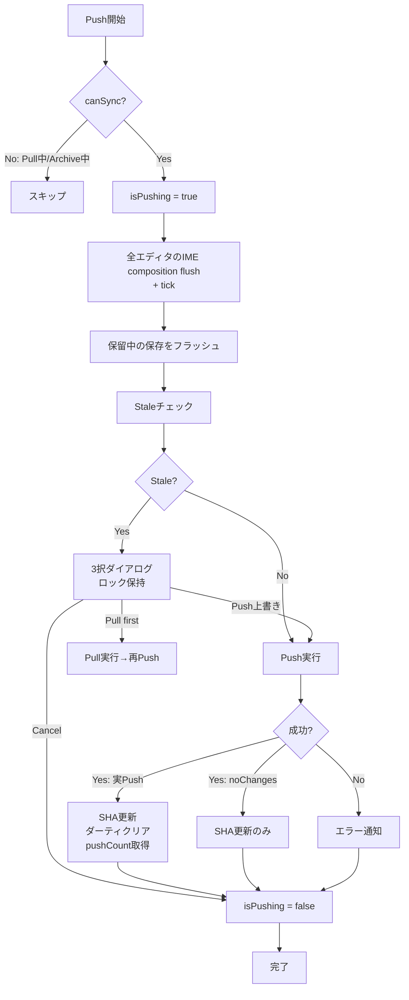
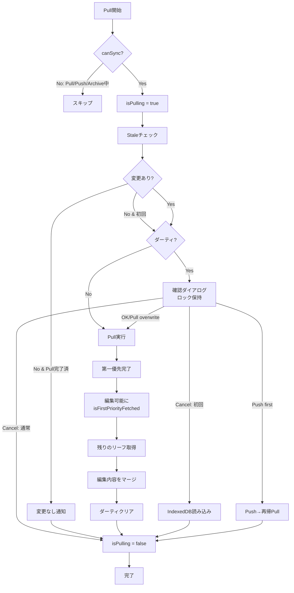
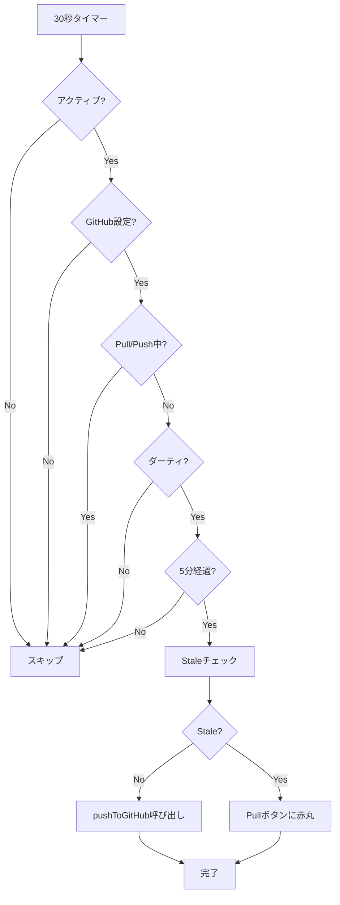
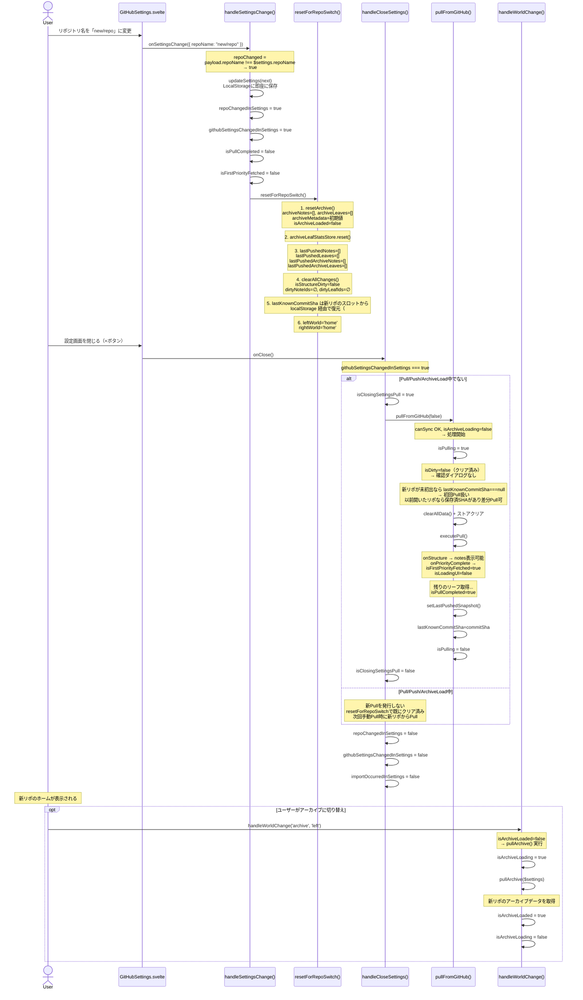
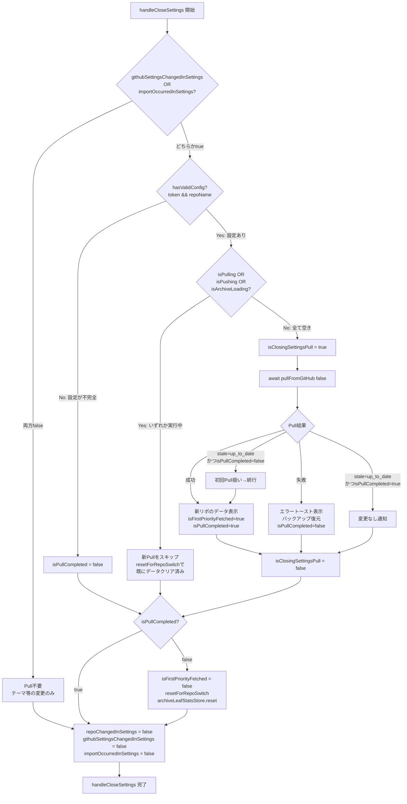
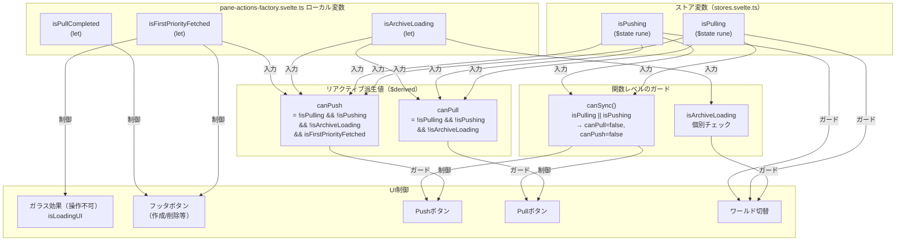

# Push/Pull処理

## 設計思想

### 1つの統合関数による排他制御

Push/Pull処理は、それぞれ**1つの統合関数**に集約されています：

- **Push**: `pushToGitHub()` - すべてのPush操作がこの関数を通る
- **Pull**: `pullFromGitHub()` - すべてのPull操作がこの関数を通る

この設計により、以下を実現しています：

1. **自動的な排他制御**: 各関数の冒頭で即座にロック（`isPushing.value` / `isPulling.value`）を取得し、finally句で必ず解放
2. **データ損失の防止**: 非同期処理の最中に他の操作が割り込むことを根本的に防止
3. **コードの可読性**: 分散していたロジックが1箇所に集約され、動作を理解しやすい

### Promise版ダイアログによるロック保持

確認ダイアログ表示中もロックを保持するため、Promise版のダイアログ関数を使用：

- `confirmAsync(message)` - 確認ダイアログ（true/false を返す）
- `choiceAsync(message, options)` - 選択肢ダイアログ（選択値/null を返す）
- `promptAsync(message, placeholder)` - 入力ダイアログ（string/null を返す）

従来のコールバック版（`showConfirm`）では、ダイアログ表示中にロックを解放する必要がありましたが、Promise版では`await`で待機することでロックを保持したまま処理を継続できます。

---

## Push処理

### pushToGitHub() - 統合関数

すべてのPush操作（ボタンクリック、Ctrl+S、自動Push、Vim `:w`）は、この1つの関数を通ります。

**処理ステップ:**

1. 交通整理: Pull/Push中またはアーカイブロード中は不可
2. 即座にロック取得（非同期処理の前に取得することが重要）
3. **全エディタの IME composition を強制 flush** + `tick()` で reactive 更新を 1 サイクル待つ（#186）
4. 保留中の自動保存をフラッシュ
5. Staleチェック（共通関数で時刻も更新）
6. Stale編集の場合は確認（ロックを保持したまま await）
7. Push飛行中フラグを設定（`pushInFlightAt`）
8. Push実行
9. Push飛行中フラグをクリア
10. 結果処理（成功時はダーティクリア、リモートからpushCount取得）
11. ロック解放（finallyで必ず実行）

**ステップ 3（IME flush）の意義（#186）:**

Android (Gboard 等) の IME 確定前に push が押されると、`MarkdownEditor.svelte` の `pendingCompositionChange` フラグが立ったまま `onChange` が呼ばれず、`leaves.value` が IME 確定前の古い content のまま push されてしまう問題があった。

`src/lib/stores/editor-registry.ts` で各エディタが pane ごとに自身の `flushPendingCompositionChange` をレジストリに登録し、`pushToGitHub` がロック取得後に `flushAllEditors()` で一括 flush を促す。`tick()` で Svelte の reactive 更新を 1 サイクル待ってから push 本処理に入ることで、最新の content が `leaves.value` に反映される。

**重要**: `flushAllEditors()` と `tick()` は **ロック取得の後** に置く必要がある。canSync 通過からロック取得までの間に await を挟むと、その隙に別の push/pull が canSync を通過する競合窓ができる（過去の `flushPendingSaves` がロック前にあった頃のリグレッションと同類）。

### Push処理フロー


```mermaid
flowchart TD
    Start[Push開始] --> Check1{canSync?}
    Check1 -->|No: Pull中/Archive中| End1[スキップ]
    Check1 -->|Yes| Lock[isPushing = true]
    Lock --> FlushIME[全エディタのIME composition flush<br/>+ tick]
    FlushIME --> Flush[保留中の保存をフラッシュ]
    Flush --> Stale[Staleチェック]
    Stale --> Check2{Stale?}
    Check2 -->|Yes| Confirm[3択ダイアログ<br/>ロック保持]
    Check2 -->|No| Push
    Confirm -->|Pull first| PullFirst[Pull実行→再Push]
    Confirm -->|Push上書き| Push[Push実行]
    Confirm -->|Cancel| Unlock
    Push --> Success{成功?}
    Success -->|Yes: 実Push| Clear[SHA更新<br/>ダーティクリア<br/>pushCount取得]
    Success -->|Yes: noChanges| ShaOnly[SHA更新のみ]
    Success -->|No| Notify[エラー通知]
    Clear --> Unlock[isPushing = false]
    ShaOnly --> Unlock
    Notify --> Unlock
    Unlock --> End2[完了]
```

**成功時の分岐:**

- 実際にPushした場合: `lastKnownCommitSha`更新 + スナップショット更新 + ダーティクリア + `lastPushTime`更新 + `pushCount`取得
- `github.noChanges`の場合: `lastKnownCommitSha`のみ更新（スナップショット・ダーティは触らない）

noChangesで`lastKnownCommitSha`を更新するのは、SHAがリモートHEADの外的事実であり、更新を怠るとドリフトして次回staleチェックで誤検出につながるため。一方、スナップショットをnoChangesで更新しないのは、`executePush`をawaitしている間にユーザーが加えた編集がベースラインに吸収されて消失するのを防ぐため（`stale-detection.md`の「なぜSHA更新のみでスナップショットを更新しないか」と同じ原則）。

### 排他制御のポイント

1. **ロック取得は最初**: `canSync`チェック直後、すべての非同期処理の前にロックを取得
2. **finally句で解放**: 成功・失敗・エラー・キャンセルに関わらず、必ずロックを解放
3. **ダイアログ中もロック保持**: `await confirmAsync()` / `await choiceAsync()`でロックを保持したまま待機

### データ損失が起きる可能性があった箇所（修正済み）

**修正前の問題:**

ロック取得が遅く、`flushPendingSaves()`の間にPullが開始される可能性がありました。

**修正後:**

即座にロック取得し、try-finallyで確実に解放します。

### Push処理の原子性と失敗時の安全性

**PullとPushの構造的な違い:**

| 処理 | 構造                 | API呼び出し数                  | 部分的失敗                     |
| ---- | -------------------- | ------------------------------ | ------------------------------ |
| Pull | 並列処理             | リーフ数だけ（100個なら100回） | あり得る（一部成功、一部失敗） |
| Push | 単一トランザクション | 固定3回（Tree→Commit→Ref）     | なし（全成功か全失敗）         |

**Push処理の3段階:**

1. **Tree作成**: 全ファイルを1つのJSONで送信
2. **Commit作成**: 上記Treeを指すCommitオブジェクトを作成
3. **Ref更新**: ブランチのHEADを新Commitに向ける

**各段階での失敗時の挙動:**

```typescript
// どの段階で失敗しても success: false を返す
if (!newTreeRes.ok) {
  return { success: false, message: 'github.treeCreateFailed' }
}
if (!newCommitRes.ok) {
  return { success: false, message: 'github.commitCreateFailed' }
}
if (!updateRefRes.ok) {
  return { success: false, message: 'github.branchUpdateFailed' }
}
```

**ダーティフラグの扱い:**

```typescript
// pane-actions-factory.svelte.ts: 成功時のみダーティクリア
if (result.variant === 'success') {
  setLastPushedSnapshot(...)
  clearAllChanges()  // ← 成功時のみ
  lastPushTime.set(Date.now())
}
```

失敗時はダーティフラグが維持されるため、ユーザーが再度Pushボタンを押すと全データが再送信されます（冪等性あり）。

**Orphan Commitの扱い:**

Commit作成は成功したがRef更新で失敗した場合、Commitオブジェクトは作られますがブランチから到達不可能（orphan）になります。

- 次回Push時に別の新しいCommitを作成（重複するが無害）
- GitHubのGC（garbage collection）で自動削除される
- 実害がないため、特別な処理は不要

**結論:**

Push処理は単一のトランザクション的処理であり、「一部だけ送信成功」という状態は起きません。Pullのような並列処理特有の問題（一部失敗での全体失敗処理）は存在せず、現在の実装で十分安全です。

---

## Pull処理

### pullFromGitHub() - 統合関数

**起動時の例外（#158）**: アプリ起動時は原則として、リモート HEAD SHA と `lastKnownCommitSha` を `initApp` 内で比較し、一致し、かつローカルキャッシュが clean（未Push変更なし）で `metadata` / `pushCount` も復元できるなら `pullFromGitHub` を呼ばずに IndexedDB + per-repo localStorage から直接復元する（アプリのバンドルハッシュが変わっただけのリロードで全リーフ再取得を避けるため）。一致しない / SHA が `null`（初回接続）/ stale-check 失敗 / dirty cache / メタ情報欠落、またはユーザー操作由来の Pull はこの関数を通る。詳細は [`data-model.md` の「状態の初期化フロー」](../data-model.md) を参照。

通常ルートで `pullFromGitHub` を通るケース: Pull ボタン、設定画面閉じる、定期 stale-pull、起動時の SHA 不一致/失敗時フォールバック。

**処理ステップ:**

1. 交通整理: Pull/Push中またはアーカイブロード中は不可
2. 即座にロック取得
3. Staleチェック（リモートが `up_to_date` かつ Pull完了済みなら早期リターン。実Pullが走らないパスで誤った「上書き警告」を出さないため、#152）
   - **#158**: 呼び出し元で既に stale check 済みなら `precomputedStale` 引数で結果を渡せる。GitHub Refs API の二重呼び出しを避ける
4. ダーティチェック（ロックを保持したまま確認ダイアログ。実Pullが走る可能性がある場合のみ）
5. Pull実行（第一優先で編集可能に、残りはバックグラウンド）
6. 結果処理（成功時はpushCount更新、ダーティクリア）
7. ロック解放（finallyで必ず実行）

### Pull処理フロー


```mermaid
flowchart TD
    Start[Pull開始] --> Check1{canSync?}
    Check1 -->|No: Pull/Push/Archive中| End1[スキップ]
    Check1 -->|Yes| Lock[isPulling = true]
    Lock --> Stale[Staleチェック]
    Stale --> Check3{変更あり?}
    Check3 -->|No & Pull完了済| Msg[変更なし通知]
    Check3 -->|No & 初回| Check2
    Check3 -->|Yes| Check2{ダーティ?}
    Check2 -->|Yes| Confirm[確認ダイアログ<br/>ロック保持]
    Check2 -->|No| Pull[Pull実行]
    Confirm -->|OK/Pull overwrite| Pull
    Confirm -->|Push first| PushFirst[Push→再帰Pull]
    Confirm -->|Cancel: 初回| Cancel1[IndexedDB読み込み]
    Confirm -->|Cancel: 通常| Unlock
    Msg --> Unlock
    Pull --> Priority[第一優先完了]
    Priority --> Edit[編集可能に<br/>isFirstPriorityFetched]
    Edit --> Rest[残りのリーフ取得]
    Rest --> Merge[編集内容をマージ]
    Merge --> Clear[ダーティクリア]
    Clear --> Unlock[isPulling = false]
    Cancel1 --> Unlock
    PushFirst --> Unlock
    Unlock --> End2[完了]
```

### 第一優先Pull - 段階的ローディング

Pull処理は、ユーザーが早く編集を開始できるよう、優先度ベースで段階的に実行されます：

1. **構造取得**: ノート構造とリーフスケルトンを取得
2. **第一優先リーフ取得**: URLで指定されたリーフを最優先で取得
3. **閲覧・編集可能に**: `isFirstPriorityFetched = true`, `isLoadingUI = false`（全体のガラス効果解除）
4. **残りのリーフ取得**: バックグラウンドで10並列取得（`CONTENT_FETCH_CONCURRENCY = 10`）
5. **全操作可能に**: `isPullCompleted = true`（フッタのボタン有効化）

**UI制御の段階:**

- **第1段階完了まで**: 全体がガラス効果（`isLoadingUI = true`）で完全に操作不可
- **第1段階完了後**: ガラス効果解除、リーフの閲覧・編集が可能、ただしフッタのボタン（作成・削除・移動など）は無効化（`!isPullCompleted`）
- **第2段階完了後**: すべての操作が可能

これにより、残りのリーフ取得中にユーザーが同名リーフを作成したり、まだ取得していないノートを削除するなどの矛盾を防ぎます。

**ガラス効果中の操作ブロック（`PaneView.svelte`）:**

ガラス効果は視覚的なオーバーレイだけでなく、背面要素を HTML の `inert` 属性で完全に操作不可にします。対象は `<main class="main-pane">` 配下（ノート一覧・エディタ・プレビュー等）で、ヘッダ（Breadcrumbs）とフッタは対象外のため引き続き操作可能です。これにより：

- エディタのキー入力・フォーカス遷移を遮断
- Priority リーフのリンクからのジャンプを遮断
- クリック・タップ・スクリーンリーダー操作を一律遮断

ガラス効果の表示条件は `(isLoadingUI || isPushing) && !isOfflineLeaf(currentLeaf)` で、オフラインリーフを開いている間はオーバーレイも `inert` も適用されず通常通り編集できます（GitHub 同期と無関係なため）。

**PullOptionsコールバック:**

- `onStructure`: ノートとメタデータをストアに設定し、URLから優先情報を返す
- `onLeaf`: 各リーフをストアに追加
- `onPriorityComplete`: 閲覧・編集許可、ガラス効果解除、URL復元

### Pull中の編集保護

Pull処理中（第一優先完了後）にユーザーが編集を行った場合、その編集内容を保護します：

- ダーティなリーフを識別してMapに保持
- Pull結果とマージ時、ダーティなリーフは編集内容とダーティ状態を維持
- Pull完了後、ダーティな変更がない場合のみクリア

---

## 自動Push処理

### 自動Pushの条件

30秒ごとに以下の条件をチェックし、すべて満たす場合のみ`pushToGitHub()`を呼び出します：

1. タブがアクティブ（`document.visibilityState === 'visible'`）
2. GitHub設定済み
3. Pull/Push中でない
4. ダーティフラグが立っている
5. 最後のPushから5分経過

自動Pushも`pushToGitHub()`を呼ぶため、手動Pushと完全に同じ排他制御が適用されます。

### 自動Pushフロー


```mermaid
flowchart TD
    Timer[30秒タイマー] --> Active{アクティブ?}
    Active -->|No| Skip[スキップ]
    Active -->|Yes| Config{GitHub設定?}
    Config -->|No| Skip
    Config -->|Yes| Sync{Pull/Push中?}
    Sync -->|Yes| Skip
    Sync -->|No| Dirty{ダーティ?}
    Dirty -->|No| Skip
    Dirty -->|Yes| Time{5分経過?}
    Time -->|No| Skip
    Time -->|Yes| Stale[Staleチェック]
    Stale --> Check{Stale?}
    Check -->|Yes| Notify[Pullボタンに赤丸]
    Check -->|No| Push[pushToGitHub呼び出し]
    Push --> End[完了]
    Notify --> End
```

自動Pushも`pushToGitHub()`を呼ぶため、手動Pushと完全に同じ排他制御が適用されます。

---

## Push回数カウント機能

### 概要

アプリの使用状況を可視化するため、GitHub Push回数をカウントして統計情報として表示します。

### データ構造

Push回数は `metadata.json` の `pushCount` フィールドに保存されます。

### Push時の自動インクリメント

`pushAllWithTreeAPI` 関数内で、既存ツリーのblob SHAからBlob APIでmetadata.jsonを読み取り、`pushCount` を+1してmetadata.jsonに保存します。
Contents APIではなくBlob APIを使うことで、同一commitのtreeから確実に読み取り、race conditionによるpushCountリセットを防止しています。

- treeにmetadata.jsonがない場合 = 初回Push → pushCount=0から開始（正常）
- Blob API失敗時 = APIエラー → pushをabortしてユーザーに再試行を促す

### Pull時のデータ取得

`executePull` 関数内で、metadata.jsonから `pushCount` を取得し、Svelteストアに保存します。後方互換性のため、フィールドが存在しない場合は0として扱います。

### UI表示

StatsPanel.svelte でホーム画面の右下に`lastPulledPushCount`を統計情報として表示します。Push成功後はリモートから最新の`pushCount`を取得して更新するため、常に正確な値が表示されます。

なお、stale検出は`pushCount`ではなくcommit SHA比較で行われます（`lastKnownCommitSha`ストア）。詳細は[stale-detection.md](./stale-detection.md)を参照。

---

## データ損失バグの撲滅

### 発生していた問題

Pull実行中にPushが開始されると、以下のような順序でデータ損失が発生していました：

1. Pull開始
2. Pull中にPushボタンをクリック
3. Push処理がロック取得前の非同期処理（flushPendingSaves等）を実行
4. その間にPullが完了し、leaves.set([]) でデータをクリア
5. Pushが実行され、空のデータをGitHubにPush
6. リーフが消失

### 解決方法

1. **ロック取得を最初に**: すべての非同期処理の前にロックを取得
2. **finally句で解放**: 必ずロックを解放
3. **Promise版ダイアログ**: ダイアログ表示中もロックを保持
4. **統合関数**: すべての操作が1つの関数を通るため、抜け穴がない

### 修正箇所

| 修正前                                                              | 修正後                                                                             |
| ------------------------------------------------------------------- | ---------------------------------------------------------------------------------- |
| `handlePushToGitHub()` + `executePushInternal()`（2関数）           | `pushToGitHub()`（1関数）                                                          |
| `handlePull()` + `executePullInternal()`（2関数）                   | `pullFromGitHub()`（1関数）                                                        |
| `showConfirm(message, onOK, onCancel)`（コールバック版）            | `await confirmAsync(message)` / `await choiceAsync(message, options)`（Promise版） |
| `await flushPendingSaves(); isPushing.value = true`（ロックが遅い） | `isPushing.value = true; await flushPendingSaves()`（ロックが早い）                |

### 動作フロー（例：自動Push中にPullボタンをクリック）

1. 自動Push開始
2. pushToGitHub() → canSync OK → isPushing.value = true（即座にロック）
3. flushPendingSaves() 実行中...
4. Pullボタンをクリック
5. pullFromGitHub() → canSync → isPushing.value = true を検出 → return
6. Pull は実行されない ✅
7. Push処理が完了
8. isPushing.value = false（ロック解放）

---

## 不完全Pull時のデータ保護

### 発生していた問題

Pull中に一部のリーフ取得が失敗すると、不完全な状態でPull成功と判定され、次のPushでデータが消失する可能性がありました：

1. Pull開始、10並列でリーフ取得
2. 一部のリーフで取得失敗（ネットワーク遅延等）→ `return null`で除外
3. Pull成功として処理、不完全なリーフリストがIndexedDBに保存
4. ユーザーがPush
5. GitHubにあるが、IndexedDBにないリーフが「削除された」と判定
6. リーフ消失

### 解決方法

1. **失敗検出**: リーフ取得失敗を`failedLeafPaths`配列に記録
2. **Pull全体を失敗扱い**: 1件でも失敗があれば`success: false`を返す
3. **UIロック維持**: `isFirstPriorityFetched = false`でガラス効果を維持
4. **isPullCompleted = false**: Pull失敗パス全体で`isPullCompleted`を`false`に設定し、フッタボタンを無効化
5. **メモリ上のストアクリア**: 不完全なデータでのPushを防ぐ
6. **IndexedDBには取得済みリーフを保持**: 次回Pullのblob SHAキャッシュとして再利用し、API呼び出し数を削減する

### 不完全Pull時の動作

- UIはガラス効果でロック（初回Pull前と同じ状態）
- オフラインリーフのみ編集可能
- ノート・リーフの作成・編集・削除は不可
- IndexedDBに途中まで取得したリーフが保存される（次回Pull時にキャッシュヒットでスキップ）
- Pushボタンは機能しない（`canSync`チェックで弾かれる）
- 再度Pullを試行してすべてのリーフを取得する必要がある

### Pull失敗時のバックアップ復元

Pull失敗時のバックアップ復元は**初回Pull（`isInitialStartup = true`）ではメモリにリストアしない**。

- **初回Pull失敗**: メモリ（`notes.value`/`leaves.value`）にはリストアしない（UIはガラス状を維持）。ただしIndexedDBにはバックアップを書き戻し、次回PullのblobSHAキャッシュを保全する。オフラインリーフのみ操作可能。`online`イベントでオンライン復帰を検知し、自動でPullをリトライする
- **非初回Pull失敗**: 直前の同期済みデータからメモリとIndexedDBの両方にバックアップ復元する（作業中の状態を保護）

初回Pull時にメモリにリストアすると、同期未完了のまま編集可能になり、オンライン復帰後のPullで上書きされるリスクがある。IndexedDBへの書き戻しはキャッシュ目的のみで、UIの状態には影響しない。

---

## アーカイブロード中の操作制限

### 発生していた問題

ホームのPull中にアーカイブビューに切り替えると、アーカイブのPullが並行で走り始めます。ホームのPull完了時にアーカイブのPullが未完了でもPushボタンが有効になり、不完全なアーカイブデータがPushされる可能性がありました。

### 解決方法

`isArchiveLoading`フラグを既存の`isPulling`/`isPushing`と同列の排他条件に追加しました。

**ブロックされる操作:**

| 操作                                    | ブロック条件                                     |
| --------------------------------------- | ------------------------------------------------ |
| ワールド切り替え（`handleWorldChange`） | `isPulling \|\| isPushing \|\| isArchiveLoading` |
| Pull実行（`pullFromGitHub`）            | `canSync`失敗 \|\| `isArchiveLoading`            |
| Push実行（`pushToGitHub`）              | `canSync`失敗 \|\| `isArchiveLoading`            |
| ノート移動（`moveNoteToWorld`）         | `isPulling \|\| isPushing \|\| isArchiveLoading` |
| リーフ移動（`moveLeafToWorld`）         | `isPulling \|\| isPushing \|\| isArchiveLoading` |
| 自動Push/自動Pull                       | `isPulling \|\| isPushing \|\| isArchiveLoading` |

**UIの制御:**

- `canPull`/`canPush`リアクティブ宣言に`!isArchiveLoading`条件を追加
- Breadcrumbsコンポーネントに`isSyncing`プロパティを追加し、Pull/Push中はワールド切替ドロップダウンを無効化

---

## 設定画面でのPush/Pull

### 設定画面を開くとき

設定画面を開くときに**Pushは実行しない**。以前はリポジトリ変更前のデータ保全のために強制Pushを行っていたが、リポジトリを変更する＝新しい環境で作業したいユースケースであり、旧データの保全は不要と判断して廃止した。

### 設定画面を閉じるとき

設定画面を閉じるときに**Pullが実行されるのは、リポジトリまたはトークンが変更された場合、もしくはインポートが行われた場合のみ**（`handleCloseSettings()`）。テーマやツール名だけの変更ではPullは実行されない。

さらに、**トークンまたはリポジトリ名が空の場合**（`hasValidConfig = false`）は**Pullを実行せず、初回Pull前の状態に戻す**（`isPullCompleted = false` → `isFirstPriorityFetched = false` + `resetForRepoSwitch()` + `archiveLeafStatsStore.reset()`）。これにより、設定が不完全な状態でデータ操作が行われることを防ぐ。

Pull/Push/アーカイブロード中に設定画面を閉じた場合は、即時Pullではなく**予約Pull**に切り替える。`pendingRepoSync = true` を立て、進行中の同期処理が完了した直後に、最新の `settings.repoName` / `settings.token` に対して `pullFromGitHub(false)` を1回だけ自動実行する。

**Pullが失敗した場合**も同様に、`isPullCompleted = false`となるため初回Pull前の状態にリセットされる（`isFirstPriorityFetched = false` + `resetForRepoSwitch()` + `archiveLeafStatsStore.reset()`）。

### リポジトリ変更時の注意表示

リポジトリ名（`settings.repoName`）が設定画面内で変更された場合、赤い警告メッセージを表示する。これは設定を閉じると新しいリポジトリからPullされることをユーザーに明示するため。

- 初回設定（空欄→入力）の場合は警告不要
- 変更を元に戻した場合は警告が消える

---

## リポジトリ切替時の状態リセット

### 背景

リポジトリを切り替えた際、旧リポの状態（アーカイブデータ、commit SHA、ダーティスナップショット等）が残っていると、新リポに対して誤ったデータがPushされたり、stale検出が誤動作する可能性がある。これを防ぐため、リポ切替時に全リポ固有状態を一括リセットする。

### トリガー

`handleSettingsChange()`内で`repoName`または`token`の変更を検知すると、以下を実行する：

- **リポジトリ名の変更時**: `repoChangedInSettings = true`を設定し、`resetForRepoSwitch()`で全リポ固有状態を一括リセットする
- **トークンの変更時**: `githubSettingsChangedInSettings = true`を設定する（リセットは不要。同じリポに対して新トークンで再接続するため）
- **いずれの変更でも**: `githubSettingsChangedInSettings = true`が設定され、設定画面を閉じる時にPullが実行される

1. `repoChangedInSettings = true`（リポ名変更時のみ）
2. `githubSettingsChangedInSettings = true`（リポ名またはトークン変更時のPull判定用フラグ）
3. `isPullCompleted = false` / `isFirstPriorityFetched = false`（操作ロック、リポ名変更時のみ）
4. `resetForRepoSwitch()`（stores.svelte.tsの一括リセット関数、リポ名変更時のみ）

```typescript
// pane-actions-factory.svelte.ts handleSettingsChange() 内
const repoChanged = payload.repoName !== undefined && payload.repoName !== settings.value.repoName
const tokenChanged = payload.token !== undefined && payload.token !== settings.value.token
const next = { ...settings.value, ...payload }
updateSettings(next)
if (repoChanged) {
  repoChangedInSettings = true
  githubSettingsChangedInSettings = true
  isPullCompleted = false
  isFirstPriorityFetched = false
  resetForRepoSwitch()
} else if (tokenChanged) {
  githubSettingsChangedInSettings = true
}
```

---

### 図1: 操作排他マトリクス

横軸は現在のアプリ状態、縦軸は試みる操作。5つの主要操作（Pull / Push / ArchiveLoad / WorldSwitch / RepoSwitch）の排他関係を示す。

#### 操作 × 状態 の排他表

|                                         | 通常 | Pull中        | Push中      | ArchiveLoad中 | リポ切替直後（Pull前） |
| --------------------------------------- | ---- | ------------- | ----------- | ------------- | ---------------------- |
| **手動Pull**                            | 許可 | ブロック      | ブロック    | ブロック      | 許可（自動実行）       |
| **手動Push**                            | 許可 | ブロック      | ブロック    | ブロック      | ブロック（注1）        |
| **自動Push（42秒）**                    | 許可 | ブロック      | ブロック    | ブロック      | ブロック（注2）        |
| **自動Pull（stale検出）**               | 許可 | ブロック      | ブロック    | ブロック      | ブロック（注3）        |
| **ワールド切替（Home↔Archive）**        | 許可 | ブロック      | ブロック    | ブロック      | ブロック（注4）        |
| **ノート/リーフ移動（World間）**        | 許可 | ブロック      | ブロック    | ブロック      | ブロック（注4）        |
| **ノート/リーフ作成・削除**             | 許可 | 条件付き(注5) | 許可        | 許可          | ブロック（注4）        |
| **リーフ編集**                          | 許可 | 条件付き(注6) | 許可        | 許可          | ブロック（注4）        |
| **設定画面を開く**                      | 許可 | 許可          | 許可        | 許可          | 許可                   |
| **リポ切替（設定画面内）**              | 許可 | 許可（注7）   | 許可（注7） | 許可（注7）   | 許可                   |
| **アーカイブPull（handleWorldChange）** | 許可 | ブロック      | ブロック    | ブロック      | ブロック（注4）        |

**注釈:**

1. `isFirstPriorityFetched = false`により`canPush`が`false`→Pushボタン無効
2. `isDirty = false`（resetForRepoSwitchでクリア済み）→自動Push条件不成立
3. `lastStaleCheckTime = 0`→`canPerformCheck()`が`false`→チェック自体が実行されない
4. `isFirstPriorityFetched = false`によりUIガラス効果で操作不可
5. `isPullCompleted = false`の間はフッタボタンが無効。`isFirstPriorityFetched = true`後は作成/削除可能
6. `isFirstPriorityFetched = true`後のみ編集可能（第一優先リーフ取得完了後）
7. 設定画面は常に開ける。リポ切替を実行すると`resetForRepoSwitch()`が即座に呼ばれ、進行中のPull/Pushには影響しない（完了しても`isArchiveLoaded`等がリセット済みのため無害）

#### 5操作間の排他関係（クロスリファレンス）

以下の表は、行の操作が実行中に列の操作を開始しようとした場合の結果を示す。

|            | Pull開始 | Push開始 | ArchiveLoad開始 | WorldSwitch開始 | RepoSwitch開始 |
| ---------- | -------- | -------- | --------------- | --------------- | -------------- |
| **Pull中** | -        | ブロック | ブロック        | ブロック        | 許可（注7）    |
| **Push中** | ブロック | -        | ブロック        | ブロック        | 許可（注7）    |
| **AL中**   | ブロック | ブロック | -               | ブロック        | 許可（注7）    |
| **WS中**   | 条件付き | 条件付き | 条件付き        | -               | 許可           |
| **RS中**   | 自動実行 | ブロック | ブロック        | ブロック        | -              |

※ AL = ArchiveLoad、WS = WorldSwitch、RS = RepoSwitch

**ブロック機構の実装箇所:**

| ガード条件                             | チェック箇所                        | 影響する操作           |
| -------------------------------------- | ----------------------------------- | ---------------------- |
| `isPulling.value \|\| isPushing.value` | `canSync()` in `sync-handlers.ts`   | Pull, Push             |
| `isArchiveLoading`                     | 各関数の冒頭で個別チェック          | Pull, Push, WS, 移動   |
| `!isFirstPriorityFetched`              | UI側: `isLoadingUI`によるガラス効果 | 編集, 作成, 削除, 移動 |
| `!isPullCompleted`                     | フッタボタンの`disabled`属性        | 作成, 削除             |

---

### 図2: リポ切替シーケンス図

ユーザーが設定画面でリポを変更してから、新リポのデータが表示されるまでの時系列。


```mermaid
sequenceDiagram
    actor User
    participant Settings as GitHubSettings.svelte
    participant HSC as handleSettingsChange()
    participant RFRS as resetForRepoSwitch()
    participant HCS as handleCloseSettings()
    participant PFG as pullFromGitHub()
    participant HWC as handleWorldChange()

    User->>Settings: リポジトリ名を「new/repo」に変更
    Settings->>HSC: onSettingsChange({ repoName: "new/repo" })

    Note over HSC: repoChanged =<br/>payload.repoName !== $settings.repoName<br/>→ true
    HSC->>HSC: updateSettings(next)<br/>LocalStorageに即座に保存
    HSC->>HSC: repoChangedInSettings = true
    HSC->>HSC: githubSettingsChangedInSettings = true
    HSC->>HSC: isPullCompleted = false
    HSC->>HSC: isFirstPriorityFetched = false

    HSC->>RFRS: resetForRepoSwitch()
    Note over RFRS: 1. resetArchive()<br/>  archiveNotes=[], archiveLeaves=[]<br/>  archiveMetadata=初期値<br/>  isArchiveLoaded=false
    Note over RFRS: 2. archiveLeafStatsStore.reset()
    Note over RFRS: 3. lastPushedNotes=[]<br/>  lastPushedLeaves=[]<br/>  lastPushedArchiveNotes=[]<br/>  lastPushedArchiveLeaves=[]
    Note over RFRS: 4. clearAllChanges()<br/>  isStructureDirty=false<br/>  dirtyNoteIds=∅, dirtyLeafIds=∅
    Note over RFRS: 5. lastKnownCommitSha は新リポのスロットから<br/>  localStorage 経由で復元（#131）<br/>  lastPulledPushCount=0<br/>  isStale=false<br/>  lastPushTime=0<br/>  lastStaleCheckTime=0
    Note over RFRS: 6. leftWorld='home'<br/>  rightWorld='home'

    User->>Settings: 設定画面を閉じる（×ボタン）
    Settings->>HCS: onClose()
    Note over HCS: githubSettingsChangedInSettings === true

    alt Pull/Push/ArchiveLoad中でない
        HCS->>HCS: isClosingSettingsPull = true
        HCS->>PFG: pullFromGitHub(false)
        Note over PFG: canSync OK, isArchiveLoading=false<br/>→ 処理開始
        PFG->>PFG: isPulling = true
        Note over PFG: isDirty=false（クリア済み）<br/>→ 確認ダイアログなし
        Note over PFG: 新リポが未初出なら lastKnownCommitSha===null<br/>→ 初回Pull扱い<br/>以前開いたリポなら保存済SHAがあり差分Pull可
        PFG->>PFG: clearAllData() + ストアクリア
        PFG->>PFG: executePull()
        Note over PFG: onStructure → notes表示可能<br/>onPriorityComplete →<br/>  isFirstPriorityFetched=true<br/>  isLoadingUI=false
        Note over PFG: 残りのリーフ取得...<br/>isPullCompleted=true
        PFG->>PFG: setLastPushedSnapshot()
        PFG->>PFG: lastKnownCommitSha=commitSha
        PFG->>PFG: isPulling = false
        HCS->>HCS: isClosingSettingsPull = false
    else Pull/Push/ArchiveLoad中
        Note over HCS: 新Pullを発行しない<br/>resetForRepoSwitchで既にクリア済み<br/>次回手動Pull時に新リポからPull
    end

    HCS->>HCS: repoChangedInSettings = false
    HCS->>HCS: githubSettingsChangedInSettings = false
    HCS->>HCS: importOccurredInSettings = false

    Note over User: 新リポのホームが表示される

    opt ユーザーがアーカイブに切り替え
        User->>HWC: handleWorldChange('archive', 'left')
        Note over HWC: isArchiveLoaded=false<br/>→ pullArchive() 実行
        HWC->>HWC: isArchiveLoading = true
        HWC->>HWC: pullArchive($settings)
        Note over HWC: 新リポのアーカイブデータを取得
        HWC->>HWC: isArchiveLoaded = true
        HWC->>HWC: isArchiveLoading = false
    end
```

---

### 図3: 状態変数のライフサイクル

全リポ固有変数について、各操作でどう変化するかの完全な一覧。

#### stores.svelte.ts 内の変数

| 変数名                     | 型                         | 初期値                                                 | Pull時の変化                                  | Push時の変化                                  | リポ切替時のリセット値                               | リセットしないと何が起きるか                                                  |
| -------------------------- | -------------------------- | ------------------------------------------------------ | --------------------------------------------- | --------------------------------------------- | ---------------------------------------------------- | ----------------------------------------------------------------------------- |
| `archiveNotes`             | `$state<Note[]>`           | `[]`                                                   | 変化なし（Pull対象外）                        | そのままPush                                  | `[]`                                                 | 旧リポのアーカイブノートが新リポにPushされる（**データ破壊**）                |
| `archiveLeaves`            | `$state<Leaf[]>`           | `[]`                                                   | 変化なし                                      | そのままPush                                  | `[]`                                                 | 旧リポのアーカイブリーフが新リポにPushされる（**データ破壊**）                |
| `archiveMetadata`          | `$state<Metadata>`         | `{version:1,...,pushCount:0}`                          | 変化なし                                      | そのままPush                                  | `{version:1,...,pushCount:0}`                        | 旧リポのメタデータで新リポが上書きされる                                      |
| `isArchiveLoaded`          | `$state<boolean>`          | `false`                                                | 変化なし                                      | 変化なし                                      | `false`                                              | `true`のまま残ると、アーカイブ表示時にPullがスキップされ旧データが表示される  |
| `lastPushedNotes`          | `Note[]`（モジュール変数） | `[]`                                                   | `setLastPushedSnapshot()`でディープコピー保存 | `setLastPushedSnapshot()`でディープコピー保存 | `[]`                                                 | 新リポのノートと旧リポのスナップショットを比較し、全ノートが「dirty」と誤判定 |
| `lastPushedLeaves`         | `Leaf[]`（モジュール変数） | `[]`                                                   | 同上                                          | 同上                                          | `[]`                                                 | 同上（リーフ側）                                                              |
| `lastPushedArchiveNotes`   | `Note[]`（モジュール変数） | `[]`                                                   | 変化なし                                      | 同上                                          | `[]`                                                 | 同上（アーカイブ側）                                                          |
| `lastPushedArchiveLeaves`  | `Leaf[]`（モジュール変数） | `[]`                                                   | 変化なし                                      | 同上                                          | `[]`                                                 | 同上（アーカイブ側）                                                          |
| `dirtyNoteIds`             | `$state<Set<string>>`      | `new Set()`                                            | 変化なし（isDirty=falseならクリア）           | `clearAllChanges()`でクリア                   | `new Set()`                                          | 旧リポのdirtyフラグが残りPushボタンに赤丸が表示される                         |
| `dirtyLeafIds`             | `$state<Set<string>>`      | `new Set()`                                            | 同上                                          | 同上                                          | `new Set()`                                          | 同上（リーフ側）                                                              |
| `isStructureDirty`         | `$state<boolean>`          | `false`                                                | 同上                                          | `clearAllChanges()`で`false`                  | `false`                                              | 旧リポの構造変更フラグが残り不要なdirty判定が発生                             |
| `lastKnownCommitSha`       | `$state<string\|null>`     | LocalStorageの現リポスロットから復元（なければ`null`） | `result.commitSha`をセット                    | `result.commitSha`をセット                    | 新リポのスロットから再読込（#131、未初出なら`null`） | 旧リポのSHAと新リポのHEADが比較され、必ず「stale」と誤判定                    |
| `lastPulledPushCount`      | `$state<number>`           | `0`                                                    | `result.metadata.pushCount`をセット           | `fetchRemotePushCount()`で更新                | `0`                                                  | 旧リポのPush回数が統計画面に表示される                                        |
| `isStale`                  | `$state<boolean>`          | `false`                                                | `false`にセット                               | `false`にセット                               | `false`                                              | Pullボタンに赤丸（staleバッジ）が残る                                         |
| `lastPushTime`             | `$state<number>`           | `0`                                                    | 変化なし                                      | `Date.now()`をセット                          | `0`                                                  | 旧リポの最終Push時刻が残り自動Push間隔の計算が狂う                            |
| `lastStaleCheckTime`       | `$state<number>`           | `0`                                                    | 変化なし                                      | 変化なし                                      | `0`                                                  | 0にすることで`canPerformCheck()`がfalse→新Pull完了までstaleチェック抑制       |
| `leftWorld` / `rightWorld` | `$state<WorldType>`        | `'home'`                                               | 変化なし                                      | 変化なし                                      | `'home'`                                             | `'archive'`のまま残るとクリア済みアーカイブストアを参照し空画面になる         |
| `archiveLeafStatsStore`    | カスタムStore              | `reset()済み`                                          | 変化なし                                      | 変化なし                                      | `.reset()`                                           | 旧リポのリーフ統計（文字数等）がアーカイブ画面に表示される                    |

#### pane-actions-factory.svelte.ts 内の変数

| 変数名                            | 型        | 初期値  | Pull時の変化                           | Push時の変化 | リポ切替時のリセット値                               | リセットしないと何が起きるか                                                        |
| --------------------------------- | --------- | ------- | -------------------------------------- | ------------ | ---------------------------------------------------- | ----------------------------------------------------------------------------------- |
| `isFirstPriorityFetched`          | `boolean` | `false` | `false`→`true`（onPriorityComplete時） | 変化なし     | `false`                                              | ガラス効果が解除されたまま残り空データで操作してしまう                              |
| `isPullCompleted`                 | `boolean` | `false` | `false`→`true`（全リーフ取得完了時）   | 変化なし     | `false`                                              | フッタの作成/削除ボタンが有効なまま残り空データで操作してしまう                     |
| `repoChangedInSettings`           | `boolean` | `false` | 変化なし                               | 変化なし     | `true`                                               | `false`のままだと`handleCloseSettings()`でリポ切替時のリセットが正しく追跡されない  |
| `githubSettingsChangedInSettings` | `boolean` | `false` | 変化なし                               | 変化なし     | `true`（リポ名またはトークン変更時）                 | `false`のままだと`handleCloseSettings()`でPullが実行されない                        |
| `importOccurredInSettings`        | `boolean` | `false` | 変化なし                               | 変化なし     | 変化なし（リポ切替とは独立）                         | インポート後にPullが走らない（リポ切替とは無関係）                                  |
| `isClosingSettingsPull`           | `boolean` | `false` | 変化なし                               | 変化なし     | 変化なし                                             | 設定画面閉じ時のPull中表示の管理用（リポ切替と直接の関係なし）                      |
| `isArchiveLoading`                | `boolean` | `false` | 変化なし                               | 変化なし     | 変化なし（resetForRepoSwitchでは直接リセットしない） | 進行中のアーカイブPullが完了しても`isArchiveLoaded=false`なので再Pull必要。実害なし |

---

### 図4: エッジケース一覧

リポ切替・Pull/Push・アーカイブ・外部要因が絡む全29エッジケースと対策の一覧。

#### Sランク（最重大 — データ破壊の可能性）

| #   | 操作シナリオ                                    | 期待動作                                       | 対応するガード/関数                                                                             | 深刻度 |
| --- | ----------------------------------------------- | ---------------------------------------------- | ----------------------------------------------------------------------------------------------- | :----: |
| 1   | ホーム表示中にリポ切替                          | 旧データがクリアされ新リポからPullされる       | `resetForRepoSwitch()` → `handleCloseSettings()` → `pullFromGitHub()`                           |   S    |
| 2   | アーカイブ表示中にリポ切替                      | 旧アーカイブがクリアされ、ワールドがhomeに戻る | `resetForRepoSwitch()` → `resetArchive()` + `leftWorld/rightWorld='home'`                       |   S    |
| 3   | リポ切替直後にPush（旧dirty data）              | 旧データが新リポにPushされない                 | `resetForRepoSwitch()` → `clearAllChanges()` + `isFirstPriorityFetched=false` → `canPush=false` |   S    |
| 4   | アーカイブ取得済み→リポ切替→Push                | 旧アーカイブが新リポにPushされない             | `resetForRepoSwitch()` → `resetArchive()` + `isArchiveLoaded=false`                             |   S    |
| 5   | リポ切替後に未保存変更のconfirmが旧データで出る | confirmダイアログが出ない                      | `resetForRepoSwitch()` → `clearAllChanges()` → `isDirty=false`                                  |   S    |

#### Aランク（重大 — 誤動作の可能性）

| #   | 操作シナリオ                               | 期待動作                                | 対応するガード/関数                                                                                                               | 深刻度 |
| --- | ------------------------------------------ | --------------------------------------- | --------------------------------------------------------------------------------------------------------------------------------- | :----: |
| 6   | Pull中にリポ切替                           | 進行中Pull完了後に新repo pullへ収束する | `handleCloseSettings()` → `pendingRepoSync=true` → Pull finally後に予約pull実行                                                   |   A    |
| 7   | Push中にリポ切替                           | Push完了後に新repo pullへ収束する       | `handleCloseSettings()` → `pendingRepoSync=true` → Push finally後に予約pull実行                                                   |   A    |
| 8   | アーカイブロード中にリポ切替               | archive完了後に新repo pullへ収束する    | `handleCloseSettings()` → `pendingRepoSync=true` → archive load finally後に予約pull実行                                           |   A    |
| 9   | lastKnownCommitShaが旧リポのまま残る       | staleチェックが新リポのSHAと比較する    | #131以降、SHAはリポ単位で localStorage に保持。`rehydrateForRepo()` で新リポのスロットから再読込（未初出なら`null`→初回Pull扱い） |   A    |
| 10  | lastPushedSnapshotが旧リポのまま残る       | dirty検出が新リポ基準で動作する         | `resetForRepoSwitch()` → 全スナップショット配列を`[]`にクリア                                                                     |   A    |
| 11  | 自動Push（42秒タイマー）がリポ切替後に発火 | 旧データを新リポにPushしない            | `resetForRepoSwitch()` → `clearAllChanges()` → `isDirty=false` → 自動Push条件不成立                                               |   A    |
| 12  | staleチェックがリポ切替をまたぐ            | 旧リポのSHAでstale判定しない            | `lastStaleCheckTime=0` → `canPerformCheck()=false` → 新Pull完了までチェック抑制                                                   |   A    |

#### Bランク（UX問題 — 動作はするが改善が望ましい）

| #   | 操作シナリオ                           | 期待動作                          | 対応するガード/関数                                                                                               | 深刻度 |
| --- | -------------------------------------- | --------------------------------- | ----------------------------------------------------------------------------------------------------------------- | :----: |
| 13  | リポ切替直後にアーカイブ切替           | 新リポのアーカイブがPullされる    | `isArchiveLoaded=false` → `handleWorldChange()` → `pullArchive()`                                                 |   B    |
| 14  | リポ切替連打（A→B→A）                  | 最終的にAのデータが表示される     | 各変更で`resetForRepoSwitch()`が呼ばれ最後の設定が残る。閉じる時に1回だけPull                                     |   B    |
| 15  | 同じリポ名・トークンを再設定           | 何も起きない（リセット/Pullなし） | `repoChanged`/`tokenChanged`判定で`false` → `handleCloseSettings()`でスキップ                                     |   B    |
| 15a | トークンだけ変更して閉じる             | Pullが走る（新トークンで再取得）  | `githubSettingsChangedInSettings=true` → `handleCloseSettings()` → `pullFromGitHub()`                             |   B    |
| 16  | テーマだけ変更して閉じる               | Pullされない                      | `githubSettingsChangedInSettings=false` かつ `importOccurredInSettings=false` → `handleCloseSettings()`でスキップ |   B    |
| 17  | インポート後にリポ切替なしで閉じる     | インポートデータの同期Pullが走る  | `importOccurredInSettings=true` → `handleCloseSettings()` → `pullFromGitHub()`                                    |   B    |
| 18  | リポ切替＋インポート両方実行して閉じる | Pullは1回だけ実行される           | `repoChangedInSettings \|\| importOccurredInSettings` → 1回の`pullFromGitHub()`                                   |   B    |
| 19  | URL状態が旧リポのID参照                | ホームにフォールバック            | `restoreStateFromUrl()` → ID不一致 → ホーム表示                                                                   |   B    |
| 20  | IndexedDB自動保存が旧データで上書き    | 新リポデータが保持される          | `pullFromGitHub()` → `clearAllData()` → 新データ保存                                                              |   B    |

#### Cランク（軽微 — 現在の動作で問題なし）

| #   | 操作シナリオ                             | 期待動作                         | 対応するガード/関数                                                                                                                 | 深刻度 |
| --- | ---------------------------------------- | -------------------------------- | ----------------------------------------------------------------------------------------------------------------------------------- | :----: |
| 21  | リポ切替後にワールド切替（Home→Archive） | 新リポのアーカイブがPullされる   | `isArchiveLoaded=false` → `handleWorldChange()` → `pullArchive()`                                                                   |   C    |
| 22  | 空のリポ名を設定して閉じる               | Pullせずリセット                 | `hasValidConfig=false` → `isPullCompleted=false` → リセット処理（初回Pull前の状態に戻す）                                           |   C    |
| 23  | 存在しないリポ名を設定                   | 404エラー表示                    | `pullFromGitHub()` → `executePull()` → エラーハンドリング                                                                           |   C    |
| 24  | アーカイブが空のリポに切替               | 空のアーカイブが表示される       | `pullArchive()`が空データで成功返却                                                                                                 |   C    |
| 25  | 別端末でPush済み→リポ切替→Pull           | 最新データが取得される           | 新リポが未初出: `lastKnownCommitSha=null` → 初回Pull扱い / 以前開いたリポ: 保存済SHAからstaleチェック→差分Pull                      |   C    |
| 26  | ネットワーク切断中にリポ切替             | エラー表示、バックアップから復元 | `pullFromGitHub()` → エラーハンドリング + バックアップ復元                                                                          |   C    |
| 27  | APIレート制限中にリポ切替                | レート制限メッセージ表示         | `rateLimitInfo`をトーストに表示                                                                                                     |   C    |
| 28  | トークン変更のみ（リポ名同じ）           | 新トークンで接続（Pullあり）     | `githubSettingsChangedInSettings=true` → リセットなし、Pull実行                                                                     |   B    |
| 29  | トークンとリポの組み合わせが不正         | 認証エラー表示                   | GitHub API 401→エラートースト                                                                                                       |   C    |
| 30  | トークンを空にして閉じる                 | Pullせずリセット                 | `hasValidConfig=false` → `isPullCompleted=false` → リセット処理（初回Pull前の状態に戻す）                                           |   C    |
| 31  | Pull失敗（ネットワーク等）後の状態       | 初回Pull前の状態に戻る           | `isPullCompleted=false` → リセット処理（`isFirstPriorityFetched=false` + `resetForRepoSwitch()` + `archiveLeafStatsStore.reset()`） |   C    |

---

### 図5: Before/After 比較

修正前（resetForRepoSwitch導入前）と修正後の動作を主要シナリオごとに対比する。

#### シナリオ1: アーカイブ表示中にリポ切替

**修正前（BUG）:**

- アーカイブストア（`archiveNotes`, `archiveLeaves`）が旧リポのデータを保持したまま
- `isArchiveLoaded = true`のまま残る
- 新リポでPush実行すると、旧リポのアーカイブデータが新リポにPushされる
- **結果: データ破壊**

**修正後:**

- `resetForRepoSwitch()` → `resetArchive()`でアーカイブストア全クリア
- `isArchiveLoaded = false`にリセット
- `leftWorld/rightWorld = 'home'`でホームに戻す
- 新リポでアーカイブ表示時に`handleWorldChange()`が`pullArchive()`を実行
- **結果: 安全。新リポのアーカイブが正しく取得される**

#### シナリオ2: リポ切替直後のPush

**修正前（BUG）:**

- `lastPushedNotes/Leaves`が旧リポのスナップショットを保持
- 新リポのPull完了後、旧スナップショットとの差分で全データが「dirty」と判定
- Push実行で旧リポと新リポのデータが混在してPushされる可能性
- **結果: 意図しないdirty判定、最悪の場合データ不整合**

**修正後:**

- `resetForRepoSwitch()`で`lastPushedNotes/Leaves = []`にクリア
- `clearAllChanges()`で`dirtyNoteIds/dirtyLeafIds = new Set()`にクリア
- `isFirstPriorityFetched = false`により`canPush = false`→Pushボタン無効
- Pull完了時に`setLastPushedSnapshot()`で新リポのスナップショットが正しく設定される
- **結果: 安全。Pull完了まではPush不可、Pull後は新リポ基準でdirty検出**

#### シナリオ3: staleチェックがリポ切替をまたぐ

**修正前（BUG）:**

- `lastKnownCommitSha`が旧リポのSHAを保持
- 新リポのHEADと比較され、必ず「stale」と判定される
- 自動Pullが不必要に発火する
- **結果: 不要なAPI呼び出し、最悪の場合は旧リポのstaleバッジが残る**

**修正後:**

- `lastKnownCommitSha`は**リポ単位のlocalStorageスロット**に保存されている（#131）
- リポ切替時は `rehydrateForRepo()` が新リポのスロットからSHAを読み直す（未初出なら`null`）
- `lastStaleCheckTime = 0`にリセット → `canPerformCheck() = false`
- 新Pull完了までstaleチェックが抑制される
- Pull成功時に`lastKnownCommitSha`が新リポのSHAで更新され、そのリポのスロットに保存される
- **結果: 安全。staleチェックは新Pull完了後に新リポ基準で正しく動作。以前開いたリポに戻ったときは保存済SHAで差分Pull可能**

#### シナリオ4: 自動Pushがリポ切替後に発火

**修正前（BUG）:**

- `isDirty = true`が残ったまま（旧リポでの編集由来）
- `lastPushTime`が旧リポの時刻のまま → 5分経過判定がずれる
- 自動Push条件が成立し、空データまたは旧データが新リポにPushされる
- **結果: データ消失または不正データのPush**

**修正後:**

- `resetForRepoSwitch()`で`clearAllChanges()` → `isDirty = false`
- `lastPushTime = 0`にリセット
- `isFirstPriorityFetched = false` → `canPush = false`
- 自動Push条件が成立しない（isDirty=false かつ canPush=false）
- **結果: 安全。自動PushはPull完了・編集発生後にのみ動作**

#### シナリオ5: Pull中にリポ切替して閉じる

**修正前（BUG）:**

- 設定画面を閉じると`handleCloseSettings()`がPull中チェックなしで`pullFromGitHub()`を呼ぶ
- `canSync()`で`isPulling = true`のためブロックされるが、旧Pullの結果が新リポ設定のUIに表示される可能性
- **結果: 旧リポのデータが表示される混乱状態**

**修正後:**

- `handleCloseSettings()`で`isPulling.value || isPushing.value || isArchiveLoading`をチェック
- いずれかがtrueの場合、即時Pullではなく `pendingRepoSync = true` を記録
- `resetForRepoSwitch()`で既にデータクリア済みなので、進行中の旧Pull結果は操作対象として残らない
- 進行中の同期が finally に入った時点で予約を確認し、新repo pull を1回だけ実行する
- **結果: 安全性を保ったまま、自動で新リポへ収束する**

---

### 図6: handleCloseSettings の判定フロー

`importOccurredInSettings`の分岐を含む完全なフローチャート。


```mermaid
flowchart TD
    Start[handleCloseSettings 開始] --> CheckFlags{githubSettingsChangedInSettings<br/>OR<br/>importOccurredInSettings?}

    CheckFlags -->|両方false| SkipPull[Pull不要<br/>テーマ等の変更のみ]
    SkipPull --> ClearFlags

    CheckFlags -->|どちらかtrue| CheckValid{hasValidConfig?<br/>token && repoName}

    CheckValid -->|No: 設定が不完全| SetNotCompleted[isPullCompleted = false]
    SetNotCompleted --> CheckReset

    CheckValid -->|Yes: 設定あり| CheckSync{isPulling OR<br/>isPushing OR<br/>isArchiveLoading?}

    CheckSync -->|Yes: いずれか実行中| SkipSafe[新Pullをスキップ<br/>resetForRepoSwitchで<br/>既にデータクリア済み]
    SkipSafe --> CheckReset

    CheckSync -->|No: 全て空き| SetClosing[isClosingSettingsPull = true]
    SetClosing --> Pull[await pullFromGitHub false]

    Pull --> PullResult{Pull結果}
    PullResult -->|成功| NewData[新リポのデータ表示<br/>isFirstPriorityFetched=true<br/>isPullCompleted=true]
    PullResult -->|失敗| ErrorHandle[エラートースト表示<br/>バックアップ復元<br/>isPullCompleted=false]
    PullResult -->|stale=up_to_date<br/>かつisPullCompleted=true| NoChange[変更なし通知]
    PullResult -->|stale=up_to_date<br/>かつisPullCompleted=false| Continue[初回Pull扱い→続行]
    Continue --> NewData

    NewData --> ResetClosing[isClosingSettingsPull = false]
    ErrorHandle --> ResetClosing
    NoChange --> ResetClosing

    ResetClosing --> CheckReset{isPullCompleted?}

    CheckReset -->|false| Reset[isFirstPriorityFetched = false<br/>resetForRepoSwitch<br/>archiveLeafStatsStore.reset]
    CheckReset -->|true| ClearFlags

    Reset --> ClearFlags[repoChangedInSettings = false<br/>githubSettingsChangedInSettings = false<br/>importOccurredInSettings = false]
    ClearFlags --> End[handleCloseSettings 完了]
```

#### handleCloseSettings() の条件分岐表

| githubSettingsChanged | importOccurred | hasValidConfig | isPulling | isPushing | isArchiveLoading | 結果                                                      |
| :-------------------: | :------------: | :------------: | :-------: | :-------: | :--------------: | --------------------------------------------------------- |
|         true          |     false      |      true      |   false   |   false   |      false       | Pull実行（リポ名またはトークン変更後のデータ取得）        |
|         true          |     false      |      true      | **true**  |   false   |      false       | スキップ（リセット済み、次回手動Pull時に取得）            |
|         true          |     false      |      true      |   false   | **true**  |      false       | スキップ（同上）                                          |
|         true          |     false      |      true      |   false   |   false   |     **true**     | スキップ（同上）                                          |
|         true          |     false      |   **false**    |     -     |     -     |        -         | Pullせずリセット（設定が不完全 → 初回Pull前の状態に戻す） |
|         false         |      true      |      true      |   false   |   false   |      false       | Pull実行（インポート後のデータ同期）                      |
|         false         |      true      |      true      | **true**  |   false   |      false       | スキップ                                                  |
|         true          |      true      |      true      |   false   |   false   |      false       | Pull実行（両方trueでも1回のみ）                           |
|         false         |     false      |       -        |     -     |     -     |        -         | スキップ（テーマ等の変更のみ → Pullなし）                 |

**補足**:

- `repoChanged`も`importOccurred`も`false`の場合（テーマ変更のみ等）、外側のif文で弾かれるためPullは実行されない。これにより不要なAPI呼び出しとトースト通知を回避する。
- `hasValidConfig`は`!!(settings.value.token && settings.value.repoName)`で判定。`false`の場合は`isPullCompleted = false`を設定し、Pullを実行せずに後続の`isPullCompleted`チェックでリセット処理に入る。
- Pull失敗時も`isPullCompleted = false`となるため、同様にリセット処理（`isFirstPriorityFetched = false` + `resetForRepoSwitch()` + `archiveLeafStatsStore.reset()`）が実行される。

---

### 図7: ガード変数の依存グラフ

`isPulling`, `isPushing`, `isArchiveLoading`, `isPullCompleted`, `isFirstPriorityFetched`, `canPull`, `canPush` の依存関係を示す。どの変数がどの変数に影響するかの全体図。


```mermaid
flowchart TB
    subgraph "ストア変数（stores.svelte.ts）"
        isPulling["isPulling<br/>($state rune)"]
        isPushing["isPushing<br/>($state rune)"]
    end

    subgraph "pane-actions-factory.svelte.ts ローカル変数"
        isArchiveLoading["isArchiveLoading<br/>(let)"]
        isFirstPriorityFetched["isFirstPriorityFetched<br/>(let)"]
        isPullCompleted["isPullCompleted<br/>(let)"]
    end

    subgraph "リアクティブ派生値（$derived）"
        canPull["canPull<br/>= !isPulling && !isPushing<br/>&& !isArchiveLoading"]
        canPush["canPush<br/>= !isPulling && !isPushing<br/>&& !isArchiveLoading<br/>&& isFirstPriorityFetched"]
    end

    subgraph "UI制御"
        glassFX["ガラス効果（操作不可）<br/>isLoadingUI"]
        footerBtns["フッタボタン<br/>（作成/削除等）"]
        pushBtn["Pushボタン"]
        pullBtn["Pullボタン"]
        worldSW["ワールド切替"]
    end

    subgraph "関数レベルのガード"
        canSyncFn["canSync()<br/>isPulling || isPushing<br/>→ canPull=false, canPush=false"]
        archiveGuard["isArchiveLoading<br/>個別チェック"]
    end

    isPulling -->|入力| canPull
    isPulling -->|入力| canPush
    isPulling -->|入力| canSyncFn
    isPushing -->|入力| canPull
    isPushing -->|入力| canPush
    isPushing -->|入力| canSyncFn
    isArchiveLoading -->|入力| canPull
    isArchiveLoading -->|入力| canPush
    isArchiveLoading -->|入力| archiveGuard
    isFirstPriorityFetched -->|入力| canPush
    isFirstPriorityFetched -->|制御| glassFX
    isFirstPriorityFetched -->|制御| footerBtns
    isPullCompleted -->|制御| footerBtns

    canPull -->|制御| pullBtn
    canPush -->|制御| pushBtn
    canSyncFn -->|ガード| pullBtn
    canSyncFn -->|ガード| pushBtn
    archiveGuard -->|ガード| worldSW

    isPulling -->|ガード| worldSW
    isPushing -->|ガード| worldSW
```

#### 各ガード変数の書き込みタイミング

| 変数                     | trueにするタイミング                                  | falseにするタイミング                                        |
| ------------------------ | ----------------------------------------------------- | ------------------------------------------------------------ |
| `isPulling`              | `pullFromGitHub()` 冒頭（canSyncチェック直後）        | `pullFromGitHub()` のfinally句                               |
| `isPushing`              | `pushToGitHub()` 冒頭（canSyncチェック直後）          | `pushToGitHub()` のfinally句                                 |
| `isArchiveLoading`       | `handleWorldChange()` でアーカイブPull開始時          | `handleWorldChange()` のfinally句                            |
| `isFirstPriorityFetched` | `pullFromGitHub()` の`onPriorityComplete`コールバック | リポ切替時（`handleSettingsChange`）、Pull開始時             |
| `isPullCompleted`        | `pullFromGitHub()` のPull成功後                       | リポ切替時（`handleSettingsChange`）、Pull開始時、Pull失敗時 |

#### canPull / canPush の算出式

```typescript
// pane-actions-factory.svelte.ts（リアクティブ宣言）
let canPull = $derived(!isPulling.value && !isPushing.value && !isArchiveLoading)
let canPush = $derived(
  !isPulling.value && !isPushing.value && !isArchiveLoading && isFirstPriorityFetched
)
```

**canPull と canPush の違い**: `canPush`は`isFirstPriorityFetched`を追加で要求する。これにより、Pull完了前（データが不完全な状態）でのPushを防止する。canPullにこの条件がないのは、Pullはいつでも実行可能であるべきため（データが不完全でもPullで最新化できる）。

---

### resetForRepoSwitch() のコード（参照用）

```typescript
// src/lib/stores/stores.svelte.ts
export function resetForRepoSwitch(): void {
  // アーカイブデータをクリア
  resetArchive()
  archiveLeafStatsStore.reset()

  // Pushスナップショットをクリア（旧リポのスナップショットで誤検出しないように）
  lastPushedNotes = []
  lastPushedLeaves = []
  lastPushedArchiveNotes = []
  lastPushedArchiveLeaves = []

  // ダーティフラグをクリア
  clearAllChanges()

  // Git参照をクリア（旧リポのSHAで誤判定しないように）
  lastKnownCommitSha.value = null
  lastPulledPushCount.value = 0
  isStale.value = false
  lastPushTime.value = 0
  lastStaleCheckTime.value = 0

  // ワールドをホームに戻す（旧リポのアーカイブ表示を防止）
  leftWorld.value = 'home'
  rightWorld.value = 'home'
}
```

---

## まとめ

- **Push処理**: `pushToGitHub()` - 1つの統合関数
- **Pull処理**: `pullFromGitHub()` - 1つの統合関数
- **ロック管理**: 最初に取得、finally句で解放、Promise版ダイアログでロック保持
- **アーカイブロード保護**: `isArchiveLoading`中はPull/Push/ワールド切替/ノート移動を全てブロック
- **データ損失**: 排他制御の強化により撲滅
- **第一優先Pull**: 段階的ローディングで早期編集開始
- **編集保護**: Pull中の編集内容を保持
- **リポ切替保護**: `resetForRepoSwitch()`で全リポ固有状態を一括リセット（20変数）、旧リポのデータ混入を防止。図1〜図7で全容を文書化
- **不完全Pull保護**: リーフ取得失敗時はUIをロックしてデータ消失を防止
