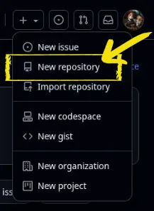
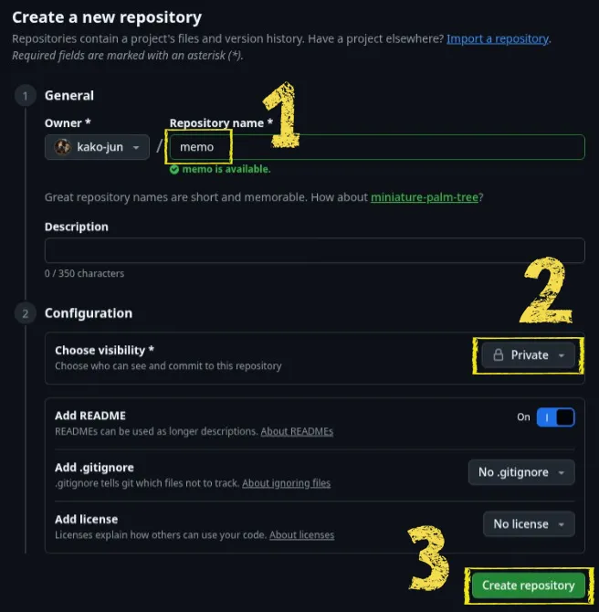
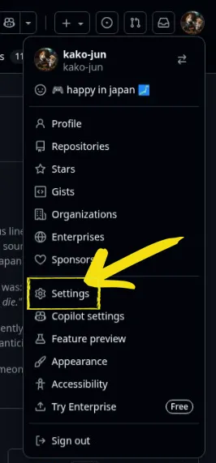
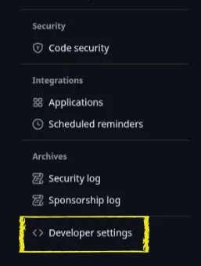
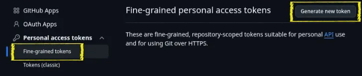
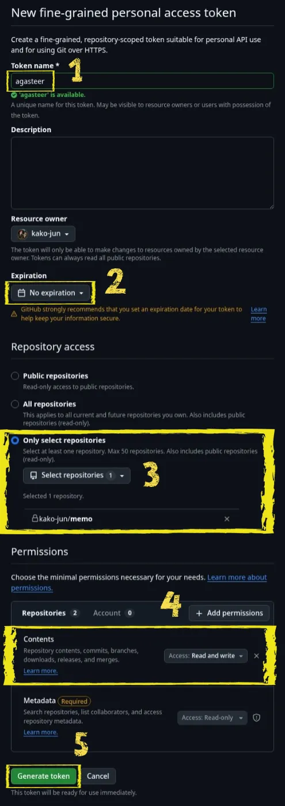
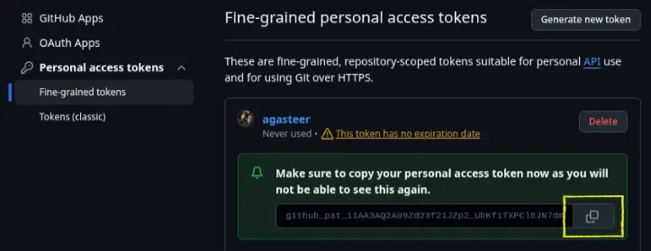

# GitHub連携セットアップガイド

Agasteerは、GitHubをノートの保存先として使用するアプリです。GitHub連携を設定しないと、ブラウザ内の一時的なオフラインノートしか使えません（ブラウザのデータを消すとノートも消えます）。

GitHub連携を設定すると：

- ノートがGitHubに保存され、**どの端末からでもアクセス可能**
- PC・スマホ間で**自動同期**
- ノートの**バックアップ**が自動で残る

設定には**リポジトリの作成**と**Personal Access Tokenの取得**が必要です。以下の手順に従ってください（5〜10分程度）。

---

## 1. リポジトリを作成する

ノートを保存するためのGitHubリポジトリを作成します。

### Step 1: New repositoryを選択

GitHubにログインし、右上の「+」ボタンから「New repository」を選択します。

### Step 2: リポジトリを作成

以下の設定でリポジトリを作成します：

| 番号 | 項目                  | 設定内容                          |
| :--: | --------------------- | --------------------------------- |
|  ①   | **Repository name**   | 好きな名前（例: `memo`, `notes`） |
|  ②   | **Visibility**        | 「Private」を選択                 |
|  ③   | **Create repository** | ボタンをクリック                  |

作成したリポジトリ名（例: `memo`）をAgasteerの設定画面で入力します。

---

## 2. Personal Access Tokenを取得する

GitHubのAPIを使用するためのトークンを取得します。

### Step 1: Settingsを開く

右上のプロフィールアイコンをクリックし、「Settings」を選択します。

### Step 2: Developer settingsを開く

左サイドバーの一番下にある「Developer settings」をクリックします。

### Step 3: Fine-grained tokensを選択

「Personal access tokens」→「Fine-grained tokens」を選択し、「Generate new token」をクリックします。

### Step 4: トークンを設定

以下の項目を設定します：

| 番号 | 項目                  | 設定内容                                                                                   |
| :--: | --------------------- | ------------------------------------------------------------------------------------------ |
|  ①   | **Token name**        | わかりやすい名前（例: `agasteer`）                                                         |
|  ②   | **Expiration**        | 任意の期限を選択（例: 90 days）。「No expiration」は便利ですがセキュリティ上は期限付き推奨 |
|  ③   | **Repository access** | 「Only select repositories」を選択し、作成したリポジトリを選択                             |
|  ④   | **Permissions**       | 「Contents」を「Read and write」に設定                                                     |
|  ⑤   | **Generate token**    | ボタンをクリック                                                                           |

### Step 5: トークンをコピー

生成されたトークンをコピーします。

> **重要**: トークンは一度しか表示されません。必ずこの画面でコピーしてください。

コピーしたトークンをAgasteerの設定画面で入力します。

---

## 3. Agasteerで設定する

1. Agasteerの設定画面を開く
2. 左側の「GitHub Token」にコピーしたトークンを入力
3. 右側の「GitHub Repository」に `ユーザー名/リポジトリ名` を入力（例: `kako-jun/memo`）
4. 「テスト接続」ボタンで接続確認

設定が正しければ、ノートがGitHubと同期されます。

### リポジトリの切り替え

複数のリポジトリを使い分けたい場合（例: 日常メモ用と専用プロジェクト用）：

1. リポジトリ入力欄の右にある「▼」ボタンをタップ
2. 過去に接続したリポジトリがドロップダウンに表示される
3. 切り替えたいリポジトリを選択
4. 新しいリポジトリを使う場合は、直接入力も可能

> **💡 Tip**: 同じトークンで複数のリポジトリにアクセスするには、トークン作成時に対象リポジトリを全て選択するか、「All repositories」を選択してください。

ドロップダウンの各エントリの右にある「×」ボタンで、履歴からリポジトリを削除できます。

---

## トラブルシューティング

### "Bad credentials" エラー

- トークンが正しくコピーされているか確認
- トークンの有効期限が切れていないか確認

### "Not Found" エラー

- リポジトリ名が `ユーザー名/リポジトリ名` の形式になっているか確認
- トークンに正しいリポジトリへのアクセス権限があるか確認

### トークンを忘れた場合

トークンは再表示できません。新しいトークンを生成してください。

> **ヒント**: Agasteerの設定画面でトークン入力欄の横にあるコピーボタンをクリックすると、入力済みのトークンをクリップボードにコピーできます。別の端末で設定する際に便利です。

---

## 関連ドキュメント

- [基本操作](./basic-usage.md) - Push/Pullの使い方
- [パワーユーザー向け](./power-user.md) - GitHub連携の詳細
- [よくある質問（FAQ）](./faq.md)
