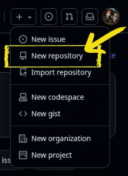
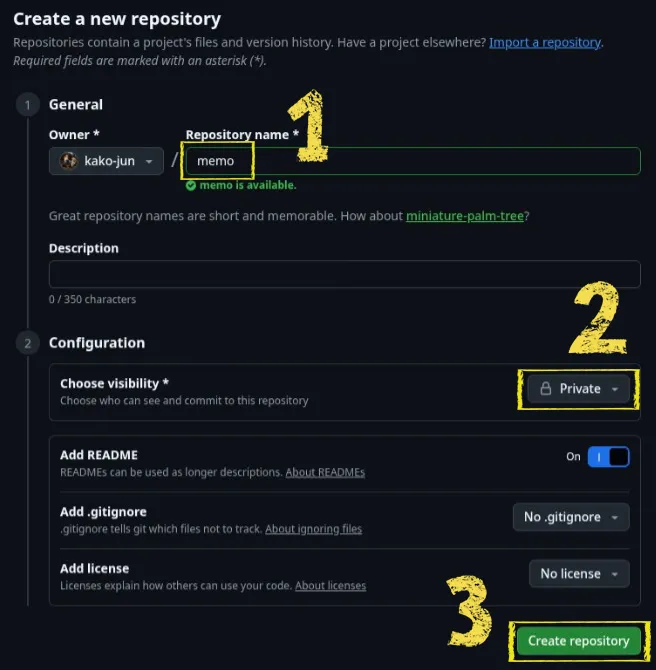
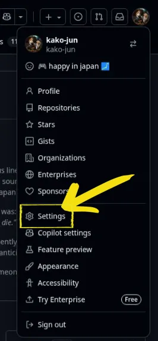
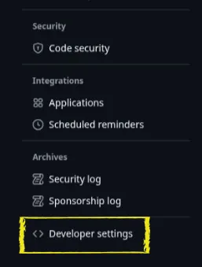
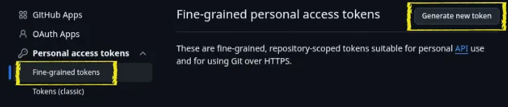
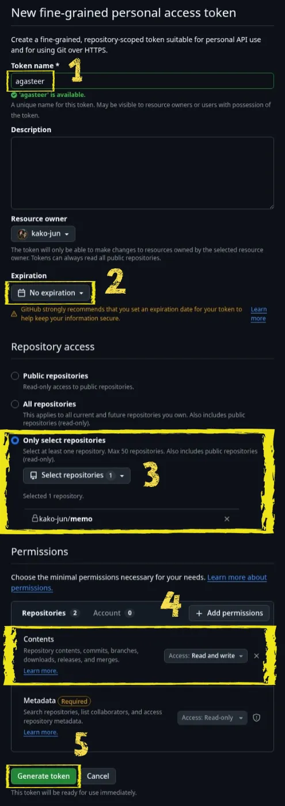
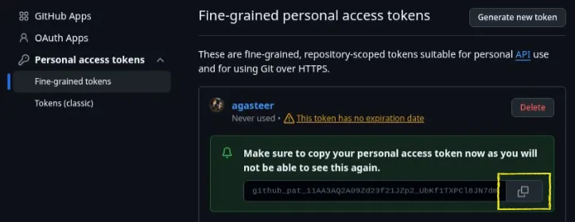

# GitHub連携セットアップガイド

Agasteerは、GitHubをノートの保存先として使用するアプリです。GitHub連携を設定しないと、ブラウザ内の一時的なオフラインノートしか使えません（ブラウザのデータを消すとノートも消えます）。

GitHub連携を設定すると：

- ノートがGitHubに保存され、**どの端末からでもアクセス可能**
- PC・スマホ間で**自動同期**
- ノートの**バックアップ**が自動で残る

設定には**リポジトリの作成**と**Personal Access Tokenの取得**が必要です。以下の手順に従ってください（5〜10分程度）。

---

## 1. リポジトリを作成する

ノートを保存するためのGitHubリポジトリを作成します。

### Step 1: New repositoryを選択

GitHubにログインし、右上の「+」ボタンから「New repository」を選択します。

### Step 2: リポジトリを作成

以下の設定でリポジトリを作成します：

| 番号 | 項目                  | 設定内容                          |
| :--: | --------------------- | --------------------------------- |
|  ①   | **Repository name**   | 好きな名前（例: `memo`, `notes`） |
|  ②   | **Visibility**        | 「Private」を選択                 |
|  ③   | **Create repository** | ボタンをクリック                  |

作成したリポジトリ名（例: `memo`）をAgasteerの設定画面で入力します。

---

## 2. Personal Access Tokenを取得する

GitHubのAPIを使用するためのトークンを取得します。

まず「**ファイル添付（画像・動画など）を使うか？**」で手順が分かれます。

- **添付を使わない** → 下の [A. 添付を使わない場合](#a-添付を使わない場合fine-grained-pat) へ。fine-grained PAT で最小権限。
- **添付を使う** → 下の [B. 添付を使う場合](#b-添付を使う場合) へ。2つの選択肢から選びます。

> **なぜ分かれるのか**: 添付ファイルは `{リポジトリ名}-media` という別のプライベートリポジトリに保存され、初回添付時に自動作成が試みられます。この自動作成には**新規リポジトリを作成する権限**が必要です。最小権限の fine-grained PAT（選択したリポジトリのみ・Contents 権限のみ）ではこの作成ができず、添付時に `HTTP 403 Resource not accessible by personal access token` となり添付が失敗します（fine-grained トークンは新規リポジトリを作成できない仕様のため）。そのため添付を使う場合は下記 B のいずれかを選びます。

---

### A. 添付を使わない場合（fine-grained PAT）

最小権限で済みます。

#### Step 1: Settingsを開く

右上のプロフィールアイコンをクリックし、「Settings」を選択します。

#### Step 2: Developer settingsを開く

左サイドバーの一番下にある「Developer settings」をクリックします。

#### Step 3: Fine-grained tokensを選択

「Personal access tokens」→「Fine-grained tokens」を選択し、「Generate new token」をクリックします。

#### Step 4: トークンを設定

以下の項目を設定します：

| 番号 | 項目                  | 設定内容                                                                                   |
| :--: | --------------------- | ------------------------------------------------------------------------------------------ |
|  ①   | **Token name**        | わかりやすい名前（例: `agasteer`）                                                         |
|  ②   | **Expiration**        | 任意の期限を選択（例: 90 days）。「No expiration」は便利ですがセキュリティ上は期限付き推奨 |
|  ③   | **Repository access** | 「Only select repositories」を選択し、作成したリポジトリを選択                             |
|  ④   | **Permissions**       | 「Contents」を「Read and write」に設定                                                     |
|  ⑤   | **Generate token**    | ボタンをクリック                                                                           |

#### Step 5: トークンをコピー

生成されたトークンをコピーします。

> **重要**: トークンは一度しか表示されません。必ずこの画面でコピーしてください。

コピーしたトークンをAgasteerの設定画面で入力します。

---

### B. 添付を使う場合

次の2つの選択肢があります。どちらでも添付は動きます。手軽さと権限の広さのトレードオフで選んでください。

#### B-1. Classic トークン（`repo` スコープ）— 最も簡単

`{リポジトリ名}-media` リポジトリが**初回添付時に自動作成**されるため、事前準備が要りません。

1. 「Settings」→「Developer settings」を開く
2. 「Personal access tokens」→「**Tokens (classic)**」を選択
3. 「**Generate new token (classic)**」をクリック
4. Note（名前）と Expiration（期限）を設定
5. Scopes（スコープ）で「**`repo`**」にチェックを入れる
6. 「**Generate token**」をクリックし、表示されたトークンをコピー

> **⚠️ トレードオフ**: `repo` スコープはそのアカウントの**全リポジトリ**に対する読み書き権限を含みます。特定のリポジトリだけに絞ることはできません。最小権限を優先するなら B-2 を選んでください。

#### B-2. Fine-grained PAT（最小権限）— mediaリポを自分で作る

権限を絞れますが、`{リポジトリ名}-media` リポジトリを**先に自分で作成**する必要があります（fine-grained トークンは新規リポジトリを自動作成できないため）。

1. 「1. リポジトリを作成する」と同じ手順で、`{リポジトリ名}-media` という名前のプライベートリポジトリをもう1つ作成する（例: ノートが `memo` なら `memo-media`）
2. 上の **A の Step 1〜5** と同じ手順でトークンを作成する。ただし ③「Repository access」では **ノートのリポジトリと `{リポジトリ名}-media` リポジトリの両方**を選択する
3. ④「Permissions」は同じく「Contents」を「Read and write」に設定する

---

## 3. Agasteerで設定する

1. Agasteerの設定画面を開く
2. 左側の「GitHub Token」にコピーしたトークンを入力
3. 右側の「GitHub Repository」に `ユーザー名/リポジトリ名` を入力（例: `kako-jun/memo`）
4. 「テスト接続」ボタンで接続確認

設定が正しければ、ノートがGitHubと同期されます。

### リポジトリの切り替え

複数のリポジトリを使い分けたい場合（例: 日常メモ用と専用プロジェクト用）：

1. リポジトリ入力欄の右にある「▼」ボタンをタップ
2. 過去に接続したリポジトリがドロップダウンに表示される
3. 切り替えたいリポジトリを選択
4. 新しいリポジトリを使う場合は、直接入力も可能

> **💡 Tip**: 同じトークンで複数のリポジトリにアクセスするには、トークン作成時に対象リポジトリを全て選択するか、「All repositories」を選択してください。

ドロップダウンの各エントリの右にある「×」ボタンで、履歴からリポジトリを削除できます。

リポジトリを切り替えると、以下のデータが自動的にリセットされます：

- **ホームのノート・リーフ**: 設定画面を閉じた時に新しいリポジトリから自動取得されます
- **アーカイブ**: クリアされ、次回アーカイブ表示時に新しいリポジトリから取得されます
- **未保存の変更**: リセットされます（切り替え前にPushしてください）
- **同期状態**: staleチェックやPush履歴もリセットされます

---

## トラブルシューティング

### "Bad credentials" エラー

- トークンが正しくコピーされているか確認
- トークンの有効期限が切れていないか確認

### "Not Found" エラー

- リポジトリ名が `ユーザー名/リポジトリ名` の形式になっているか確認
- トークンに正しいリポジトリへのアクセス権限があるか確認

### トークンを忘れた場合

トークンは再表示できません。新しいトークンを生成してください。

> **ヒント**: Agasteerの設定画面でトークン入力欄の横にあるコピーボタンをクリックすると、入力済みのトークンをクリップボードにコピーできます。別の端末で設定する際に便利です。

---

## 関連ドキュメント

- [基本操作](./basic-usage.md) - Push/Pullの使い方
- [パワーユーザー向け](./power-user.md) - GitHub連携の詳細
- [よくある質問（FAQ）](./faq.md)
